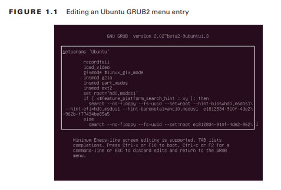
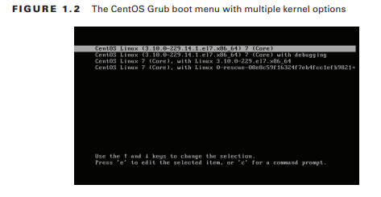

# Sistema de Arranque

Antes de que pueda iniciar sesión y comenzar a usar su sistema Linux, debe realizarse un complicado proceso de inicio del sistema operativo. Suceden muchas cosas detrás de escena en el proceso de arranque de Linux. Es útil saber todo lo que está sucediendo en caso de que algo salga mal.
Este capítulo examina los procesos de arranque e inicio en sistemas Linux. Primero, analiza el papel que desempeña el firmware de la computadora a la hora de iniciar el proceso. Después de eso, analiza los cargadores de arranque de Linux y examina cómo configurarlos. A continuación, el capítulo analiza el proceso de inicialización de Linux y muestra cómo Linux decide qué aplicaciones en segundo plano iniciar durante el arranque. El capítulo termina analizando algunas opciones de recuperación del sistema que tiene disponibles para ayudar a salvar un sistema que no arranca.
### El proceso de arranque de Linux
Cuando enciende su sistema Linux, se desencadena una serie de eventos que eventualmente conducen al mensaje de inicio de sesión. Normalmente, no te preocupas por lo que sucede detrás de escena de esos eventos; simplemente inicia sesión y comienza a usar tus aplicaciones.
Sin embargo, puede haber ocasiones en las que su sistema Linux no se inicie correctamente, o tal vez una aplicación que esperaba que se ejecutara en segundo plano no se esté ejecutando. En esos casos, es útil tener una comprensión básica de cómo Linux inicia el sistema operativo e inicia los programas para poder solucionar el problema.
Esta sección recorre los pasos del proceso de inicio y muestra cómo puede observarlo para ver qué pasos fallaron.
### Siguiendo el proceso de arranque
El proceso de arranque de Linux se puede dividir en tres pasos principales:
1. El firmware de la estación de trabajo se inicia, realiza una verificación rápida del hardware, llamada autoprueba de encendido (POST), y luego busca un programa de carga de arranque para ejecutar desde un dispositivo de arranque.
2. El gestor de arranque se ejecuta y determina qué programa del kernel de Linux cargar.
3. El programa del kernel se carga en la memoria e inicia los programas en segundo plano necesarios para que el sistema funcione (como un administrador de escritorio gráfico para escritorios o servidores web y de bases de datos para servidores).
### El proceso de arranque de Linux
Si bien estos tres pasos pueden parecer simples en la superficie, detrás de escena se produce una serie de operaciones algo complicadas para mantener el proceso de arranque en funcionamiento. Cada paso realiza varias acciones mientras prepara su sistema para ejecutar Linux.
### Ver el proceso de arranque
Puede monitorear el proceso de inicio de Linux observando la pantalla de la consola del sistema mientras se inicia el sistema. Verá muchos mensajes informativos desplazarse a medida que el sistema detecta hardware y carga

Por lo general, los mensajes de inicio se desplazan con cierta rapidez y es difícil ver qué está sucediendo. Si necesita solucionar problemas de arranque, puede revisar los mensajes de tiempo de arranque usando el comando `dmesg`. La mayoría de las distribuciones de Linux copian los mensajes del kernel de arranque en un búfer de anillo especial en la memoria llamado búfer de anillo del kernel. El búfer es circular y está configurado en un tamaño predeterminado. A medida que se registran nuevos mensajes en el búfer, los mensajes más antiguos se eliminan.
El comando `dmesg` muestra los mensajes de arranque más recientes que están almacenados actualmente en el búfer de anillo del kernel, como se muestra en el Listado 1.1.

### Listing 1.1: Salida del comando `dmsg`

```bash
$ dmesg

[    0.000000] Linux version 6.6.15-amd64 (devel@kali.org) (gcc-13 (Debian 13.2.0-13) 13.2.0, GNU ld (GNU Binutils for Debian) 2.42) #1 SMP PREEMPT_DYNAMIC Kali 6.6.15-2kali1 (2024-04-09)
[    0.000000] Command line: BOOT_IMAGE=/vmlinuz-6.6.15-amd64 root=/dev/mapper/kali--vg-root ro quiet splash
[    0.000000] BIOS-provided physical RAM map:
[    0.000000] BIOS-e820: [mem 0x0000000000000000-0x000000000009e7ff] usable
[    0.000000] BIOS-e820: [mem 0x000000000009e800-0x000000000009ffff] reserved
[    0.000000] BIOS-e820: [mem 0x00000000000dc000-0x00000000000fffff] reserved
[    0.000000] BIOS-e820: [mem 0x0000000000100000-0x00000000bfecffff] usable
[    0.000000] BIOS-e820: [mem 0x00000000bfed0000-0x00000000bfefefff] ACPI data
[    0.000000] BIOS-e820: [mem 0x00000000bfeff000-0x00000000bfefffff] ACPI NVS
[    0.000000] BIOS-e820: [mem 0x00000000bff00000-0x00000000bfffffff] usable
[    0.000000] BIOS-e820: [mem 0x00000000f0000000-0x00000000f7ffffff] reserved
[    0.000000] BIOS-e820: [mem 0x00000000fec00000-0x00000000fec0ffff] reserved
[    0.000000] BIOS-e820: [mem 0x00000000fee00000-0x00000000fee00fff] reserved
[    0.000000] BIOS-e820: [mem 0x00000000fffe0000-0x00000000ffffffff] reserved
[    0.000000] BIOS-e820: [mem 0x0000000100000000-0x00000001c3ffffff] usable
[    0.000000] NX (Execute Disable) protection: active
[    0.000000] APIC: Static calls initialized
[    0.000000] SMBIOS 2.7 present.
[    0.000000] DMI: VMware, Inc. VMware Virtual Platform/440BX Desktop Reference Platform, BIOS 6.00 11/12/2020
[    0.000000] vmware: hypercall mode: 0x02
[    0.000000] Hypervisor detected: VMware
[    0.000000] vmware: TSC freq read from hypervisor : 1190.392 MHz
[    0.000000] vmware: Host bus clock speed read from hypervisor : 66000000 Hz
[    0.000000] vmware: using clock offset of 8320391212 ns
[    0.000192] tsc: Detected 1190.392 MHz processor
[    0.002108] e820: update [mem 0x00000000-0x00000fff] usable ==> reserved
[    0.002112] e820: remove [mem 0x000a0000-0x000fffff] usable
[    0.002118] last_pfn = 0x1c4000 max_arch_pfn = 0x400000000
[    0.002141] MTRR map: 8 entries (5 fixed + 3 variable; max 21), built from 8 variable MTRRs
[    0.002157] x86/PAT: Configuration [0-7]: WB  WC  UC- UC  WB  WP  UC- WT  
[    0.002208] e820: update [mem 0xc0000000-0xffffffff] usable ==> reserved
[    0.002215] last_pfn = 0xc0000 max_arch_pfn = 0x400000000
[    0.013413] found SMP MP-table at [mem 0x000f6a70-0x000f6a7f]
[    0.013452] Using GB pages for direct mapping
[    0.013744] RAMDISK: [mem 0x2e549000-0x3329bfff]
[    0.013750] ACPI: Early table checksum verification disabled
[    0.013753] ACPI: RSDP 0x00000000000F6A00 000024 (v02 PTLTD )
[    0.013758] ACPI: XSDT 0x00000000BFEDB633 00005C (v01 INTEL  440BX    06040000 VMW  01324272)
[    0.013764] ACPI: FACP 0x00000000BFEFEE73 0000F4 (v04 INTEL  440BX    06040000 PTL  000F4240)
[    0.013776] ACPI: DSDT 0x00000000BFEDD001 021E72 (v01 PTLTD  Custom   06040000 MSFT 03000001)
[    0.013781] ACPI: FACS 0x00000000BFEFFFC0 000040
[    0.013784] ACPI: FACS 0x00000000BFEFFFC0 000040
[    0.013786] ACPI: BOOT 0x00000000BFEDCFB4 000028 (v01 PTLTD  $SBFTBL$ 06040000  LTP 00000001)
[    0.013790] ACPI: APIC 0x00000000BFEDC872 000742 (v01 PTLTD  ? APIC   06040000  LTP 00000000)
[    0.013793] ACPI: MCFG 0x00000000BFEDC836 00003C (v01 PTLTD  $PCITBL$ 06040000  LTP 00000001)
[    0.013796] ACPI: SRAT 0x00000000BFEDB72F 0008D0 (v02 VMWARE MEMPLUG  06040000 VMW  00000001)
[    0.013799] ACPI: HPET 0x00000000BFEDB6F7 000038 (v01 VMWARE VMW HPET 06040000 VMW  00000001)
[    0.013802] ACPI: WAET 0x00000000BFEDB6CF 000028 (v01 VMWARE VMW WAET 06040000 VMW  00000001)
[    0.013804] ACPI: Reserving FACP table memory at [mem 0xbfefee73-0xbfefef66]
[    0.013805] ACPI: Reserving DSDT table memory at [mem 0xbfedd001-0xbfefee72]
[    0.013806] ACPI: Reserving FACS table memory at [mem 0xbfefffc0-0xbfefffff]

[    0.013809] ACPI: Reserving SRAT table memory at [mem 0xbfedb72f-0xbfedbffe]
[    0.013809] ACPI: Reserving HPET table memory at [mem 0xbfedb6f7-0xbfedb72e]
[    0.013810] ACPI: Reserving WAET table memory at [mem 0xbfedb6cf-0xbfedb6f6]
[    0.013853] system APIC only can use physical flat
[    0.013860] APIC: Switched APIC routing to: physical flat
[    0.013889] SRAT: PXM 0 -> APIC 0x00 -> Node 0
[    0.013891] SRAT: PXM 0 -> APIC 0x02 -> Node 0
[    0.013891] SRAT: PXM 0 -> APIC 0x04 -> Node 0
[    0.013892] SRAT: PXM 0 -> APIC 0x06 -> Node 0
[    0.013892] SRAT: PXM 0 -> APIC 0x08 -> Node 0
```

La mayoría de las distribuciones de Linux también almacenan los mensajes de inicio en un archivo de registro, generalmente en la carpeta `/var/log`. Para los sistemas basados en Debian, el archivo suele ser `/var/log/boot`, mientras que para los sistemas basados en Red Hat, el archivo es `/var/log/boot.log`.
Aunque ayuda poder ver los diferentes mensajes generados durante el tiempo de arranque, también es útil saber qué genera esos mensajes. Este capítulo analiza cada uno de estos tres pasos de arranque y presenta algunos ejemplos que muestran cómo funcionan.
### El inicio del firmware
Todas las estaciones de trabajo y servidores compatibles con IBM utilizan algún tipo de firmware integrado para controlar cómo se inicia el sistema operativo instalado. En estaciones de trabajo y servidores más antiguos, este firmware se denominaba Sistema básico de entrada/salida (BIOS). En las estaciones de trabajo y servidores más nuevos, un nuevo método, llamado Interfaz de firmware extensible unificada (UEFI), es responsable de mantener el estado del hardware del sistema e iniciar un sistema operativo instalado.
Sin embargo, ambos métodos eventualmente inician el programa principal del sistema operativo y cada método utiliza diferentes formas de hacerlo. Esta sección lo guía a través de los conceptos básicos de los métodos BIOS y UEFI, mostrándole cómo participan en el proceso de arranque de Linux.
### El inicio del BIOS
El firmware BIOS que se encuentra en estaciones de trabajo y servidores más antiguos tenía algo de limitado en lo que podía hacer. El firmware del BIOS tenía una interfaz de menú simplista que le permitía cambiar algunas configuraciones para controlar cómo el sistema encontraba el hardware y definir qué dispositivo debía usar el BIOS para iniciar el sistema operativo.
Una de las limitaciones del firmware del BIOS original era que solo podía leer los datos de un sector de un disco duro en la memoria para poder ejecutarse. Como probablemente puedas adivinar, ese no es suficiente espacio para cargar un sistema operativo completo. Para sortear esa limitación, la mayoría de los sistemas operativos (incluidos Linux y Microsoft Windows) dividen el proceso de arranque en dos partes.
Primero, el BIOS ejecuta un programa de cargador de arranque. El gestor de arranque es un pequeño programa que inicializa el hardware necesario para buscar y ejecutar el sistema operativo completo, que normalmente se encuentra en otra ubicación del mismo disco duro, pero a veces se encuentra en un dispositivo de almacenamiento interno o externo independiente.
El programa de arranque generalmente tiene un archivo de configuración, por lo que puede indicarle dónde encontrar el archivo del sistema operativo real para ejecutarlo o incluso generar un pequeño menú que permita al usuario iniciar entre múltiples sistemas operativos.
### El inicio del firmware
Para comenzar, el BIOS debe saber dónde encontrar el programa del cargador de arranque en un dispositivo de almacenamiento instalado. La mayoría de las configuraciones de BIOS le permiten cargar el programa del gestor de arranque desde varias ubicaciones:
- Un disco duro interno
- Un disco duro externo
- Una unidad de CD/DVD
- Una memoria USB
- Un servidor de red
Al arrancar desde un disco duro, debe designar desde qué disco duro y desde qué partición del disco duro el BIOS debe cargar el programa del cargador de arranque. Esto se hace definiendo un Master Boot Record (MBR).
El MBR es el primer sector de la primera partición del disco duro del sistema. Sólo hay un MBR para el sistema informático. El BIOS busca el MBR y lee el programa almacenado allí en la memoria. Dado que el programa de arranque debe caber en un sector, debe ser muy pequeño, por lo que no puede hacer mucho. El programa de arranque apunta principalmente a la ubicación del archivo del núcleo del sistema operativo real, que se almacena en un sector de arranque de una partición separada del sistema. No hay limitaciones de tamaño en el archivo de inicio del kernel.
### La puesta en marcha de UEFI
Si bien el BIOS tenía muchas limitaciones, los fabricantes de computadoras aprendieron a vivir con ellas y el BIOS fue el estándar predeterminado para los sistemas compatibles con IBM durante muchos años. Sin embargo, a medida que los sistemas operativos se volvieron más complicados, finalmente quedó claro que era necesario desarrollar un nuevo método de arranque.
Intel creó la Interfaz de firmware extensible (EFI) en 1998 para abordar algunas de las limitaciones del BIOS. La adopción de EFI fue un proceso algo lento, pero en 2005 la idea se hizo popular entre otros proveedores y se adoptó la especificación Universal EFI (UEFI) como estándar. Hoy en día, casi todos los sistemas de servidores y de escritorio compatibles con IBM utilizan el estándar de firmware UEFI.
En lugar de depender de un único sector de arranque en un disco duro para contener el programa del cargador de arranque, UEFI especifica una partición de disco especial, llamada Partición del sistema EFI (ESP) para almacenar los programas del cargador de arranque. Esto permite cualquier tamaño de programa de cargador de arranque, además de la capacidad de almacenar múltiples programas de cargador de arranque para múltiples sistemas operativos.
La configuración de ESP utiliza el antiguo sistema de archivos de la tabla de asignación de archivos (FAT) de Microsoft para almacenar los programas del gestor de arranque. En los sistemas Linux, el ESP generalmente se monta en la carpeta `/boot/efi` y los archivos del gestor de arranque generalmente se almacenan usando la extensión de nombre de archivo .efi.
El firmware UEFI utiliza un mini gestor de arranque integrado (a veces denominado administrador de arranque), que le permite configurar qué archivo de programa del gestor de arranque iniciar.
Con UEFI, debe registrar cada archivo individual del cargador de arranque que desee que aparezca en el momento del arranque en el menú de la interfaz del administrador de arranque. La aplicación efibootmgr Linux le permite crear y eliminar entradas de inicio o cambiar el orden de inicio. La interfaz UEFI incluye un entorno de shell, que le permite ingresar comandos para modificar la configuración de inicio o seleccionar el gestor de arranque para ejecutar cada vez que inicia el sistema.
Una vez que el firmware encuentra y ejecuta el gestor de arranque, su trabajo estará hecho. El paso del gestor de arranque en el proceso de arranque puede ser algo complicado. La siguiente sección profundiza en cubrir este paso.
### Cargadores de arranque de Linux
El programa de arranque ayuda a cerrar la brecha entre el firmware del sistema y el kernel completo del sistema operativo Linux. En Linux, tienes varias opciones de cargadores de arranque. Los más populares con los que te encontrarás son estos:
- Linux Loader (LILO)
- Grand Unified Bootloader (GRUB) Legacy
- GRUB2
En las versiones originales de Linux, el gestor de arranque Linux Loader (LILO) era el único disponible. Era extremadamente limitado en lo que podía hacer, pero cumplió su propósito, es decir, cargar el kernel de Linux desde el inicio del BIOS. LILO se convirtió en el gestor de arranque predeterminado utilizado por las distribuciones de Linux en la década de 1990. El archivo de configuración de LILO se almacena en un único archivo, `/etc/lilo.conf`, que define los sistemas a arrancar. Desafortunadamente, LILO no funciona con sistemas UEFI, por lo que tiene un uso limitado en sistemas modernos y rápidamente está desapareciendo en la historia.
La primera versión del gestor de arranque GRUB (ahora llamado GRUB Legacy) se creó en 1999 para proporcionar un gestor de arranque más robusto y configurable para reemplazar a LILO. GRUB se convirtió rápidamente en el gestor de arranque predeterminado para todas las distribuciones de Linux, ya sea que se ejecutaran en sistemas BIOS o UEFI.

GRUB2 se creó en 2005 como una reescritura total del sistema GRUB Legacy. Admite funciones avanzadas, como la capacidad de cargar módulos de controladores de hardware y usar declaraciones lógicas para alterar las opciones del menú de inicio dinámicamente, según las condiciones detectadas en el sistema (por ejemplo, si hay un disco duro externo conectado).

Esta sección recorre los conceptos básicos de los cargadores de arranque GRUB Legacy y GRUB2, que deberían cubrir casi todas las distribuciones de Linux con las que se encontrará estos días.
### GRUB Legacy
El gestor de arranque GRUB Legacy fue diseñado para simplificar el proceso de creación de menús de arranque y paso de opciones a los kernels. GRUB Legacy le permite seleccionar múltiples kernels y/o sistemas operativos usando una interfaz de menú así como un shell interactivo. Usted configura la interfaz del menú para proporcionar opciones para cada kernel o sistema operativo que desee iniciar. El shell interactivo proporciona una manera de personalizar los comandos de arranque sobre la marcha.
Tanto el menú como el shell interactivo utilizan un conjunto de comandos que controlan las funciones del gestor de arranque. Esta sección le explica cómo configurar el gestor de arranque GRUB Legacy, cómo instalarlo y cómo interactuar con él en el momento del arranque.
### Configuración de GRUB heredado
Cuando utiliza el menú interactivo de GRUB Legacy, debe indicarle qué opciones mostrar.
Esto se hace utilizando comandos especiales del menú de GRUB.
El sistema GRUB Legacy almacena los comandos del menú en un archivo de configuración de texto estándar. El archivo de configuración utilizado por GRUB Legacy es `menu.lst` y se almacena en la carpeta `/boot/grub`. (Aunque no es un requisito, algunas distribuciones de Linux crean una partición `/boot` separada en el disco duro). Las distribuciones de Linux derivadas de Red Hat (como CentOS y Fedora) usan `grub.conf` en lugar de `menu.lst` para el archivo de configuración.
El archivo de configuración de GRUB Legacy consta de dos secciones:
- Definiciones globales
- Definiciones de inicio del sistema operativo
La sección de definiciones globales define comandos que controlan el funcionamiento general del menú de inicio de GRUB Legacy. Las definiciones globales deben aparecer primero en el archivo de configuración.
Sólo hay un puñado de configuraciones globales. La Tabla 1.1 muestra estas configuraciones.

| **Setting** | **Description**                                                                                                                                                            |
| ----------- | -------------------------------------------------------------------------------------------------------------------------------------------------------------------------- |
| color       | Especifica los colores de primer plano y de fondo que se usarán en el menú de inicio.Especifica los colores de primer plano y de fondo que se usarán en el menú de inicio. |
| default     | Define la opción de menú predeterminada para seleccionar.                                                                                                                  |
| fallback    | Una selección de menú secundario para usar si falla la opción de menú predeterminada                                                                                       |
| hiddenmenu  | No mostrar las opciones de selección del menú.                                                                                                                             |
| splashimage | Apunta a un archivo de imagen para usar como fondo para el menú de inicio.                                                                                                 |
| timeout     | Especifica la cantidad de tiempo que se debe esperar para una selección de menú antes de usar el valor predeterminado.                                                     |

Para GRUB Legacy, para definir un valor para un comando, simplemente indique el valor como un parámetro de línea de comando:
- predeterminado 0 tiempo de espera 10
- color blanco/azul amarillo/azul

El comando de color define la combinación de colores del menú. El primer par de valores define los colores de primer plano/fondo para las entradas de menú normales, mientras que el segundo par define los colores de primer plano/fondo para la entrada de menú seleccionada.
Después de las definiciones globales, coloque definiciones para los sistemas operativos individuales que están instalados en el sistema. Cada sistema operativo debe tener su propia sección de definición. Puede utilizar muchas configuraciones de definición de arranque para personalizar cómo el gestor de arranque encuentra el archivo del kernel del sistema operativo. Afortunadamente, sólo se necesitan unos pocos comandos para definir el sistema operativo. Los que hay que recordar son los siguientes:
- tittle: la primera línea de cada sección de definición de inicio; esto es lo que aparece en el menú de inicio.
- root: define el disco y la partición donde se encuentra la partición de la carpeta GRUB `/boot` en el sistema.
- kernel: define el archivo de imagen del kernel almacenado en la carpeta `/boot` para cargar.
-  initrd: define el archivo de disco RAM inicial, que contiene los controladores necesarios para que el kernel interactúe con el hardware del sistema.
- rootnoverify: define particiones de arranque que no son de Linux, como Windows.

El comando `root` define el disco duro y la partición que contienen la carpeta `/boot` para GRUB Legacy. Desafortunadamente, GRUB Legacy utiliza una forma un tanto extraña de hacer referencia a esos valores:
(disco duro, partición)

Desafortunadamente, GRUB Legacy no se refiere a los discos duros como lo hace Linux: utiliza un sistema de numeración para hacer referencia tanto a los discos como a las particiones, comenzando en 0 en lugar de 1. Por ejemplo, para hacer referencia a la primera partición en el primer disco duro. del sistema, usarías (hd0,0). Para hacer referencia a la segunda partición en el primer disco duro, usaría (hd0,1).
El comando `initrd` es otra característica importante de GRUB Legacy. Ayuda a resolver un problema que surge al utilizar hardware o sistemas de archivos especializados como unidad raíz. El comando `initrd` define un archivo que el kernel monta en el momento del arranque como un disco RAM. Luego, el kernel puede cargar módulos desde el disco RAM, lo que le permite acceder a hardware o sistemas de archivos no compilados en el propio kernel. 
El Listado 1.2 muestra un archivo de configuración heredado de GRUB de muestra que define tanto una partición de Windows como una partición de Linux para el arranque.

**Listado 1.2:** Ejemplo de archivo de configuración de GRUB Legacy

```bash
default 0
timeout 10
color white/blue yellow/blue 

title CentOS Linux 
root (hd1,0)

kernel (hd1,0)/boot/vmlinuz 
initrd /boot/initrd 

title Windows 
rootnoverify (hd0,0)
```

Este ejemplo muestra dos opciones de arranque: una para un sistema CentOS Linux y otra para un sistema Windows. El sistema CentOS se instala en la primera partición del segundo disco duro, mientras que el sistema Windows se instala en la primera partición del primer disco duro. La selección de arranque de Linux especifica el archivo del kernel que se cargará, así como el archivo de imagen `initrd` que se cargará en la memoria.
### Instalación de GRUB heredado
Una vez que cree el archivo de configuración de GRUB Legacy, debe instalar el programa GRUB Legacy en el MBR. El comando para hacer esto es `grub-install`.
El comando `grub-install` utiliza un único parámetro que indica la partición en la que instalar GRUB. Puede especificar la partición utilizando el formato Linux o GRUB Legacy. Por ejemplo, para usar el formato Linux, escribirías

```bash
# grub-install /dev/sda
```

para instalar GRUB en el MBR del primer disco duro. Para utilizar el formato GRUB Legacy, debe incluir el formato del disco duro entre comillas:

```bash
# grub-install '(hd0)'
```

Si está utilizando el método `chainloading` y prefiere instalar una copia de GRUB Legacy en el sector de arranque de una partición en lugar de en el MBR de un disco duro, debe especificar la partición, nuevamente usando el formato Linux o GRUB. :

```bash
# grub-install /dev/sda1

# grub-install 'hd(0,0)'
```

No es necesario reinstalar GRUB Legacy en el MBR después de realizar cambios en el archivo de configuración, porque GRUB Legacy lee el archivo de configuración cada vez que se ejecuta.
### Interactuando con GRUB Legacy
Cuando inicia un sistema que utiliza el gestor de arranque GRUB Legacy, verá un menú que muestra las opciones de inicio que definió en el archivo de configuración. Si espera a que expire el tiempo de espera, se procesará la opción de inicio predeterminada. Alternativamente, puede usar las teclas de flecha para seleccionar una de las opciones de inicio y luego presionar la tecla Enter para seleccionarla.
También puede editar las opciones de arranque sobre la marcha desde el menú de GRUB. Primero, diríjase a la opción de inicio que desea modificar y luego presione la tecla E. Utilice la tecla de flecha para mover el cursor a la línea que necesita modificar y luego presione la tecla E para editarla. Presione la tecla B para iniciar el sistema usando los nuevos valores. También puede presionar la tecla C en cualquier momento para ingresar a un modo de shell interactivo, lo que le permitirá enviar comandos sobre la marcha.
### GRUB 2
Dado que el sistema GRUB2 fue pensado como una mejora con respecto a GRUB Legacy, muchas de las características son las mismas, con solo algunos cambios. Por ejemplo, el sistema GRUB2 cambia el nombre del archivo de configuración a `grub.cfg` y lo almacena en la carpeta `/boot/grub/`. (Esto le permite tener instalados GRUB Legacy y GRUB2 al mismo tiempo).
### Configurando GRUB2
También hay algunos cambios en los comandos utilizados en GRUB2. Por ejemplo, en lugar del comando de título, GRUB usa el comando de entrada de menú y también debe encerrar cada sección de inicio individual entre llaves inmediatamente después del comando de entrada de menú.
Aquí hay un ejemplo de un archivo de configuración GRUB2:

```bash
menuentry "CentOS Linux" {
	set root=(hd1,1)    
	linux /boot/vmlinuz    
	initrd /initrd
}

menuentry "Windows" {
	set root=(hd0,1)
}
```

Observe que GRUB2 usa el comando set para asignar valores a la palabra clave raíz y usa un signo igual para asignar el dispositivo. GRUB2 utiliza variables de entorno para configurar ajustes en lugar de comandos.
Para hacer las cosas más confusas, GRUB2 cambia el sistema de numeración de las particiones.
Si bien todavía usa 0 para el primer disco duro, la primera partición se establece en 1. 
Entonces, para definir la carpeta `/boot` en la primera partición del primer disco duro, ahora necesita usar `set  root=hd(0,1)`

Además, observe que los comandos `rootnoverify` y `kernel` no se utilizan en GRUB2. Las opciones de arranque que no son de Linux ahora se definen de la misma manera que las opciones de arranque de Linux usando la variable de entorno raíz, y usted define la ubicación del kernel usando el comando de Linux.
El proceso de configuración de GRUB2 también es algo diferente. Si bien GRUB2 usa el archivo `/boot/grub/grub.cfg` como archivo de configuración, nunca debe modificar ese archivo. En cambio, hay archivos de configuración separados almacenados en la carpeta `/etc/grub.d`. Esto le permite a usted (o al sistema) crear archivos de configuración individuales para cada opción de inicio instalada en su sistema (por ejemplo, un archivo de configuración para iniciar Linux y otro para iniciar Windows).
Para comandos globales, utilice el archivo de configuración `/etc/default/grub`. El formato de algunos de los comandos globales ha cambiado con respecto a los comandos de GRUB Legacy, por lo que es `GRUB_TIMEOUT` en lugar de solo tiempo de espera.
La mayoría de las distribuciones de Linux generan el nuevo archivo de configuración `grub.cfg` automáticamente después de ciertos eventos, como cuando se actualiza el kernel. Por lo general, la distribución mantendrá una opción de arranque que apunta al archivo del kernel antiguo en caso de que el nuevo falle.
### Instalación de GRUB2
A diferencia de GRUB Legacy, no es necesario instalar GRUB2. Todo lo que necesita hacer es reconstruir el archivo de instalación principal ejecutando el programa `grub-mkconfig`.
El programa `grub-mkconfig` lee los archivos de configuración almacenados en la carpeta `/etc/grub.d` y reúne los comandos en un único archivo de configuración `grub.cfg`.
Puede actualizar el archivo de configuración manualmente ejecutando el comando `grub-mkconfig`:
`# grub-mkconfig > /boot/grub/grub.cfg`

Tenga en cuenta que debe redirigir la salida del programa `grub-mkconfig` al archivo de configuración `grub.cfg` o usar la opción `–o` para especificar el archivo de salida. De forma predeterminada, el programa `grub-mkconfig` simplemente envía los nuevos comandos del archivo de configuración a la salida estándar.
### Interactuando con GRUB2
El gestor de arranque GRUB2 produce un menú de arranque similar al método GRUB Legacy. Puede usar las teclas de flecha para cambiar entre las opciones de inicio, la tecla E para editar una entrada de inicio o la tecla C para abrir la línea de comando de GRUB2 y enviar comandos de inicio interactivos. La Figura 1.1 ilustra la edición de una entrada en el menú de inicio de GRUB2 en un sistema Ubuntu.



### Cargadores de arranque alternativos
Si bien GRUB Legacy y GRUB2 son los programas de arranque de Linux más populares, es posible que se encuentre con algunos otros, dependiendo de las distribuciones de Linux que esté utilizando.
El programa de gestor de arranque `Systemd-boot` está empezando a ganar popularidad en las distribuciones de Linux que utilizan el método `systemd init`. El gestor de arranque `systemd-boot` genera un menú de opciones de imagen de arranque y puede cargar cualquier imagen de arranque EFI.
El programa de arranque `U-Boot` puede arrancar desde cualquier tipo de disco y cargar cualquier tipo de imagen de arranque.
El proyecto `Syslinux` incluye cinco programas de gestor de arranque independientes que tienen usos especiales en Linux:
- SYSLINUX: un gestor de arranque para sistemas que utilizan el sistema de archivos Microsoft FAT (popular para arrancar desde memorias USB)
- EXTLINUX: un mini gestor de arranque para arrancar desde un sistema de archivos ext2, ext3, ext4 o btrfs.
- ISOLINUX: un gestor de arranque para arrancar desde un LiveCD o LiveDVD
- PXELINUX: un gestor de arranque para arrancar desde un servidor de red
- MEMDISK: una utilidad para iniciar sistemas operativos DOS antiguos desde otros cargadores de arranque `Syslinux`.
El gestor de arranque `ISOLINUX` es popular para su uso en distribuciones que lanzan una versión de LiveDVD. El gestor de arranque requiere dos archivos: `isolinux.bin`, que contiene la imagen del programa del gestor de arranque, e `isolinux.cfg`, que contiene los ajustes de configuración.

El gestor de arranque `PXELINUX` es algo complicado. Utiliza el estándar Pre-boot Execution Environment (PXE), que define cómo una estación de trabajo de red puede iniciar y cargar un sistema operativo desde un servidor de red central. PXE usa DHCP para asignar una dirección de red a la estación de trabajo y BOOTP para cargar la imagen del gestor de arranque desde el servidor. El servidor de red debe admitir el Protocolo trivial de transferencia de archivos (TFTP) para transferir el archivo de imagen de inicio a la estación de trabajo.
Para utilizar `PXELINUX`, el servidor TFTP necesita tener el programa cargador de arranque `PXELINUX` almacenado como `/tftpboot/pxelinux.0` disponible para que las estaciones de trabajo lo descarguen. Cada estación de trabajo también debe tener un archivo de configuración disponible en el directorio `/tftpboot/pxelinux.cfg`. Los archivos reciben nombres según la dirección MAC de la estación de trabajo y contienen ajustes de configuración específicos necesarios para esa estación de trabajo.
### Cargadores de arranque seguros
Hay otra característica nueva en el método de arranque UEFI que puede causar acidez de estómago a los administradores de Linux. UEFI admite una función llamada arranque seguro. En el arranque seguro, el administrador de arranque UEFI solo carga imágenes del cargador de arranque firmadas digitalmente para garantizar su seguridad. Esta es una gran característica para evitar que un virus o programa malicioso se apodere de su sistema, pero agrega una capa adicional de complejidad al proceso de arranque de Linux.
Generalmente existen tres formas de ejecutar Linux en un entorno de arranque seguro:
- Deshabilite el arranque seguro en el administrador de arranque UEFI
- Compre su propia clave de firma digital para firmar las imágenes de su gestor de arranque
- Utilice una imagen del gestor de arranque firmada por otra persona

El primer método suele ser el más sencillo, siempre que el administrador de arranque UEFI de su sistema le permita desactivar la función de arranque seguro. Sin embargo, eso puede dejar su sistema Linux vulnerable a ataques y no todos los sistemas le permiten desactivar el arranque seguro.
Comprar su propia clave de firma digital puede resultar costoso y algo engorroso si cambia las imágenes del gestor de arranque con frecuencia. Cada vez que cambia la imagen del gestor de arranque, debe volver a firmar el archivo, lo que significa involucrar a un agente de firma externo.
Sin embargo, existe una solución relativamente sencilla. Algunas organizaciones de Linux producen imágenes de minicargadores de arranque firmadas para uso público. El mini gestor de arranque actúa como intermediario en el proceso de arranque. El administrador de arranque UEFI arranca el mini cargador de arranque y luego, a su vez, arranca la imagen estándar del cargador de arranque de Linux.
Actualmente, los dos métodos de imágenes de mini-cargador de arranque más populares son los de la Fundación Linux (llamado precargador) y Fedora (llamado shim). El archivo del minicargador de arranque shim se denomina `shim.efi` y se almacena en la carpeta uefi del sistema. Cuando arranca, busca automáticamente un archivo de imagen del cargador de arranque GRUB 2 llamado `grubx64.efi`, también en la carpeta uefi del sistema. De esa manera aún puedes cambiar la imagen del gestor de arranque GRUB 2 sin tener que preocuparte por el archivo `shim.efi` firmado digitalmente.
### Inicialización del proceso
Un sistema Linux comprende muchos programas que se ejecutan en segundo plano para proporcionar servicios al sistema. El programa `init` inicia todos esos programas cuando se inicia el sistema Linux. Esto se llama proceso de inicialización.
Cuando el kernel termina de cargarse, busca el programa `init` en una de tres ubicaciones:
- `/sbin/init`
- `/etc/init`
-  `/bin/init`
Si ninguno de estos archivos existe, el kernel intenta iniciar una sesión de shell genérica utilizando el programa `/bin/sh`. Si eso también falla, el kernel entra en modo de pánico y detiene el procesamiento.
La tarea principal del programa `init` es iniciar otros programas. Los programas que se inician se basan en las funciones que desea ejecutar en su sistema Linux. Por ejemplo, un servidor Linux no necesariamente necesita iniciar un entorno de escritorio gráfico, o un escritorio Linux no necesariamente necesita iniciar el servicio de servidor web Apache.
Actualmente se utilizan tres métodos populares de proceso de inicialización en las distribuciones de Linux:
- Unix System V (también llamado `SysV`)
- `systemd`
- `upstart`
El programa de inicio de Linux original se basó en el programa de inicio de Unix System V y pasó a denominarse comúnmente `SysV` (o, a veces, `SysV-init`). El programa de inicio `SysV` utiliza una serie de scripts de shell divididos en niveles de ejecución separados para determinar qué programas se ejecutan en qué momentos. Un nivel de ejecución agrupa aplicaciones comunes que deben iniciarse o detenerse juntas en un grupo común. Cada programa utiliza un script de shell independiente para iniciar y detener el programa individual, pero el sistema puede ejecutar todos los scripts al mismo tiempo.
El administrador del sistema establece el nivel de ejecución en el que se inicia el sistema Linux. Esto a su vez determina qué conjunto de programas se está ejecutando. El administrador del sistema también puede cambiar el nivel de ejecución en cualquier momento mientras el sistema está en ejecución.
El programa `init SysV` había servido bien a la comunidad Linux durante muchos años, pero a medida que los sistemas Linux se volvieron más complicados y requirieron más servicios, los scripts de shell de nivel de ejecución se volvieron más complicados. Esto hizo que los desarrolladores de Linux buscaran otras soluciones.

El programa `systemd` fue desarrollado por el grupo Red Hat Linux para manejar el inicio y la detención de programas en entornos dinámicos de Linux. En lugar de niveles de ejecución, utiliza objetivos y unidades para controlar qué aplicaciones se ejecutan en cualquier momento en el sistema. Utiliza archivos de configuración separados que determinan este comportamiento.

La versión `Upstart` del programa `init` se desarrolló como parte de la distribución Ubuntu Linux. Su objetivo principal era manejar el entorno dinámico que provocan los dispositivos conectables en caliente en Linux. El método `Upstart` utiliza archivos de configuración separados para cada servicio, y cada archivo de configuración de servicio establece en qué nivel de ejecución debe iniciarse el servicio. De esa manera, tendrá un solo archivo de servicio que se utilizará para múltiples niveles de ejecución.
### El método SysV
La clave para el proceso de inicialización de `SysV` son los niveles de ejecución. El programa de inicio determina qué programas iniciar según el nivel de ejecución del sistema.
Los niveles de ejecución están numerados del 0 al 6 y a cada uno se le asigna un conjunto de programas que deberían ejecutarse para ese nivel de ejecución. Cuando se inicia el kernel de Linux, determina qué nivel de ejecución iniciar mediante un archivo de configuración. Es importante saber cómo administrar los niveles de ejecución y cómo determinar cuándo el kernel utiliza cada nivel de ejecución.
### Niveles de ejecución
Si bien cada distribución de Linux define las aplicaciones que deben ejecutarse en niveles de ejecución específicos, existen algunas pautas generales que puede utilizar. La Tabla 1.2 muestra el uso general de los niveles de ejecución de Linux.

| Runlevel | Descripcion                                        |
| -------- | -------------------------------------------------- |
| 0        | Shut down the system                               |
| 1        | Single-user mode, used for system maintenance      |
| 2        | On Debian-based systems, multiuser graphical mode  |
| 3        | On Red Hat–based systems, multiuser text mode      |
| 4        | Undefined                                          |
| 5        | On Red Hat–based systems, multiuser graphical mode |
| 6        | Reboot the system                                  |

La mayoría de las distribuciones de Linux utilizan el método de nivel de ejecución de Red Hat de utilizar el nivel de ejecución 3 para el modo de texto multiusuario y el nivel de ejecución 5 para el modo gráfico multiusuario. Sin embargo, los sistemas basados en Debian utilizan el nivel de ejecución 2 para todos los modos multiusuario.
### Iniciar aplicaciones en un nivel de ejecución
Hay dos formas de iniciar aplicaciones en niveles de ejecución:
- Usando el archivo `/etc/inittab`
- Uso de secuencias de comandos de inicio

El archivo `/etc/inittab` define qué aplicaciones se inician en qué nivel de ejecución. Cada línea del archivo `/etc/inittab` define una aplicación y utiliza el siguiente formato:

```bash
id:runlevels:acción:process
```

El campo de identificación contiene de uno a cuatro caracteres que definen de forma única el proceso. El campo niveles de ejecución contiene una lista de niveles de ejecución en los que debería ejecutarse la aplicación. La lista no está separada por comas, por lo que el valor 345 indica que la aplicación debe iniciarse en los niveles de ejecución 3, 4 y 5.
El campo de acción contiene una palabra clave que le dice al kernel qué hacer con la aplicación para ese nivel de ejecución. Los valores posibles se muestran en la Tabla 1.3.

| Action      | Description                                                                                       |
| ----------- | ------------------------------------------------------------------------------------------------- |
| boot        | The process is started at boot time                                                               |
| bootwait    | The process is started at boot time, and the system will wait for it to finish                    |
| initdefault | Specifies the runlevel to enter after the system boots                                            |
| kbrequest   | The process is started after a special key combination is pressed                                 |
| once        | The process is started once when the runlevel is entered                                          |
| powerfail   | The process is started when the system is powered down                                            |
| powerwait   | The process is started when the system is powered down, and the system will wait for it to finish |
| respawn     | The process is started when the runlevel is entered and restarted when-ever it terminates         |
| sysinit     | The process is started at boot time before any boot or bootwait items                             |
| wait        | The process is started once, and the system will wait for it to finish                            |

La línea initdefault especifica el nivel de ejecución en el que normalmente se ejecuta el sistema después del arranque:

```bash
id:3:initdefault:
```

Además de los niveles de ejecución, el método de inicio de `SysV` también especifica scripts de inicio para controlar cómo se inician y se detienen las aplicaciones. El script `/etc/init.d/rc` o `/etc/rc.d/rc` ejecuta todos los scripts con un nivel de ejecución especificado. Los scripts en sí se almacenan en la carpeta `/etc/init.d/rcx.d` o `/etc/rcx.d`, donde x es el número de nivel de ejecución.
Los scripts se almacenan con un nombre de archivo específico que indica si se inician o se detienen en el nivel de ejecución. Los scripts que comienzan con una S inician los programas y los scripts que comienzan con una K los detienen. Los nombres de los archivos de script también contienen un número, que indica el orden en el que el programa rc ejecuta los scripts. Esto le permite especificar qué scripts se inician antes que otros para controlar cualquier problema de dependencia.
### Modificar los niveles de ejecución del programa
Trabajar con todos los archivos de script almacenados para iniciar y detener programas individuales puede resultar algo complicado. Para hacer la vida más fácil, las distribuciones de Linux incluyen un par de utilidades para asignar fácilmente un nivel de ejecución a cualquier programa que necesite iniciar o detener:
- `chkconfig`
- `actualización-rc.d`

El comando `chkconfig` se utiliza en la mayoría de las distribuciones de Linux basadas en Red Hat. Es un comando muy versátil que le permite enumerar en qué niveles de ejecución se inicia la aplicación y también cambiar los niveles de ejecución en los que se inicia una aplicación específica.
Cuando se usa con el parámetro `–-list`, el comando `chkconfig` muestra todas las aplicaciones definidas, junto con los niveles de ejecución en los que se inician. Alternativamente, puede enumerar una aplicación específica para ver cómo está configurada:

```bash
$ chkconfig –-list network
network 0:off 1:off 2:on 3:on 4:on 5:on 6:off 
$
```

En este ejemplo, la aplicación de red está configurada para iniciarse en los niveles de ejecución 2, 3, 4 y 5.
Luego puede usar el parámetro `–-levels` para modificar los niveles de ejecución:

```bash
# chkconfig –-levels 12345 network on
```

Esto configura el programa de red para que se inicie en los niveles de ejecución 1, 2, 3, 4 y 5.
La Tabla 1.4 muestra los diferentes formatos que puede usar con el comando `chkconfig`. 

| Format                                   | Descripción                                                  |
| ---------------------------------------- | ------------------------------------------------------------ |
| `chkconfig program`                      | Check if the program is set to start at the current runlevel |
| `chkconfig program on`                   | Start the program at the default runlevel                    |
| `chkconfig program off`                  | Don’t start the program at the default runlevel              |
| `chkconfig –-add program`                | Add the program to start at boot                             |
| `chkconfig –-del program`                | Remove the program from starting at boot                     |
| `chkconfig –-levels [levels] program on` | Set the program to start at the specified runlevels          |
| `chkconfig –-list program`               | Display the current runlevel settings for the program        |

Para distribuciones de Linux basadas en Debian, necesitará utilizar el comando `update-rc.d` para controlar los niveles de ejecución de la aplicación. Para iniciar un programa en el nivel de ejecución predeterminado, simplemente use el siguiente formato:

```
update-rc.d program defaults
```
Para evitar que el programa se inicie en el nivel de ejecución predeterminado, utilice el siguiente formato: 

```
update-rc.d program remove
```
Si desea especificar en qué niveles de ejecución comienza y se detiene el programa, deberá utilizar el siguiente formato:

```
update-rc.d –f program start 40 2 3 4 5 . stop 80 0 1 6 .
```
40 y 80 especifican el orden relativo dentro del nivel de ejecución cuando el programa debe iniciarse o detenerse (de 0 a 99). Esto le permite personalizar exactamente cuándo se inician o detienen programas específicos durante la secuencia de inicio.
### Comprobación del nivel de ejecución del sistema
Ha visto que el archivo `/etc/inittab` indica el nivel de ejecución predeterminado con la acción `initdefault`, pero no hay garantía de que ese sea el nivel de ejecución en el que se está ejecutando actualmente su sistema Linux. El comando `runlevel` muestra tanto el nivel de ejecución actual como el nivel de ejecución anterior del sistema:

```
$ runlevel
N 2
$
```
El primer personaje es el nivel de ejecución anterior. El carácter N significa que el sistema está en el nivel de ejecución de inicio original. El segundo carácter es el nivel de ejecución actual.
### Cambiar niveles de ejecución
Puede cambiar el nivel de ejecución actual de su sistema Linux usando el comando `init` o `telinit`. Simplemente especifique el número del nivel de ejecución como parámetro de la línea de comandos. Por ejemplo, para reiniciar su sistema puede ingresar este comando:

```
# init 6
```

La desventaja de usar el comando `init` es que cambia inmediatamente el sistema al nivel de ejecución especificado. Puede que eso no sea un problema si usted es la única persona en su sistema Linux, pero en un entorno Linux multiusuario, esto puede tener efectos adversos para los demás usuarios.

Una forma más amable de cambiar el nivel de ejecución en sistemas multiusuario es utilizar uno de los pocos comandos especiales diseñados para ese propósito:
- shutdown: cambia elegantemente el nivel de ejecución a 1, o modo de usuario único
- halt: cambia elegantemente el nivel de ejecución a 0 para detener el sistema
- poweroff: cambia elegantemente el nivel de ejecución a 0 para detener el sistema
- reboot: cambia elegantemente el nivel de ejecución a 6 para reiniciar el sistema

Cada uno de estos comandos también le permite especificar un mensaje para enviar a cualquier otro usuario del sistema antes de cambiar el nivel de ejecución. También puede especificar una hora para el cambio, como +15 durante 15 minutos.
### El método systemd
El método del proceso de inicialización de `systemd` está ganando rápidamente popularidad en el mundo Linux. Actualmente es el proceso de inicialización predeterminado utilizado en las distribuciones Fedora, CentOS y Red Hat Linux.
El proceso de inicialización de `systemd` introdujo un cambio de paradigma importante en cómo los sistemas Linux manejan los servicios. Esto también ha causado cierta controversia en el mundo Linux. En lugar de muchos pequeños scripts de inicialización de shell, el método `systemd` emplea un programa monolítico que utiliza archivos de configuración individuales para cada servicio. Esto es algo así como una desviación de la filosofía anterior de Linux.

### Unidades y objetivos
En lugar de utilizar scripts de shell y niveles de ejecución, el método `systemd` utiliza unidades y objetivos. Una unidad define un servicio o acción en el sistema. Consta de un nombre, un tipo y un archivo de configuración. Actualmente existen ocho tipos diferentes de unidades `systemd`:
- automount
- device
- mount
- push
- service
- snapshot
- socket
- target
El programa `systemd` identifica las unidades por su nombre y tipo utilizando el formato `nombre.tipo`. Utilice el comando `systemctl` para enumerar las unidades actualmente cargadas en su sistema Linux:

```
# systemctl list-units 
UNIT LOAD ACTIVE SUB DESCRIPTION 
... 
crond.service loaded active running Command Scheduler 
cups.service loaded active running CUPS Printing Service 
dbus.service loaded active running D-Bus System Message 
... 
multi-user.target loaded active active Multi-User System 
network.target loaded active active Network 
paths.target loaded active active Paths 
remote-fs.target loaded active active Remote File Systems 
slices.target loaded active active Slices 
sockets.target loaded active active Sockets 
... 
#
```

Las distribuciones de Linux pueden tener cientos de unidades diferentes cargadas y activas. Simplemente seleccionamos algunos del resultado para mostrarle cómo se ven. El método `systemd` utiliza unidades de tipo de servicio para administrar los demonios en el sistema Linux. Las unidades de tipo objetivo son importantes porque agrupan varias unidades para que puedan iniciarse al mismo tiempo. Por ejemplo, la unidad `network.target` agrupa todas las unidades necesarias para iniciar las interfaces de red del sistema.

El proceso de inicialización de `systemd` utiliza objetivos similares a la forma en que `SysV` utiliza niveles de ejecución. Un objetivo representa un grupo diferente de servicios que deberían ejecutarse en el sistema. En lugar de cambiar los niveles de ejecución para alterar lo que se ejecuta en el sistema, simplemente cambia los objetivos.

Para que la transición de `SysV` a `systemd` sea más fluida, existen objetivos que imitan los niveles de ejecución estándar de `SysV` 0 a 6, llamados `runlevel0.target` a `runlevel6.target`.
### Configurar unidades
Cada unidad requiere un archivo de configuración que define qué programa inicia y cómo debe iniciarlo. El sistema `systemd` almacena los archivos de configuración de la unidad en la carpeta `/lib/systemd/system`. A continuación se muestra un ejemplo del archivo de configuración de la unidad `sshd.service` utilizado en CentOS:

```
# cat sshd.service 
[Unit] 
Description=OpenSSH server daemon 
After=syslog.target network.target auditd.service 

[Service] 
EnvironmentFile=/etc/sysconfig/sshd 
ExecStartPre=/usr/sbin/sshd-keygen 
ExecStart=/usr/sbin/sshd -D $OPTIONS 
ExecReload=/bin/kill -HUP $MAINPID 
KillMode=process 
Restart=on-failure 
RestartSec=42s 

[Install] 
WantedBy=multi-user.target 
#
```

El archivo de configuración `sshd.service` define el programa que se iniciará (`/usr/sbin/sshd`), junto con algunas otras características, como qué servicios deben ejecutarse antes de que se inicie el servicio sshd (la línea Después), qué nivel objetivo debe tener el sistema en (la línea WantedBy) y cómo recargar el programa (la línea Reiniciar).
Las unidades de destino también utilizan archivos de configuración. No definen programas, sino que definen qué unidades de servicio iniciar. A continuación se muestra un ejemplo del archivo de configuración de la unidad `Graphical.target` utilizado en CentOS:

```
# cat graphical.target 
#  This file is part of systemd.
#

# systemd is free software; you can redistribute it and/or modify it
# under the terms of the GNU Lesser General Public License as published by
#  the Free Software Foundation; either version 2.1 of the License, or
#  (at your option) any later version.
[Unit]
Description=Graphical Interface
Documentation=man:systemd.special(7)
Requires=multi-user.target
After=multi-user.target
Conflicts=rescue.target
Wants=display-manager.service
AllowIsolate=yes

[Install]
Alias=default.target
#
```

La configuración del objetivo define qué objetivos deben cargarse primero (la línea Después), qué objetivos son necesarios para que este objetivo se inicie (la línea Requiere), qué objetivos entran en conflicto con este objetivo (la línea Conflictos) y qué objetivos o servicios tiene el objetivo. requiere estar ejecutándose (la línea Wants).
### Establecer el objetivo predeterminado
El destino predeterminado utilizado cuando se inicia el sistema Linux se define en la carpeta `/etc/systemd/system` como el archivo `default.target`. Este es el archivo que busca el programa `systemd` cuando se inicia. Este archivo normalmente se configura como un enlace a un archivo de destino estándar en la carpeta `/lib/systemd/system`:

```
# ls -al default.target
lrwxrwxrwx. 1 root root 36 Oct  1 09:14 default.target ->
 /lib/systemd/system/graphical.target
#
```

En este sistema CentOS, el objetivo predeterminado está configurado en la unidad `Graphical.target`.
### El programa `systemctl`
En el método `systemd`, utiliza el programa `systemctl` para controlar servicios y objetivos. El programa `systemctl` utiliza opciones para definir qué acción tomar, como se muestra en la Tabla 1.5.


| Command name   | Explanation                                                                                       |
| -------------- | ------------------------------------------------------------------------------------------------- |
| `list-units`   | Displays the current status of all configured units                                               |
| `default`      | Changes to the default target unit                                                                |
| `isolate`      | Starts the named unit and stops all others                                                        |
| `start name`   | Starts the named unit                                                                             |
| `stop name`    | Stops the named unit                                                                              |
| `reload name`  | Causes the named unit to reload its configuration file                                            |
| `restart name` | Causes the named unit to shut down and restart                                                    |
| `status name`  | Displays the status of the named unit (You can pass a PID value rather than a name, if you like.) |
| `enable name`  | Configures the unit to start when the computer next boots                                         |
| `disable name` | Configures the unit not to start when the computer next boots                                     |

En lugar de utilizar scripts de shell para iniciar y detener servicios, utilice los comandos de inicio y detención:

```
# systemctl stop sshd.service
# systemctl status sshd.service sshd.service - OpenSSH server daemon
Loaded: loaded (/usr/lib/systemd/system/sshd.service; disabled)
Active: inactive (dead)

Oct 04 10:33:33 localhost.localdomain systemd[1]: Stopped OpenSSH server  daemon.

# systemctl start sshd.service
# systemctl status sshd.service 
sshd.service - OpenSSH server daemon
Loaded: loaded (/usr/lib/systemd/system/sshd.service; disabled)
Active: active (running) since Thu 2014-10-04 10:34:08 EDT; 4s ago
Process: 3882
ExecStartPre=/usr/sbin/sshd-keygen (code=exited, status=0/SUCCESS)
Main PID: 3889 (sshd)

CGrup: /system.slice/sshd.service
            3889 /usr/sbin/sshd -D

Oct 04 10:34:08 localhost.localdomain sshd-keygen[3882]: Generating SSH2 RSA host key: [  OK  ]
Oct 04 10:34:08 localhost.localdomain systemd[1]: Started OpenSSH server daemon.
Oct 04 10:34:08 localhost.localdomain sshd[3889]: Server listening on  0.0.0.0 port 22. Oct 04 10:34:08 localhost.localdomain sshd[3889]: Server listening on ::
 port 22. #
```

Para cambiar el objetivo que se está ejecutando actualmente, debe usar el comando `isolate`. Por ejemplo, para ingresar al modo de usuario único, usaría lo siguiente:

```
# systemctl isolate rescue.target
```

Para volver al destino predeterminado del sistema, simplemente use el comando `default`.

Una de las características más controvertidas del proceso de inicialización de `systemd` es que no utiliza el sistema de archivos de registro `syslogd` estándar de Linux. En cambio, tiene sus propios archivos de registro y esos archivos de registro no se almacenan en formato de texto. Para ver los archivos de registro de `systemd`, debe utilizar el programa `journalctl`.
### El método `upstart`
La distribución Ubuntu Linux creó el proceso de inicialización Upstart como reemplazo del proceso de inicialización `SysV`. El objetivo era crear un proceso de inicialización que pudiera manejar mejor los dispositivos conectables en caliente que se encuentran comúnmente en los sistemas actuales.

El método `Upstart` reemplaza el archivo `/etc/inittab` y todos los scripts de inicio `/etc/init.d` con una única carpeta `/etc/init`. La carpeta `/etc/init` contiene archivos de configuración para cada servicio y programa del sistema que necesita iniciarse, generalmente en el formato `nombre.conf`, donde nombre es el nombre del programa.

Un ejemplo de un archivo de configuración `Upstart` se ve así:

```
# tty1 - getty 
# 
# This service maintains a getty on tty1 from the point the system is 
# started until it is shut down again. 

start on stopped rc RUNLEVEL=[2345] and ( 
		not-container or 
		container CONTAINER=lxc or 
		container CONTAINER=lxc-libvirt) 
stop on runlevel [!2345] 

respawn 
exec /sbin/getty -8 38400 tty1 
$
```

El archivo de configuración `tty1.conf` especifica cuándo se debe habilitar el puerto de consola tty1. Observe que el archivo de configuración especifica los niveles de ejecución cuando debe comenzar (2, 3, 4 y 5).
Una de las grandes características de `Upstart` es que puede activar un script para que se ejecute no sólo en un nivel de ejecución específico sino también cuando un dispositivo está conectado al sistema.

Para cambiar el nivel de ejecución o evento que inicia o detiene un programa, simplemente modifica el archivo de configuración del programa en la carpeta `/etc/init`.
Para detener un programa o servicio usando `Upstart`, simplemente use el comando de línea de comando stop, junto con el nombre del programa o servicio:

```
$ sudo stop bluetooth 
bluetooth stop/waiting 
$ 
	Likewise, to start up a program or service, you use the start command: 
	
$ sudo start bluetooth
bluetooth start/running, process 2635 
$
```

### Recuperación del sistema
No hay nada peor que iniciar su sistema Linux y no recibir un mensaje de inicio de sesión. Muchas cosas pueden salir mal en el proceso de inicio de Linux, pero la mayoría de los problemas se reducen a dos categorías:
- Fallos del kernel
- Fallos en la unidad

Afortunadamente, existen formas de ayudar a recuperar su sistema Linux de muchos de estos errores. Las siguientes secciones lo guiarán a través de algunas prácticas estándar de solución de problemas que puede seguir para intentar recuperar un sistema Linux que no arranca.
### Fallos del kernel
Las fallas del kernel ocurren cuando el kernel de Linux deja de ejecutarse en la memoria, lo que provoca que el sistema Linux falle. A menudo son el resultado de un cambio de software, como instalar un nuevo kernel sin los cambios de módulo o biblioteca adecuados o iniciar (o detener) un programa en un nuevo nivel de ejecución. A menudo, este tipo de errores de arranque se pueden solucionar iniciando el sistema utilizando un método alternativo y editando los archivos necesarios para cambiar el sistema. Esta sección describe las técnicas que puede utilizar para modificar la configuración del sistema después de un inicio fallido.
### Seleccionar kernels anteriores en el arranque
Uno de los mayores culpables de un arranque fallido es actualizar el kernel de Linux, ya sea por su cuenta o desde una actualización de distribución empaquetada. Cuando instala un nuevo archivo del kernel, siempre es una buena idea dejar el archivo del kernel antiguo en su lugar y crear una entrada adicional en el menú de inicio de GRUB para apuntar al nuevo kernel.
Al crear varias entradas del kernel en el menú de inicio de GRUB, puede seleccionar qué versión del kernel iniciar. Si el nuevo kernel no arranca correctamente, puede reiniciar y seleccionar la versión anterior del kernel.
La mayoría de las distribuciones de Linux hacen esto automáticamente cuando agregan un nuevo kernel, manteniendo el kernel más reciente disponible en el menú de inicio, como se muestra en la Figura 1.2. FIGURA 1.2 El menú de inicio de CentOS Grub con múltiples opciones del kernel


### Modo de usuario único
En ocasiones, es posible que necesite realizar algún tipo de mantenimiento del sistema, como agregar un nuevo módulo de hardware o un archivo de biblioteca para que el sistema arranque correctamente. En estas situaciones, querrá que el sistema se inicie sin permitir que se conecten varios usuarios, especialmente en un entorno de servidor. Esto se llama modo de usuario único.
El menú de GRUB le permite iniciar el sistema en modo de usuario único agregando el comando único a la línea de Linux en los comandos del menú de inicio. Para llegar allí, presione la tecla e en la opción de inicio en el menú de inicio de GRUB.

Cuando agrega el comando único, el sistema se iniciará en el nivel de ejecución 1, lo que crea un inicio de sesión único para la cuenta de usuario raíz. Una vez que inicie sesión como cuenta de usuario raíz, podrá modificar los módulos apropiados, los scripts de inicio o las opciones del menú de inicio de GRUB necesarios para que su sistema se inicie correctamente.
### Pasar parámetros del kernel
Además del truco del modo de usuario único, puede agregar otros parámetros del kernel al comando de Linux en el menú de inicio de GRUB. El kernel acepta muchos parámetros que alteran la recuperación del sistema.
los módulos de hardware que activa o la configuración de hardware que busca con dispositivos específicos. (Esto es especialmente cierto para las tarjetas de sonido y de red). Puede especificar las diferentes configuraciones de hardware como parámetros adicionales para el kernel en el comando de Linux y luego iniciar desde esa entrada en el menú de GRUB.
### Fallo de la unidad raíz
Quizás la peor sensación que puede experimentar un administrador de un sistema Linux es ver que el gestor de arranque no puede leer el dispositivo de la unidad raíz. Sin embargo, este tipo de error puede no ser fatal porque a veces es posible recuperarse de una unidad raíz corrupta. 
### Usando un disco de rescate
Muchas distribuciones de Linux proporcionan lo que se llama un disco de rescate que se utiliza cuando se producen errores fatales en el disco. El disco de rescate normalmente arranca desde la unidad de CD/DVD o como una memoria USB, y carga un pequeño sistema Linux en la memoria. Dado que el sistema Linux se ejecuta completamente en la memoria, puede dejar todos los discos duros de la estación de trabajo libres para su examen y reparación. Desde la línea de comandos del sistema, puede realizar algunas tareas de diagnóstico y reparación en los discos duros del sistema.
La herramienta elegida para comprobar y corregir errores del disco duro es el comando `fsck`. El comando `fsck` no es un programa. Más bien, es un alias para una familia de comandos específicos de diferentes tipos de sistemas de archivos (como ext2, ext3 y ext4). Debe ejecutar el comando `fsck` con el nombre del dispositivo de la partición que contiene el directorio raíz de su sistema Linux. Por ejemplo, si el directorio raíz está en la partición /dev/sda1, ejecutaría este comando:

```
#fsck /dev/sda1
```

El comando `fsck` examinará la tabla de inodos, junto con los bloques de archivos almacenados en el disco duro, e intentará reconciliarlos. Si se produce algún error, se le preguntará si desea repararlo o no. Si hay muchos errores en la partición, puede agregar el parámetro `-y` para responder sí automáticamente a todas las preguntas de reparación. Después de una reparación exitosa, es una buena idea ejecutar el comando `fsck` una vez más para asegurarse de que se hayan encontrado y corregido todos los errores. Continúe ejecutando el comando `fsck` hasta que obtenga una ejecución limpia y sin errores.
### Montaje de una unidad raíz
Cuando se complete la reparación de `fsck`, puede probar la partición reparada montándola en el directorio virtual creado en la memoria. Simplemente use el comando mount para montarlo en un directorio de montaje disponible:

```
# mount /dev/sda1 /media
```

Puede examinar el sistema de archivos almacenado en la partición para asegurarse de que no esté dañado. Antes de reiniciar, debes desmontar la partición usando el comando `umount`:

```
# umount /dev/sda1
```

Después de desmontar con éxito la partición, puede reiniciar su sistema Linux usando el gestor de arranque estándar e intentar arrancar usando el kernel y los niveles de ejecución estándar.