# Mantenimiento de sistema

Mantener un sistema Linux en funcionamiento implica muchas tareas de mantenimiento básicas importantes, como la copia de seguridad de los datos y la planificación de la capacidad. En este grupo de tareas se incluye la instalación de software y el mantenimiento de información a la comunidad de usuarios del sistema.
Este capítulo comienza explorando los medios y métodos para notificar a los usuarios sobre problemas actuales del sistema. A continuación, cubre temas de respaldo, enfocándose en las diversas herramientas estándar disponibles para realizar esta tarea. Luego se aborda la compilación e instalación de una aplicación a partir del código fuente, seguido del trabajo, a veces complicado, de planificación de la capacidad y resolución de problemas del uso de recursos.
### Mantener informados a los usuarios
Una comunicación adecuada con los usuarios del sistema, ya sean administradores de sistemas, programadores, clientes, etc., puede ser de gran ayuda para establecer buenas relaciones. Con suerte, su empresa ha establecido políticas estándar para mantener informados a los usuarios del sistema. Si es así, puede utilizar esas políticas para guiar sus métodos de comunicación manuales y automatizados con el usuario final.
Además de los viejos recursos del correo electrónico, la mensajería de texto automatizada y las páginas web de la intranet de la empresa, un sistema Linux ofrece las siguientes utilidades y archivos adicionales para ayudar con la comunicación:
-  `/etc/issue`
- `/etc/issue.net`
- `/etc/motd`
- `/sbin/shutdown`
- `/bin/usr/notify-send (/usr/bin/notify-send)`
- `/bin/wall (/usr/bin/wall)`
### Mirando la mensajería fluida
La mensajería fluida implica informar a los usuarios activos del sistema sobre eventos actuales, como el apagado del sistema, a medida que ocurren. Estos métodos están destinados a utilizarse con fines de emergencia o como comunicación complementaria para una situación planificada.
### Usando el comando `wall`
El comando `/usr/bin/wall` envía mensajes simples a ciertos usuarios del sistema. Sólo los usuarios que cumplan las siguientes condiciones recibirán estos mensajes:
- Usuarios que actualmente están conectados a una terminal (tty#) o un emulador de terminal (pts/#)
- Usuarios que tienen su estado de mensaje establecido en "sí"
El comando `/bin/mesg` o `/usr/bin/mesg` le permite ver y configurar el estado de su mensaje. El comando `mesg` se demuestra aquí:

```sh
$ mesg 
is n
$
$ mesg y
$
$ mesg
is y
$
$ mesg n
$
$ mesg*
is n 
$
```

Observe en el ejemplo anterior que el comando `mesg` usado por sí solo simplemente muestra el estado actual del mensaje. Al ejecutar el comando `mesg` y se activa la mensajería y al emitir `mesg n` se desactiva.
La sintaxis general del comando de escritura se muestra aquí:

```sh
write username terminal_id
```

En la Figura 2.1 y la Figura 2.2 se muestra un ejemplo del comando de escritura en uso.

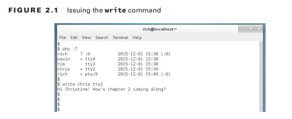

Observe en la Figura 2.1 que el comando `who -T` se usa primero. Este comando muestra el estado actual del acceso de escritura de cada usuario que ha iniciado sesión. Un signo más (+) entre el nombre de usuario y la identificación del terminal indica que se concede acceso de escritura, mientras que un signo menos (-) indica que no se ha concedido acceso de escritura. Un signo de interrogación (?) indica un usuario que ha iniciado sesión en la GUI. Para que un usuario de GUI reciba un mensaje de comando de escritura, se debe abrir un emulador de terminal GUI, designado por un tipo de terminal pts/#, y se debe otorgar acceso de escritura. La identificación del terminal pts/0 en la Figura 2.1 indica que el usuario rico tiene una aplicación de emulador de terminal ejecutándose en su GUI. Sin embargo, el terminal aún debe tener acceso de escritura otorgado (+) para poder recibir mensajes de comando de escritura, lo cual hace.

En la Figura 2.1, después de utilizar el comando `who -T`, se emplea el comando de escritura. Para utilizar el comando de escritura, se deben incluir dos opciones: el nombre de usuario del usuario, quién recibirá el mensaje y la identificación del terminal de ese usuario. En la Figura 2.1, el nombre de usuario del usuario es chris y la identificación del terminal es tty2. Una vez que se emite el comando de escritura, espera su mensaje a través de la entrada estándar. Sin embargo, no hay ningún mensaje que indique esto. Simplemente escriba su mensaje y presione Ctrl+D cuando haya terminado. El mensaje se envía automáticamente y se muestra en el terminal del usuario receptor, como se muestra en la Figura 2.2.

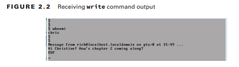

Puede utilizar la utilidad `/bin/wall` o `/usr/bin/wall` para transmitir un mensaje a todos los terminales con acceso de escritura otorgado. Por lo tanto, puede ser una utilidad útil para la comunicación estándar.

La sintaxis general del comando de muro es mensaje de muro.
La Figura 2.3 y la Figura 2.4 muestran el comando de pared en acción. Observe en la Figura 2.3 que el mensaje se escribe después de que se emite el comando de pared. El comando de pared es similar al comando de escritura en el sentido de que puede aceptar el mensaje mediante entrada estándar. En la Figura 2.3, se escribe el mensaje y se presiona Ctrl+D para enviarlo.

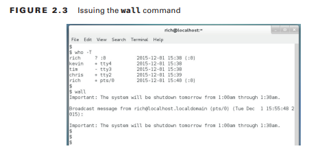

El mensaje del muro es disruptivo porque se mostrará en medio de lo que sea que el usuario esté haciendo actualmente en la terminal, como se muestra en la Figura 2.4. Sin embargo, el usuario que recibe el mensaje puede simplemente presionar Enter para recibir el mensaje $. figura 2.4 Salida de comando de pared receptora

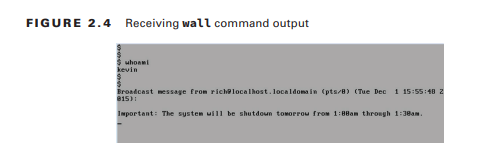

### Usando el comando notificar-enviar
El comando `wall` es útil, pero si un usuario no ha iniciado sesión en una terminal de consola o no tiene un emulador de terminal GUI abierto, no podrá enviar mensajes a ese usuario. La utilidad `/bin/notify-send` o `/usr/bin/notify-send` puede remediar esta situación y es una buena herramienta para usar junto con el comando `wall`.
Puede probar el comando `notify-send`r enviándose mensajes a sí mismo en la GUI.
La sintaxis general de notificación y envío se ve así:

```sh
notify-send "Title" "Message"
```

La Figura 2.5 muestra el comando `notify-send` en acción en una distribución CentOS. El comando se emite dentro de un emulador de terminal GUI. Observe que el mensaje se muestra en la parte inferior del escritorio. Diferentes entornos de escritorio Linux mostrarán estos mensajes de notificación en diferentes ubicaciones de visualización del escritorio.

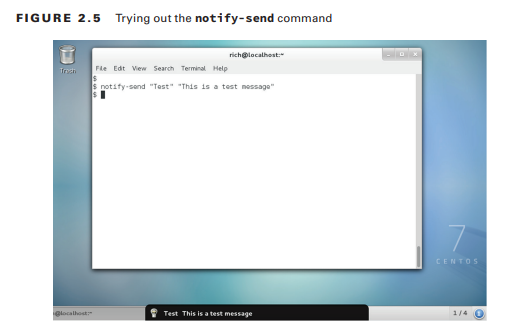

Para enviar mensajes de notificación y envío a usuarios de GUI además de usted, necesita privilegios de super usuario. Además, necesita ciertas variables de entorno, dependiendo de cómo implemente la utilidad de notificación y envío y qué distribución esté utilizando.
En la Figura 2.6, el envío de notificación lo emplea un usuario con privilegios de super usuario que ha iniciado sesión en una terminal de consola virtual de distribución de Ubuntu. Tenga en cuenta que se necesita la variable de entorno DISPLAY

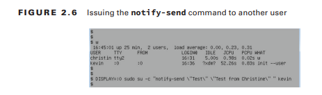

La variable de entorno DISPLAY en la Figura 2.6 se establece en el valor de la columna tty del comando w para el usuario kevin. Esto es necesario para que la utilidad `notify-send` sepa dónde enviar su salida. Observe que también se utiliza el comando `sudo`. Es necesario para que el comando `su -c` pueda usarse para emitir el comando `notify-send` cuando el usuario inicia sesión en la GUI; En este caso, ese es Kevin. Las barras invertidas (\) delante de las comillas (") que rodean tanto el título como el mensaje del comando `notify-send` también son necesarias. Porque el comando, enviado como una opción con `su -c`, debe estar entre comillas , las barras invertidas permiten que las opciones de notificación y envío tengan las comillas dobles necesarias (") y no interfieran con la operación del comando `su -c`. El último parámetro del comando largo de la Figura 2.6 es el nombre de usuario kevin. Esta es una opción para el comando `su -c`, de modo que el usuario kevin ejecutará el comando `notify-send`. Los resultados de todo este trabajo se muestran en la Figura 2.7.

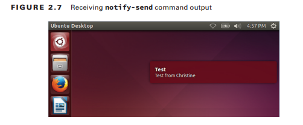

La Figura 2.7 muestra el mensaje de prueba enviado. En esta distribución de Ubuntu, el mensaje de notificación y envío recibido se muestra cerca del área superior izquierda del escritorio de Unity.
En otras distribuciones, como CentOS, al enviar mensajes a otros usuarios de GUI, se necesitan aún más variables de entorno. En la Figura 2.8, observe que antes de usar el comando `notify-send`, la variable de entorno `DBUS_SESSION_BUS_ADDRESS` debe configurarse en la configuración actual del usuario de la GUI para esa variable y luego exportarse. Esta variable de entorno suele ser necesaria cuando se crea un trabajo cron para automatizar dicha comunicación.

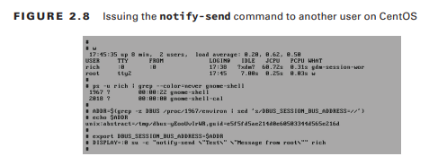

La Figura 2.8 utiliza los comandos grep y sed para extraer la configuración de la variable de entorno `DBUS_SESSION_BUS_ADDRESS` actual necesaria del archivo `/proc/proc_ID/environ`. `proc_ID` es el ID del proceso para el proceso gnome-Shell del usuario.
El comando `notify-send` tiene varias opciones adicionales que pueden resultar útiles. Desafortunadamente, en algunas distribuciones, las páginas de manual para esta utilidad en particular no existen o, en el mejor de los casos, son escasas. Si necesita más información, utilice su motor de búsqueda favorito para buscar documentación adicional de `notify-send`.
# Usando el comando `/sbin/shutdown`
El comando `/sbin/shutdown` le permite detener, reiniciar o apagar su sistema, así como comunicarse con los usuarios de su sistema mientras lo hace. Lo más probable es que ya esté familiarizado con este comando.

Como podría sospechar, el comando de apagado requiere privilegios de super usuario para su uso. La sintaxis general para el comando de apagado es tiempo de apagado [opciones] [mensaje en el muro]
Las [opciones] incluyen opciones para detener el sistema (-H), apagar el sistema (-P) y reiniciar el sistema (-r), así como varias otras selecciones útiles. Una vez que haya iniciado un proceso de apagado, normalmente puede cancelarlo usando el comando `shutdown -c`. Consulte las páginas de manual para conocer opciones de apagado adicionales que quizás desee utilizar.

El parámetro de tiempo le permite especificar una hora para implementar las opciones de apagado. Toma muchos formatos, como un diseño de hora militar especificado como hh:mm. Puede indicar el número de minutos desde la hora actual del sistema utilizando el formato +n o n. El comando de apagado permite que el parámetro de hora actual indique 0 minutos a partir de ahora (inmediatamente). En algunas distribuciones, si no se especifica el tiempo, se supone un +1. 

El parámetro [wall messaje] le permite modificar el mensaje de comando de apagado enviado a cualquier usuario que haya iniciado sesión. Este parámetro funciona de manera similar al comando wall, con una diferencia importante: ignora la configuración de mensajería en una terminal. Por lo tanto, el mensaje se puede escribir en cualquier terminal, ya sea que se le conceda acceso de escritura o no.
En la Figura 2.9 se muestra un ejemplo del uso del comando de apagado. Se incluyen los parámetros de hora y [wall messaje]. Este ejemplo en particular es de una distribución de Ubuntu.

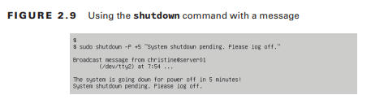

Observe en la Figura 2.9 que el parámetro [wall messaje] se muestra debajo del mensaje de comunicación de apagado del sistema: "¡El sistema se apagará en 5 minutos!" Las distintas distribuciones muestran diferentes mensajes de comunicación de apagado estándar, y su [wall messaje] puede aparecer encima o debajo del mensaje estándar. Incluso si no incluye un parámetro [wall messaje], el mensaje estándar del sistema aún se transmite a los usuarios de la terminal.

Para la distribución que se muestra en la Figura 2.9, el usuario que emite el comando de apagado no recibe un símbolo del sistema. Por lo tanto, en este caso, en lugar de ingresar el comando `shutdown -c` para cancelar el apagado, se necesita la combinación de teclas Ctrl+C para cancelar. Cuando se utiliza este método para cancelar un apagado, no se envían mensajes. Cuando se utiliza el comando `Shutdown -c`, se transmite un mensaje en el muro a los usuarios de la terminal. Aquí se muestra una versión recortada:

```sh
shutdown -c

Broadcast message from root@localhost.localdomain ...
The system shutdown has been canceled at Wed ...
```

Obviamente es importante saber cómo su distribución de Linux maneja el comando `/sbin/shutdown` antes de comenzar a usarlo en un sistema en vivo. Sería una buena práctica no sólo leer las páginas de manual de su distribución sino también probar el comando `shutdown` en un sistema de prueba.
Hay algunas [opciones] de apagado adicionales que pueden ser útiles en relación con el parámetro [wall messaje]. La opción -k deshabilitará los inicios de sesión y enviará mensajes de advertencia, pero no derribará el sistema. Aquí se muestra un ejemplo recortado de esto:

```sh
$ sudo shutdown -k +20 "Please log out..."
$
Broadcast message from christine@server01
	(/dev/tty2) at 8:43 ...

The system is going down for maintenance in 20 minutes!
Please log out...
$
```

Tenga en cuenta que cuando se utiliza la opción -k, el [wall messaje] de apagado no se ve diferente de un mensaje de apagado normal. Tenga en cuenta que esta opción no obliga a nadie a cerrar sesión.

Algunas distribuciones ofrecen la opción `--no-wall`. Permite que se realice un apagado sin mensajes en el muro para los usuarios del terminal. Sólo el super usuario que emita el comando recibirá un mensaje, similar al que se muestra aquí:

```sh
shutdown --no-wall +5

Shutdown scheduled for Wed 2016–12–02 09:02:48 EST, 
use 'shutdown -c' to cancel.
```

Tenga en cuenta que si decide cancelar el apagado después de usar la opción `--no-wall`, los usuarios del terminal seguirán recibiendo el mensaje de cancelación. Por lo tanto, si utilizó esta opción en el comando de apagado original y necesita cancelar el apagado, asegúrese de suprimir el mensaje de cancelación como este:

```sh
shutdown -c --no-wall
```

La mensajería fluida, como el uso del parámetro [wall messaje] del comando `/sbin/shutdown`, implica informar a los usuarios activos del sistema sobre los eventos que están sucediendo actualmente. También existen herramientas útiles que permiten automatizar la comunicación para futuros eventos.
# Mirando la mensajería estática
La mensajería estática implica comunicarse con los usuarios del sistema mediante archivos que se modifican sólo cuando es necesario cambiar el mensaje. Pueden contener información importante, como políticas de acceso al sistema de la empresa, o anuncios alegres, como cuándo está programado el próximo picnic de la empresa.
Los usuarios del sistema ven estos mensajes cuando inician sesión en el sistema. Por lo tanto, este formulario de mensajería estática se denomina específicamente mensajería de inicio de sesión. Estas técnicas están destinadas a ser utilizadas como métodos de comunicación principales para situaciones planificadas. Hay varios archivos de Linux que pueden ayudar a emplear este estilo de comunicación automatizada:

- `/etc/issue`
- `/etc/issue.net`
- `/etc/motd`

Cada archivo tiene un propósito ligeramente diferente y es posible que no esté disponible para todos los tipos de usuarios o en todas las distribuciones. Como ocurre con la mayoría de las opciones, es mejor explorarlas y luego decidir qué archivo de mensajes de inicio de sesión implementar en su(s) sistema(s).
# Usando el archivo `/etc/issue`
El archivo `/etc/issue` permite mostrar texto en las pantallas de inicio de sesión del terminal tty. Por lo general, contiene la política de acceso al sistema de una empresa y rara vez cambia. También puede contener próximas interrupciones planificadas del sistema. Cuando no se modifica, el archivo `/etc/issue` generalmente simplemente contiene información del sistema, como qué versión del kernel de Linux se está ejecutando. Aquí se muestra un ejemplo de este archivo sin modificar de una distribución de CentOS:

```sh
$ cat /etc/issue
\S
Kernel \r on an \m
$
```

Observe que se utilizan algunos caracteres especiales en el archivo. Puede utilizar los arreglos @character y \character siempre que sean compatibles con el programa getty de su distribución (el programa responsable de administrar terminales tty).
Con privilegios de super usuario, puede modificar el archivo, por ejemplo, si los usuarios del sistema necesitan ser informados de una próxima interrupción:

```sh
cat /etc/issue
\S
Kernel \r on an \m

########################################################

                       NOTICE

        System will be down for maintenance

        When:  December 26 1:00am through 1:30am 
        
########################################################
```

El archivo `/etc/issue` modificado hace que la pantalla de inicio de sesión de tty se vea como la que se muestra en la Figura 2.10. Observe cómo ahora se formatean los caracteres especiales en la pantalla.

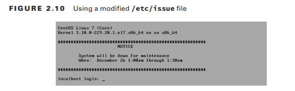

El archivo `/etc/issue` no contendrá comentarios útiles para que los lea detenidamente, porque todo su contenido se muestra en la pantalla de inicio de sesión. Normalmente puedes escribir `man issues` para obtener ayuda sobre cómo modificar este archivo.
# Usando el archivo `/etc/issue.net`
El archivo `/etc/issue.net` es muy similar al archivo `/etc/issue`. Su objetivo principal es mostrar mensajes de inicio de sesión para inicios de sesión remotos. De forma predeterminada, normalmente está habilitado sólo para conexiones Telnet. A continuación se muestra un ejemplo de un archivo `/etc/issue.net` predeterminado en una distribución de Ubuntu:

```sh
cat /etc/issue.net
Ubuntu 14.04.3 LTS
```

No existe nada demasiado interesante en este archivo. Simplemente contiene la versión actual de la distribución.

Para permitir que OpenSSH utilice el archivo `/etc/issue.net`, debe realizar un pequeño cambio en el archivo de configuración. Edite el archivo `/etc/ssh/sshd_config` en su sistema. (Este archivo de configuración no existirá si no tiene OpenSSH instalado en su sistema). Debería encontrar una línea similar a la siguiente:

```sh
Banner  /etc/issue.net
```

Elimine la marca de almohadilla (#) de la línea. Si aparece la palabra `none`, en lugar del archivo` .net` del problema, cámbielo a `/etc/issue.net`. Deberá reiniciar su servidor OpenSSH para que el cambio surta efecto.
El siguiente es un archivo `/etc/issue.net` modificado:

```sh
cat /etc/issue.net

********************************

         WARNING

Authorized access only

Violators will be prosecuted 

********************************
```

Cuando OpenSSH se ha configurado para usar el archivo `/etc/issue.net` modificado, cualquier inicio de sesión ssh debería verse similar a la Figura 2.11.

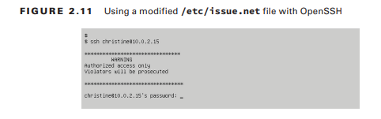

### Usando el archivo `/etc/motd`
El archivo `/etc/motd` (archivo Mensaje del día) proporciona un método de comunicación de inicio de sesión adicional solo para usuarios de terminales tty. El contenido del archivo `/etc/motd` se muestra después de que el usuario haya iniciado sesión en el sistema pero antes de que aparezca una línea de comandos.

Tradicionalmente, el archivo contenía mensajes más alegres, como próximos eventos de la empresa o dichos. Ahora normalmente contiene información sobre próximos eventos del sistema, a menudo porque los archivos `/etc/issue` y `/etc/issue.net` son necesarios para mostrar mensajes de inicio de sesión legales.
En algunas distribuciones, el archivo ya existe pero está vacío. En otros, no se instala de forma predeterminada, pero se crea fácilmente. Como era de esperar, debe tener privilegios de super usuario para crearlo o modificarlo. Aquí hay un archivo `/etc/motd` modificado ubicado en una distribución CentOS:

```sh
cat /etc/motd 
Hello, I'm a modified MOTD file.
```

La Figura 2.12 muestra cómo se muestra el archivo después de que un usuario haya iniciado sesión en el sistema. Observe que el contenido del archivo `/etc/motd` se muestra después de que el usuario haya iniciado sesión pero antes de que se reciba un mensaje de shell.

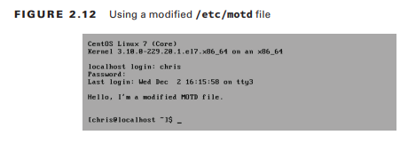

En algunas distribuciones, hay más archivos involucrados además de `/etc/motd`. Por ejemplo, en Ubuntu, se muestra un archivo llamado `/run/motd.dynamic` al iniciar sesión. Lo crea automáticamente `/etc/init.d/motd` y contiene elementos como las actualizaciones de paquetes de software que se necesitan actualmente.

La mensajería estática mediante mensajes de inicio de sesión es solo una de las muchas formas en que puede comunicarse con los usuarios del sistema. Los métodos fluidos de mensajería también proporcionan muchas herramientas de comunicación útiles. Hay muchas formas de mantener informados a los usuarios del sistema Linux como parte del proceso básico de mantenimiento del sistema.
### Copia de seguridad del sistema
Una de las tareas de mantenimiento del sistema más importantes que realiza es proteger los datos del sistema mediante un proceso de copia de seguridad. Con demasiada frecuencia, las empresas y organizaciones abordan esta tarea con poca reflexión y planificación, lo que puede conducir a un desastre financiero. Además, tener copias de seguridad es inútil si no existen planes para recuperar los datos.
### Desarrollar una estrategia de respaldo
Desarrollar un plan de respaldo bien pensado es clave para proteger los datos de la empresa. Considere iniciar el proceso de planificación de la copia de seguridad de datos con esta pregunta a los líderes de la empresa: "¿Qué tan valiosos son sus datos?"

Determinar el valor de los datos es sólo el primer paso, pero ayuda a guiar su estrategia de respaldo. Tenga en cuenta que no existe una única solución de respaldo. Su plan dependerá completamente de las necesidades individuales de protección de datos de su empresa.
Al desarrollar un plan de respaldo de datos, debe considerar varios elementos importantes. Estos elementos le permitirán determinar un presupuesto y tomar decisiones sobre qué métodos incluir en su plan de respaldo. Normalmente, estos elementos importantes incluyen lo siguiente:
- Categorías de datos
- Valor de cada categoría de datos
- Tiempo máximo aceptable de inaccesibilidad a los datos

Las categorías de datos implican catalogar sus datos en grupos para determinar el valor. Por ejemplo, tendrá una categoría de datos del sistema que cubre los datos necesarios para el funcionamiento del sistema. También puede tener categorías de datos como información de pago del cliente.
Una vez que se han categorizado los datos y se ha determinado un valor, es necesario decidir la cantidad de tiempo máxima aceptable durante la cual los datos pueden permanecer inaccesibles. Normalmente, se utilizan mediciones como el objetivo de tiempo de recuperación (RTO). RTO establece el período de tiempo máximo tolerable durante el cual los datos (o una computadora) pueden permanecer inalcanzables.

Cuando se hayan determinado los elementos clave anteriores, se podrán llevar a cabo investigaciones y decisiones sobre los siguientes temas de respaldo y recuperación:
- Medios de copia de seguridad
- Soluciones de rotación y almacenamiento de copias de seguridad
- Tipos de copia de seguridad
- Recuperación de datos
- Directorios para realizar copias de seguridad
- Soluciones de software (de red y locales)

Cuando esté desarrollando este plan, ninguno de estos temas podrá verse de forma aislada. Por ejemplo, los medios de respaldo que seleccione afectarán sus decisiones sobre software y soluciones de almacenamiento. Y, por supuesto, el mejor plan de respaldo es aquel que se revisa y prueba.
### Mirando los medios de respaldo
Hay muchos factores a considerar cuando busca los medios disponibles para su estrategia de respaldo, como la portabilidad, la longevidad y el costo. En esta sección, exploraremos diferentes medios, centrándonos en estos factores importantes:

***Cinta magnética*** Uno de los medios más antiguos utilizados para realizar copias de seguridad, la cinta magnética, todavía existe y se utiliza. Es conocido por su confiabilidad y longevidad. Sin embargo, para lograr su longevidad óptima, las cintas deben almacenarse en un lugar con controles regulados de temperatura y humedad. Esto es especialmente importante si los utiliza con fines de archivo de datos. La cinta magnética es barata y cuesta en promedio alrededor de 1 céntimo por gigabyte. Aunque es económico, las empresas de tecnología todavía están trabajando para mejorarlo. En 2014, una empresa desarrolló una única cinta magnética capaz de contener al menos 2,5 terabytes.

Aunque la cinta magnética tiene varios beneficios, también tiene desventajas que impiden que muchos la utilicen en sus esquemas de respaldo. Por ejemplo, solo se puede acceder a los datos almacenados en cinta de forma secuencial, lo que hace que la restauración de los datos tarde mucho más que los datos almacenados en medios a los que se puede acceder aleatoriamente. Además, la cinta no es multiusuario; es decir, sólo un proceso a la vez puede acceder a él.

En general, la cinta magnética no es el medio más popular para realizar copias de seguridad periódicas de datos, pero tiene su nicho. Es extremadamente útil para fines de archivo de datos debido a su bajo costo. De hecho, muchos estudios cinematográficos utilizan cintas magnéticas para almacenar los distintos formatos de películas individuales necesarios.

***Discos ópticos*** Los discos ópticos incluyen CD, DVD y discos Blu-ray, y se hicieron populares como medios de respaldo debido a su bajo costo. Además, su pequeño tamaño y portabilidad los hacen fáciles de transportar a ubicaciones de almacenamiento de respaldo externas y/o almacenar fácilmente dentro de una bóveda en el sitio de la empresa.

Para algunas organizaciones, los medios ópticos no funcionan como medios de respaldo debido a su tamaño relativamente pequeño. Para un CD, está limitado a 700 MB de datos. Los DVD suelen estar limitados a 4,7 GB. La capacidad de un disco Blu-ray suele oscilar entre 25 y 50 GB, aunque las empresas de tecnología están trabajando para aumentar las capacidades de almacenamiento de datos de Blu-ray. Otra posible limitación para el uso en copias de seguridad es que los discos ópticos pueden ser más lentos para escribir y leer que otros medios de copia de seguridad, como una unidad de disco duro local (HDD).

***HDD*** Los discos duros también son un medio de copia de seguridad antiguo y probado. Puedes utilizarlos para realizar copias de seguridad, ya sea que su tecnología sea IDE, SCSI, SATA, etc. Sólo necesita asegurarse de que estén particionados y de que se les haya colocado un sistema de archivos. En vista de su capacidad de datos, los discos duros son un medio de copia de seguridad económico y es más rápido escribir y leer que otros medios, como los discos ópticos.

El mayor problema surge si utiliza un disco duro local, en lugar de uno remoto, como medio de copia de seguridad. Dado que está conectado a su sistema Linux, cualquier desastre que le ocurra al sistema generalmente también le ocurre al disco duro de respaldo. Sin embargo, pueden ser muy convenientes para esquemas de respaldo más pequeños, como un entorno de producción, que necesita respaldos cada hora que luego se respaldan en una ubicación externa y pueden sobrevivir perdiendo un día de trabajo.

***SSD*** Las unidades de estado sólido (SSD) se pueden conectar de forma local o remota, o pueden ser extraíbles. A menudo popular para su uso como disco para un sistema operativo, su mayor ventaja para las copias de seguridad es su velocidad de escritura y lectura. Aunque no son tan portátiles como los medios ópticos, son relativamente fáciles de transportar y almacenar.

El uso de SSD puede resultar prohibitivo en un plan de respaldo debido a su costo. Actualmente son más caros que los medios ópticos o los discos duros. Además, la durabilidad del almacenamiento de datos no está probada. Se cree que si un SSD no se utiliza y se deja sin energía durante un largo período de tiempo, podría perder parte de sus datos.

No es sólo el tipo de medio el factor que influye, sino también la ubicación del medio durante y después de una copia de seguridad. Si realiza sus copias de seguridad localmente, es posible que necesite transportar los medios de copia de seguridad a otra ubicación para fines de recuperación ante desastres. 
### Explorando soluciones de rotación y almacenamiento de respaldo
Ya sea que elija una solución de respaldo local o remota, puede que sea necesario idear una solución de rotación y almacenamiento de medios. Cualquier medio extraíble, local o remoto, deberá almacenarse en una ubicación que proteja sus datos. Por ejemplo, si elige discos ópticos como medio de respaldo y almacena los discos en el mismo edificio que los datos originales, un incendio local puede destruir tanto sus datos originales como sus copias de seguridad.

Dependiendo del medio de copia de seguridad o archivo que haya elegido, los elementos a considerar para el almacenamiento de medios pueden incluir los siguientes:
- Control de temperatura
- Control de humedad
- Resistencia al fuego
- Seguridad

Los controles de temperatura y humedad son especialmente importantes para los archivos de datos en cinta. La seguridad también es importante para cualquier tipo de medio. Independientemente de cómo estén protegidos sus datos en el sistema, deberían tener una seguridad igual o mayor en sus medios de respaldo. Considere también quién tiene acceso a la ubicación de almacenamiento de medios.
Las copias de seguridad creadas localmente no sólo deben tener una solución de almacenamiento de medios, sino que también es importante un cronograma de rotación. Si los medios se almacenan fuera del sitio, debe determinar con qué frecuencia y cuándo se devolverán los medios de respaldo localmente para su reutilización.

La conveniencia de la restauración de datos también puede ser un problema para los medios almacenados fuera del sitio. A menudo, las empresas abordan este problema creando múltiples copias de seguridad de los datos. Por lo tanto, algunos medios se pueden almacenar fuera del sitio en caso de un gran desastre, mientras que otros medios se pueden almacenar cuidadosamente en el sitio para restaurar los datos rápidamente cuando sea necesario.
Si rota los medios de respaldo dentro y fuera del sitio, no olvide los problemas de seguridad del transporte. Determine cómo se deben proteger los medios mientras están en tránsito hacia la instalación de almacenamiento. Algunas empresas emplean el uso de un camión blindado porque sus datos son esencialmente dinero.

Si elige una solución de copia de seguridad remota, sus problemas de almacenamiento se reducen considerablemente y la rotación normalmente deja de ser un problema. Una red de área de almacenamiento (SAN) o un almacenamiento conectado a la red (NAS) pueden ser una solución útil para realizar copias de seguridad de datos de forma remota. Puede utilizarlos como soluciones de respaldo locales, pero para nuestros propósitos aquí, se tratan como soluciones remotas.

Una SAN proporciona almacenamiento a nivel de bloque y un NAS proporciona almacenamiento a nivel de archivos. La principal diferencia entre estos dos, para fines de respaldo, es que un NAS debe estar en la red de área local (LAN), mientras que un SAN puede estar físicamente a kilómetros de distancia conectado a través de una rápida solución de red Fibre Channel. Es fácil ver de inmediato que el almacenamiento SAN tiene ventajas de respaldo sobre NAS, pero el costo puede ser un factor. Además, el cifrado de datos a medida que viajan a través de la red debe ser parte de su plan.
Nuevamente, el valor de los datos determina la cantidad de dinero que desea gastar para realizar copias de seguridad, rotar y almacenar sus datos. 
### Mirando los tipos de copia de seguridad
Para nuestros propósitos aquí, los tipos de copia de seguridad se refieren a los diferentes métodos para realizar copias de seguridad de los datos que se han modificado. Los cuatro tipos más comunes son estos:
- Completo
- incrementales
- Diferencial
- Instantánea

Cada uno de estos tipos de copias de seguridad se explora en esta sección. Se incluyen sus ventajas y desventajas:
***Copia de seguridad completa*** Una copia de seguridad completa es una copia de todos los datos, ignorando su fecha de modificación, en otro conjunto de medios. La principal ventaja de este tipo de copia de seguridad es que lleva mucho menos tiempo que otros tipos restaurar los datos de un sistema. Sin embargo, no sólo lleva más tiempo crear una copia de seguridad completa en comparación con los otros tipos, sino que también requiere más almacenamiento. No requiere ningún otro tipo de copia de seguridad para restaurar un sistema por completo.

***Copia de seguridad incremental*** Una copia de seguridad incremental realiza una copia únicamente de los datos que se han modificado desde la última operación de copia de seguridad (cualquier tipo de operación de copia de seguridad). Normalmente, la marca de tiempo modificada de un archivo se compara con la marca de tiempo del último tipo de copia de seguridad. Este tipo de copia de seguridad requiere mucho menos tiempo para crearse que los otros tipos y requiere mucho menos espacio de almacenamiento. Sin embargo, el tiempo de restauración de datos para este tipo de copia de seguridad puede ser significativo, porque primero debe restaurar la copia de seguridad completa y luego restaurar cada copia de seguridad incremental. Para fines de optimización, debe realizar una copia de seguridad completa periódicamente.

***Copia de seguridad diferencial*** Una copia de seguridad diferencial realiza una copia de todos los datos que han cambiado desde la última copia de seguridad completa. Podría considerarse el punto medio entre las copias de seguridad completas y las incrementales. Este tipo de copia de seguridad lleva menos tiempo que una copia de seguridad completa, pero potencialmente más tiempo que una copia de seguridad incremental. Requiere menos espacio de almacenamiento que una copia de seguridad completa, pero más espacio que una copia de seguridad incremental simple. Además, la restauración lleva mucho menos tiempo utilizando copias de seguridad diferenciales que con copias de seguridad incrementales, porque sólo se necesitan la copia de seguridad completa y la última copia de seguridad diferencial. Para fines de optimización, debe realizar una copia de seguridad completa periódicamente.

***Copia de seguridad instantánea*** Una copia de seguridad instantánea se considera un enfoque híbrido y es un tipo de copia de seguridad ligeramente diferente. Primero, el software de respaldo hace una copia completa de los datos en un medio de respaldo, como una SAN, y luego el software utiliza punteros, como enlaces físicos, para crear una tabla de referencia que vincula los datos de respaldo con los datos originales. La próxima vez que realice una copia de seguridad, en lugar de una copia de seguridad completa, el software de copia de seguridad realiza una copia de seguridad incremental (solo los archivos nuevos o modificados se copian en el medio de copia de seguridad) y el software copia y actualiza la tabla de referencia de punteros. Esto ahorra espacio, porque sólo es necesario almacenar los archivos modificados y la tabla de referencia de puntero actualizada para cada copia de seguridad adicional.

Con una copia de seguridad instantánea, tendrá la capacidad de volver a cualquier momento y realizar una restauración completa del sistema desde ese punto. También utiliza mucho menos espacio que otros tipos de copias de seguridad. En esencia, las instantáneas simulan múltiples copias de seguridad completas por día sin ocupar el mismo espacio ni requerir la misma potencia de procesamiento que un tipo de copia de seguridad completa. La utilidad `rsync` utiliza este método.
### Mirando la recuperación de datos
Llega el momento en que es necesario restaurar los datos. A nadie realmente le gusta pensar en ello, pero sucede. Los archivos se eliminan accidentalmente, las unidades de disco fallan y ocurren grandes desastres. Al igual que la muerte y los impuestos, la recuperación de datos es inevitable.
La restauración de datos debe ser una parte integral de su plan de respaldo. Los detalles específicos dependen en gran medida de las otras opciones de planes que elija. Sin embargo, es necesario planificar cada uno de los siguientes escenarios de restauración de datos:

***Recuperación de archivos de datos únicos o múltiples*** Este es el escenario de recuperación de datos más común que ocurre en un sistema. Los usuarios eliminan accidentalmente sus archivos. Otros usuarios arruinan los datos de sus archivos. Es conveniente si puede proporcionar una solución que permita a los usuarios recuperar estos archivos ellos mismos y brindarles educación previa sobre cómo evitar este tipo de escenarios.

***Partición completa o recuperación de disco*** Con suerte, tiene las estructuras adecuadas, como discos RAID, para evitar este tipo de problemas, pero aún así pueden ocurrir. Sus mediciones de RTO jugarán un factor importante en el plan de recuperación para este escenario.

***Recuperación del sistema*** Esta suele ser la peor situación. Se debe restaurar todo el sistema y todos sus datos. Hay dos tipos de esta restauración: puede realizar una restauración completa del sistema, que implica iniciar el sistema operativo desde una distribución activa y luego restaurar todos los archivos necesarios para que el sistema operativo Linux funcione (todos los archivos de configuración del sistema y todos los datos). Otro tipo es la restauración de configuración/datos. Esto implica primero reinstalar Linux y luego restaurar los archivos de configuración del sistema y todos los archivos de datos.

La planificación de cada escenario de restauración de datos hará que el evento de restauración real sea mucho más sencillo. Además de planificar la recuperación de datos, asegúrese de evaluar y probar sus planes periódicamente para asegurarse de que satisfagan las necesidades actuales de su empresa.
### Explorando directorios para realizar copias de seguridad
Cuando categoriza sus datos, un elemento a considerar es dónde residen esos datos en su estructura de directorios de Linux. Esto le ayudará a determinar qué directorios incluir en las distintas copias de seguridad. Además, los directorios de los que elija realizar una copia de seguridad dependen de sus esquemas de recuperación planificados.

La Tabla 2.1 contiene directorios importantes que debe considerar incluir en su esquema de respaldo. Sus opciones variarán según sus necesidades de restauración y la configuración de su sistema. La columna Consideración de la copia de seguridad hace sugerencias basadas en las dos opciones de recuperación del sistema.


| Directory     | contents                                                                                                                     | Backup Consideration                                                                                                                                |
| ------------- | ---------------------------------------------------------------------------------------------------------------------------- | --------------------------------------------------------------------------------------------------------------------------------------------------- |
| `/bin`        | User utility programs.<br>Some distributions store many of these programs in `/usr/bin`                                      | Full system restore: yes<br>Configuration/data restore: no                                                                                          |
| `/boot`       | Holds configuration files used during the system boot process.                                                               | Full system restore: only for documentation purposes (for example, comparing boot files to restored boot files)<br>Configuration/data restore: no\| |
| `/dev`        | Contains device files for the hardware devices system.                                                                       | Full system restore: only if distro is configured to use static /dev files.<br>Configuration/data restore: no\|                                     |
| `/etc`        | System configuration files.                                                                                                  | Yes                                                                                                                                                 |
| `/home`       | Typically, the user’s home directory. However, depending on your system’s configuration, others may exist (example: /home2). | Yes                                                                                                                                                 |
| `/lib`        | Stores kernel modules and shared libraries.                                                                                  | Full system restore: yes<br>Configuration/data restore: no                                                                                          |
| `/lost+found` | Files saved during unplanned system shutdowns                                                                                | No                                                                                                                                                  |
| `/media`      | Temporary mount directory for removable media devices.                                                                       | No                                                                                                                                                  |
| `/mnt`        | Temporary mount directory for removable media devices                                                                        | No                                                                                                                                                  |
| `/opt`        | Third-party application software.                                                                                            | Yes                                                                                                                                                 |
| `/proc`       | Virtual filesystem for running processes and kernel information.                                                             | No                                                                                                                                                  |
| `/root`       | The root user’s home directory.                                                                                              | Yes                                                                                                                                                 |
| `/run`        | A tmpfs filesystem mounted early during the boot process and used by various tools.                                          | No                                                                                                                                                  |
| `/sbin`       | System administrator utility programs.                                                                                       | Full system restore: yes<br>Configuration/data restore: no                                                                                          |
| `/srv`        | System-specific files for various services.                                                                                  | Yes                                                                                                                                                 |
| `sys`         | Virtual filesystem stores information concerning and allows modification of connected hardware devices.                      | No                                                                                                                                                  |
| `/tmp`        | Temporary files.                                                                                                             | No                                                                                                                                                  |
| `/usr`        | Stores binaries, documentation, source code, libraries, and so on.                                                           | Yes                                                                                                                                                 |
| `/var`        | Contains log, lock, spool, mail, and temp files.                                                                             | Yes<br>(Some subdirectories, such as /var/run, can be excluded.)                                                                                    |

Es posible que algunos de estos directorios no aparezcan en distribuciones de Linux más antiguas. Además, tenga en cuenta que algunas distribuciones se están alejando del Estándar de jerarquía de archivos (FHS), o no lo siguen por completo. Por lo tanto, asegúrese de comprender todos los directorios que utiliza su distribución particular y lo que se almacena en ellos antes de crear un plan de respaldo.
### Revisión de soluciones de software de respaldo
Es mejor revisar las diversas soluciones de software que se utilizarán en su plan de respaldo al final. Una vez que haya recopilado y revisado sus requisitos de copia de seguridad y restauración, tendrá una idea más clara de qué software satisfará sus necesidades.

Puede agrupar las soluciones de software de respaldo en dos categorías principales: GUI y/o soluciones basadas en web y soluciones de línea de comandos. Ambas categorías ofrecen copias de seguridad locales y de red. El primer grupo a explorar es la GUI y/o las soluciones basadas en web.

***Amanda*** Amanda (también llamada Amanda Network Backup) es una solución de copia de seguridad de software de código abierto que se ejecuta en una máquina host Linux. En esencia se encuentran las utilidades de línea de comandos, como `dump` y `tar`. Proporciona la capacidad de realizar copias de seguridad de datos desde plataformas de múltiples sistemas operativos en una variedad de medios que incluyen discos y cintas, así como en la nube. Amanda ofrece varias ediciones, incluida una Community Edition descargable gratuita y una Enterprise Edition, que incluye una agradable interfaz GUI llamada Zmanda Management Console.

***Bacula*** Bacula también es una solución de respaldo de software de código abierto que se lanza bajo la Licencia AGPL v3. Tiene cinco componentes principales (servicios Director, Consola, Archivo, Almacenamiento y Monitor), que permiten flexibilidad en la forma de administrar sus copias de seguridad de red, incluidas interfaces web, GUI y basadas en texto. Proporciona la capacidad de realizar copias de seguridad de datos desde plataformas de múltiples sistemas operativos en una variedad de medios que incluyen discos y cintas, así como en la nube. Sin embargo, el proyecto Bacula no recomienda utilizar su producto si no tiene experiencia en el uso de opciones de línea de comandos, como `tar` y `dump`, debido a su dificultad de configuración. Sin embargo, hay muchos tutoriales en la Web. Además, está disponible una versión empresarial (de código cerrado) llamada Bacula Systems, que ofrece todos los distintos tipos de respaldo y soporte. 

***Bareos*** Bareos es una bifurcación del software de respaldo Bacula. Es de código abierto y también se publica bajo la licencia AGPL v3. La solución de respaldo de Bareos es casi un clon de Bacula. Tiene los mismos componentes principales, así como las distintas interfaces. Bareos tiene algunas características adicionales, incluida la capacidad de instalar el componente Director en un sistema Windows. Además, los desarrolladores de Bareos han creado su solución de respaldo para proteger sus datos de respaldo siguiendo reglas especificadas por el usuario. Esta característica puede dificultar la reutilización de cintas de respaldo con Bareos y, por lo tanto, los desarrolladores del proyecto recomiendan usar otra solución para esta situación particular. 

***Duplicity*** Otra solución de respaldo popular es Duplicity. Se puede utilizar desde la línea de comandos o mediante una interfaz gráfica de usuario llamada deja-dup. Por lo general, viene preinstalado en Ubuntu y es el núcleo detrás del ícono de Unity Backups. Está dirigido principalmente a clientes Linux/Unix, pero con un poco de trabajo puedes conseguir que se ejecute en una máquina con Windows. Proporciona la capacidad de realizar copias de seguridad de datos en una variedad de medios, así como en la nube. Le permite cifrar sus copias de seguridad utilizando GNU Privacy Guard (GPG). 

***BackupPC*** BackupPC es otra solución de copia de seguridad de software de código abierto, que se publica bajo GNU GPL. Puede realizar copias de seguridad de máquinas Linux, Unix, Mac OS X y Windows, y admite medios de copia de seguridad en disco. BackupPC tiene una interfaz basada en web y utiliza `rsync` y tar en su núcleo. 

Es posible que no necesite algo tan completo como la GUI y/o las soluciones de software basadas en web que se ofrecen. Afortunadamente, las soluciones de línea de comandos enumeradas aquí siguen siendo alternativas viables:
- cpio
- dd
- dump/restore
- `rsync`
- star (tar with SELinux)
- tar

Tenga en cuenta que algunas utilidades utilizadas para realizar copias de seguridad de datos también se pueden utilizar para otros fines. Por ejemplo, tar se puede utilizar para copias de seguridad o para distribuir código fuente. 

Una vez que haya desarrollado y revisado su estrategia de respaldo, asegúrese de probarla. Además, implemente una revisión periódica del plan de respaldo para asegurarse de que satisfaga las necesidades de protección de datos de su empresa.
### Realizar copias de seguridad
Si ha planificado adecuadamente, la copia de seguridad de sus datos se realizará de forma regular y potencialmente automatizada. Pero ocasionalmente necesitarás realizar copias de seguridad de datos no programadas. Por ejemplo, su organización puede tener un proyecto especial cuya protección de datos debe quedar fuera del plan de respaldo normal de la empresa. Ya sea que la copia de seguridad esté planificada o no, hay varias utilidades de línea de comandos disponibles para usar en las copias de seguridad de datos.
### Usando tar para realizar copias de seguridad
La utilidad tar existe desde hace bastante tiempo. Su nombre es un acrónimo de “archivador de cintas”, lo que demuestra su antigüedad. Aunque es antigua, sigue siendo una herramienta muy popular y, a menudo, se utiliza como núcleo de varias soluciones de copia de seguridad de software debido a su flexibilidad y estabilidad.

Con el comando `tar`, comienza con varios archivos de los que es necesario realizar una copia de seguridad. Termina con una copia de esos archivos, almacenada en un solo archivo, llamado archivo de almacenamiento. Si el archivo comprimido se comprime utilizando una utilidad de compresión de datos, el archivo comprimido se llama tarball.

Puede resultar un poco confuso que los archivos de copia de seguridad de datos resultantes de la utilidad tar se llamen archivos de almacenamiento. Sin embargo, aparte de ese pequeño problema, la utilidad es bastante sencilla de utilizar.
Los archivos resultantes de la utilidad tar se pueden almacenar en cualquier tipo de medio de sistema de archivos, no solo en cintas. También puede mover estos archivos a cualquier lugar que elija, como a la nube, pero primero se recomienda cifrarlos.
Una de las razones de la popularidad del comando `tar` son sus sencillas opciones de línea de comandos. Por ejemplo, para crear un archivo tar, se utiliza la opción `-c` (c como en crear) en lugar de algo no inherente como `-F`.

La Tabla 2.2 enumera varias, pero ciertamente no todas, las opciones del comando tar que puede utilizar para crear una copia de seguridad de datos. Para obtener una lista más amplia de varias opciones de tar, asegúrese de consultar sus páginas de manual. Además, puedes encontrar mucho más escribiendo info tar en la línea de comando.

| Long style Option                   | Short Style Option | Option Description                                                                                                                                         |
| ----------------------------------- | ------------------ | ---------------------------------------------------------------------------------------------------------------------------------------------------------- |
| `--create`                          | `-c`               | Create a tar archive file (full or incremental, depending on other given options).                                                                         |
| `--update`                          | `-u`               | Append files to a pre-created tar archive file but only those files modified since the original archive file was created (cannot be used with tape media). |
| `--listed-incremental=file -g file` |                    | Create an incremental or full archive based on metadata stored in file.                                                                                    |
| `--level=#`                         |                    | Force a level # archive.                                                                                                                                   |
| `--gzip`                            | `-z`               | Compress tar archive file into a tarball using gzip compression.                                                                                           |
| `--bzip2`                           | `-j`               | Compress tar archive file into a tarball using bzip2 compression.                                                                                          |
| `--xz`                              | `-J`               | Compress tar archive file into a tarball using xz compression.                                                                                             |

Lo más probable es que ya hayas creado archivos tar usando el comando `tar`. Sin embargo, tal vez convenga hacer un pequeño repaso. Aquí hay un ejemplo:

```sh
ls Project42.dat   ProjectFileA.dat   ProjectFileB.dat

tar -Jcvf Project42.tar.xz *.dat
Project42.dat
ProjectFileA.dat
ProjectFileB.dat
```

En el comando `tar` anterior, se utilizan cuatro opciones. La opción `-J` se usa para crear un tarball usando compresión `xz`. La opción `c` se utiliza para crear el archivo tar. La opción `v` permite que los nombres de los archivos se muestren como salida estándar a medida que se colocan en el archivo tar. Finalmente, la opción `f` designa el nombre del archivo tar, `Project42.tar.xz`. El parámetro `*.dat` solicita que todos los archivos con una extensión de archivo `.dat` en el directorio de trabajo actual se incluyan en este archivo.

Puede utilizar una variación de este comando para crear copias de seguridad completas e incrementales. Un ejemplo sencillo ayuda a explicar este concepto. Este es el proceso para crear una copia de seguridad completa:

```sh
ls *.dat Project42.dat   ProjectFileA.dat   ProjectFileB.dat

tar -g Archive1.snar -Jcvf Project42_Full.tar.xz *.dat
Project42.dat
ProjectFileA.dat
ProjectFileB.dat
```

Observe la opción `-g` en el ejemplo de copia de seguridad completa anterior. La opción `-g` crea un archivo, llamado archivo de instantánea, llamado `Archive1.snar`. Este archivo de instantánea puede tener cualquier nombre que desee y puede ubicarse en cualquier lugar dentro del sistema de archivos. La extensión de archivo `.snar` indica que es un archivo de instantánea de archivo tar. Un archivo de instantáneas de archivo tar contiene metadatos utilizados en asociación con comandos `tar` para crear copias de seguridad completas e incrementales. El archivo de instantánea utiliza marcas de tiempo de archivo, por lo que el comando `tar` puede determinar si un archivo ha sido modificado desde la última vez que se realizó una copia de seguridad. El archivo de instantánea también se utiliza para determinar si hay archivos nuevos o si se han eliminado desde la última copia de seguridad.

El ejemplo anterior creó una copia de seguridad completa de los archivos designados junto con el archivo de instantánea de metadatos, `Archive1.snar`. Ahora se utilizará el mismo archivo de instantánea para ayudar a determinar si algún archivo se ha modificado, es nuevo o se ha eliminado para crear una copia de seguridad incremental:

```sh
echo "Answer to everything" >> ProjectFileC.dat

tar -g Archive1.snar -Jcvf Project42_Incremental.tar.xz *.dat 
ProjectFileC.dat
```

En el ejemplo, se crea un archivo nuevo, `ProjectFileC.dat`. Nuevamente, el comando `tar` usa la opción `-g` que apunta al archivo de instantánea `Archive1.snar` creado anteriormente.

Esta vez, los metadatos dentro de `Archive1.snar` le permiten al comando `tar` saber que el archivo `ProjectFileC.dat` es un archivo nuevo y que no se incluyó en una copia de seguridad anterior. Por lo tanto, el nuevo tarball contiene sólo el archivo `ProjectFileC.dat` y es efectivamente una copia de seguridad incremental.

Puede continuar creando copias de seguridad incrementales adicionales utilizando el mismo archivo de instantánea:

```sh
echo "42 is the answer to everything" >> ProjectFileD.dat

tar -g Archive1.snar -Jcvf Project42_Incremental_2.tar.xz *.dat
ProjectFileD.dat
```

El uso de estas diversas opciones de tar le permite crear una gran variedad de copias de seguridad para proyectos pequeños o sistemas completos. Sin embargo, siempre que cree copias de seguridad de datos, es una buena práctica verificarlas. La Tabla 2.3 proporciona algunas opciones del comando `tar` para ver y verificar copias de seguridad de datos.

| Long Style Option | Short Style Option | Option Description                                                                                |
| ----------------- | ------------------ | ------------------------------------------------------------------------------------------------- |
| `--compare`       | `-d`               | Compare a tar archive file’s members with external files and list the differences.                |
| `--diff`          | `-d`               |                                                                                                   |
| `--list`          | `-t`               | Display a tar archive file’s contents.                                                            |
| `--verbose`       | `-v`               | Display the files as they are processed (typically used when creating or restoring data backups). |
| `--verify`        | `-W`               | Verify the tar archive as it is being processed (cannot be used with compression).                |
 
La verificación de la copia de seguridad puede adoptar varias formas diferentes. Puede asegurarse de que los archivos deseados estén incluidos en su copia de seguridad usando la opción `-v` en el comando `tar` para ver los archivos que se enumeran a medida que se incluyen en el archivo tar.
También puede verificar que los archivos deseados estén incluidos en su copia de seguridad después del hecho. Utilice la opción `-t` para enumerar el contenido del archivo tarball o tar:

```sh
tar -tf Project42_Full.tar.xz
Project42.dat
ProjectFileA.dat
ProjectFileB.dat
tar -tf Project42_Incremental.tar.xz
ProjectFileC.dat $ **tar -tf Project42_Incremental_2.tar.xz** ProjectFileD.dat
```

Puede verificar archivos (a veces llamados miembros) dentro de un archivo comparándolos con los archivos actuales. La opción para realizar esta tarea es `-d`. En este primer ejemplo no se encuentran diferencias:

```sh
tar -df  Project42.tar.xz
```

Sin embargo, cuando un archivo incluido en este tarball se modifica en el directorio actual y se usa nuevamente la opción `-d`, el comando `tar` enumera las diferencias del archivo:

```sh
mv ProjectFileB.dat ../
cp ProjectFileA.dat ProjectFileB.dat

tar -df Project42.tar.xz
ProjectFileB.dat: Mode differs
ProjectFileB.dat: Mod time differs
ProjectFileB.dat: Size differs

rm ProjectFileB.dat
cp ../ProjectFileB.dat ProjectFileB.dat
tar -df Project42.tar.xz ProjectFileB.dat: Mod time differs
```

Otro buen método para verificar su copia de seguridad es verificarla automáticamente inmediatamente después de crear el archivo tar. Puede lograr esto fácilmente agregando la opción `-W`, como se muestra en este fragmento:

```sh
tar -Wcvf Project_Verify.tar *.dat
Project42.dat
ProjectFileA.dat
[...]

Verify Project42.dat
Verify ProjectFileA.dat
[...]
```

No puede utilizar la opción `-W` si emplea compresión para crear un tarball. Sin embargo, primero puede crear y verificar el archivo tar y luego comprimirlo en un paso separado.

También puede utilizar la opción `-W` cuando extrae archivos de un archivo tar. Esto es útil para verificar instantáneamente los archivos restaurados a partir de copias de seguridad.

La Tabla 2.4 enumera algunas de las opciones que puede usar con el comando `tar` para restaurar datos desde un archivo tar o tarball. Tenga en cuenta que varias opciones utilizadas para crear la copia de seguridad, como `-g` y `-v`, también se pueden utilizar al restaurar datos.


| Long Style Opstion | Short Style Option | Option Description                                                          |
| ------------------ | ------------------ | --------------------------------------------------------------------------- |
| `--extrat`         | `-x`               | Extract files from a tar archive file.                                      |
| `--get`            |                    |                                                                             |
| `--gunzip`         | `-z`               | Uncompress the tar archive file from a tarball using the `gunzip` command.  |
| `--bunzip2`        | `-j`               | Uncompress the tar archive file from a tarball using the `bunzip2` command. |
| `--unxz`           | `-J`               | Uncompress the tar archive file from a tarball using the `unxz` command.    |

Lo más probable es que haya extraído archivos de archivos tar y archivos tar. Sin embargo, una pequeña reseña puede resultar útil. A continuación se muestra un ejemplo en el que los archivos de copia de seguridad incrementales, creados anteriormente en este capítulo, se restauran en un nuevo directorio:

```sh
mkdir test
cd test
tar -Jxvf ../Project42_Incremental.tar.xz ProjectFileC.dat
 
tar -Jxvf ../Project42_Incremental_2.tar.xz ProjectFileD.dat
```

### Trabajar con cinta magnética
Como se explicó anteriormente en este capítulo, la cinta magnética sigue siendo útil para almacenar datos porque es económica: se mide en proporciones de precio por byte (o terabyte). A menudo se utiliza con fines de archivo de datos debido a su bajo costo.

Cada cinta magnética puede contener varias copias de seguridad, una tras otra. Sin embargo, una cinta es un medio de acceso secuencial, no un dispositivo de acceso aleatorio como un disco duro. Piense en una serie de archivos tar alineados en una carretera larga y estrecha. Para llegar a un archivo tar cerca del final del camino, debe caminar por ese camino, pasando los otros archivos tar, para localizar ese archivo en particular. Si después de ubicar ese archivo necesita un archivo tar que esté cerca del comienzo de la carretera, debe regresar por la carretera en la dirección opuesta (rebobinar) para llegar a ese archivo. Esto muestra un buen panorama del acceso a cintas magnéticas.
Una cinta magnética contiene marcadores especiales, como el comienzo de la cinta, el final de la cinta y la marca de archivo (utilizada entre los archivos de respaldo), como se muestra en la Figura 2.13. Estos marcadores ayudan a los programas que utilizan la cinta.


Para crear archivos y copias de seguridad, las unidades de cinta SCSI son populares porque se consideran las más confiables. Linux conecta los dispositivos de cinta SCSI al sistema a través de dos archivos de dispositivo principales, `/dev/st*` y `/dev/nst*`, como se muestra en una lista recortada aquí:

```sh
ls -ld /dev/st[0–7]
crw-rw----. 1 root tape 9, 0 Dec   5   08:38 /dev/st0 
crw-rw----. 1 root tape 9, 1 Dec   5   08:38 /dev/st1
[...]
crw-rw----. 1 root tape 9, 1 Dec   7   08:38 /dev/st7
ls -ld /dev/nst[0–7]
crw-rw----. 1 root tape 9, 128 Dec   5   08:38 /dev/nst0 
crw-rw----. 1 root tape 9, 129 Dec   5   08:38 /dev/nst1
[...]
crw-rw----. 1 root tape 9, 135 Dec   7   08:38 /dev/nst7 
```

La principal diferencia entre un archivo de dispositivo de cinta `/dev/st*` y un archivo de dispositivo `/dev/nst*` es que el dispositivo st SCSI es un dispositivo de cinta que se rebobina automáticamente y el dispositivo nst SCSI no lo es. En otras palabras, cuando finaliza el programa que está utilizando con el dispositivo de cinta, automáticamente rebobinará la cinta hasta el principio o no. El rebobinado automático de una cinta al final de una operación era más popular cuando se utilizaban cintas magnéticas en situaciones de respaldo diarias.

Puede obtener más información sobre los dispositivos de cinta magnética SCSI escribiendo `man st` en la línea de comando. Además, el comando `lsscsi` (si está instalado en su sistema) mostrará información sobre todos sus dispositivos SCSI, incluidas las cintas magnéticas SCSI.

Para controlar una cinta y usarla con un programa de archivo/copia de seguridad, emplee el comando `mt`. Necesita privilegios de super usuario o membresía en un grupo de cintas para utilizar el programa mt. La sintaxis general de este comando es `mt [-f dispositivo] operación [recuento] [argumentos]`

El dispositivo `-f` especifica el dispositivo de unidad de cinta que está controlando. Puedes sustituir `-t` dispositivo. Además, si tiene definida la variable de entorno TAPE, puede omitirla, razón por la cual `-f` dispositivo se considera opcional.

Algunas de las opciones de operación de dispositivos de cinta más relevantes se enumeran en la Tabla 2.5. No todas las opciones de operación son válidas para todos los tipos de unidades de cinta. Para obtener una lista más completa, consulte la página de manual del comando `mt`.


| Operation | Operation Description                                                                         |
| --------- | --------------------------------------------------------------------------------------------- |
| status    | Display tape status information.                                                              |
| load      | Load tape (most tapes are automatically loaded when inserted into a tape drive).              |
| erase     | Erase all current data on tape.                                                               |
| fsf count | Skip count files on tape (go forward), and position tape head on the next file’s first block. |
| bsf count | Skip count files on tape (rewind), and position tape head on the previous file’s last block.  |
| tell      | Get current tape head position.                                                               |
| eod       | Go to end of current data on tape.                                                            |
| rewind    | Rewind tape.                                                                                  |
| eject     | Rewind and unload tape (if needed).                                                           |
| offline   | Rewind and unload tape (if needed).                                                           |

A continuación se muestra un ejemplo sencillo y resumido del uso del comando `mt`. Se carga una cinta dentro de una unidad de cinta SCSI, representada por el archivo de dispositivo `/dev/st0`, y se usa el comando `mt` para verificar su estado:

```sh
mt -f  /dev/st0 status SCSI 2 tape drive:
File number=0, block number=0, partition=0.
[...]
 BOT  ONLINE  IM_REP_EN
```

El código de estado EN LÍNEA que se muestra indica que la unidad de cinta tiene una cinta cargada y que está lista para funcionar. El código de estado del BOT indica que la cinta está colocada al principio del primer archivo. (En este caso, todavía no se han cargado archivos en la cinta, por lo que el cabezal de la cinta se coloca al principio de la cinta).

Ahora que la cinta está cargada y lista, puede utilizar el comando `tar` para realizar una copia de seguridad de los archivos en la cinta. Lo que realmente sucede es que se coloca un archivo tarball en la cinta, como se muestra en este ejemplo recortado:

```sh
tar -Jcvf  /dev/st0  /home/chris/Project tar: Removing leading '/' from member names
/home/chris/Project/
/home/chris/Project/ProjectFileA.dat
[...]
/home/chris/Project/Project_Verify.tar
```

Dado que se trata de un dispositivo de cinta que se rebobina automáticamente, `/dev/st0`, la cinta se rebobinará cuando se complete la operación de copia de seguridad.

Los archivos se pueden restaurar posteriormente, si se desea, desde la cinta también utilizando el comando tar. Por supuesto, primero debe cargar la cinta adecuada en la unidad de cinta. A continuación se muestra un ejemplo recortado de cómo restaurar los archivos en un directorio diferente al de la cinta:

```sh
mkdir temp
cd temp
tar -Jxvf  /dev/st0
/home/chris/Project/
/home/chris/Project/ProjectFileA.dat
[...]
/home/chris/Project/Project_Verify.tar
```

Es posible que nunca tengas que lidiar con cintas magnéticas. Pero si lo hace, los comandos `tar` y `mt` son utilidades que vale la pena emplear.
### Usando `rsync` para realizar copias de seguridad
`rsync` es una buena utilidad que le permite realizar copias de seguridad en unidades de disco localmente o en aquellas conectadas a través de una red. No solo es ultrarrápido, sino que también puedes cifrar fácilmente tus transferencias de archivos mediante túneles a través de OpenSSH.
Es bastante sencillo realizar una copia de seguridad `rsync` localmente. Las combinaciones de opciones populares, como `-av` o `-ah`, le permiten realizar copias de seguridad de archivos en una ubicación local rápidamente, como se muestra en la Figura 2.14.

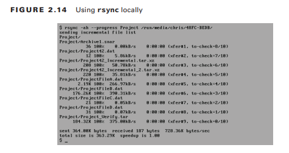

La opción `-a` se llama opción de archivo y es equivalente a usar las opciones `-rlptgoD`. Como puede sospechar, agregar `-v` aumenta la verbosidad de la salida, mientras que `-h` hace que la salida sea más legible para los humanos. La opción `--progress` es buena si desea ver un informe de progreso mientras se realiza la copia de seguridad de los archivos. Para otras opciones de `rsync`, consulte las páginas de manual.

Para usar `rsync` en una red y cifrar la transferencia, tanto las máquinas locales como las remotas deben tener `rsync` y OpenSSH instalados. La Figura 2.15 muestra un ejemplo recortado del uso de este método.

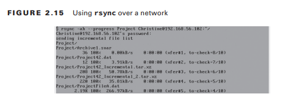

Puedes hacer mucho más con `rsync` que solo copias de seguridad parciales de archivos. También puede configurar copias de seguridad completas. Además, emplear enlaces físicos también le permite utilizar `rsync` para copias de seguridad incrementales. (Utilice su motor de búsqueda favorito para encontrar artículos sobre el uso de `rsync` y enlaces físicos para crear copias de seguridad incrementales de sus datos).
### Usando `dd `para copiar datos
Otra utilidad de línea de comandos que puede utilizar para realizar copias de seguridad de datos es el comando `dd`. Se utiliza principalmente para crear una copia de bajo nivel de un disco duro y, a menudo, se utiliza en análisis forense digital.

El comando en sí es bastante sencillo. Es una utilidad útil para copiar discos dañados. Su sintaxis general es la siguiente: `dd of=dispositivo-de-salida if=dispositivo-de-entrada`
El dispositivo de salida es una unidad completa o una partición. El dispositivo de entrada es el mismo. Sólo asegúrese de obtener el dispositivo adecuado para salir y el adecuado para entrar; de lo contrario, puedes borrar datos sin querer.

Si desea deshacerse de un disco, también puede usar el comando dd para poner a cero el disco, como se muestra aquí:

```sh
dd of=/dev/sdc if=/dev/zero count=10
```

`if=/dev/zero` utiliza el archivo de dispositivo cero para escribir ceros en el disco. Se agrega la opción de recuento para que esta acción se complete 10 veces para poner a cero el disco por completo. Esta tarea en particular tardará mucho en ejecutarse y aún es mejor destruir los discos que ya no utilizará su empresa.

Para conocer varias opciones adicionales que pueden resultar útiles para muchas otras aplicaciones, consulte las páginas de manual.
### Automatización de copias de seguridad con scripts
Con cualquier cosa repetitiva, como las copias de seguridad, tiene sentido automatizar la actividad tanto como sea posible. Los scripts de Shell pueden resultar muy útiles en este caso particular.

Una vez que tenga sus scripts de respaldo funcionando y probados, considere ejecutarlos con `cron` (o `anacron`) para asegurarse de que los respaldos nunca se olviden. Dado que las copias de seguridad son un script de shell popular, utilice su motor de búsqueda favorito para encontrar varios ejemplos ubicados en Internet. Es posible que pueda encontrar algo que satisfaga sus necesidades con sólo unas pocas modificaciones.
### Instalación de programas desde la fuente
Habrá ocasiones en las que necesites o quieras instalar un programa desde el código fuente. Puede ser que el programa no esté disponible en algún repositorio, o que quieras ver el código fuente antes de instalar el programa, o que estés pensando en escribir un nuevo programa basado en éste, etc. Cuando llegue ese momento, es útil conocer los pasos básicos necesarios:

1. Descargue el archivo de instalación.
2. Desempaquete el archivo de instalación.
3. Lea la documentación de instalación.
4. Prepárese para compilar.
5. Compile el programa.
6. Mueva los archivos binarios a las ubicaciones adecuadas.

Estos pasos son bastante sencillos y normalmente los requieren la mayoría de los programas obtenidos de esta manera. Sin embargo, tenga en cuenta que, en última instancia, depende del creador del programa.
 
En cuanto a cómo se realiza la instalación, por lo que es posible que deba modificar sus acciones para instalar un programa en particular con éxito. Y, por supuesto, necesita privilegios de super usuario para instalar programas de esta manera.
### Obtención de los archivos de instalación
Hay muchas formas diferentes de obtener los archivos de instalación de un programa en particular. Los archivos de instalación normalmente vienen empaquetados en formato tarball. A menudo, el creador del programa mantiene una presencia en la web que le dirigirá a la fuente de descarga del archivo tar del programa.

Una vez que ubique la fuente de descarga tarball del programa, utilice el método que elija para descargar el archivo. Puede utilizar una descarga HTTP o HTTPS directa a través de su navegador web favorito o, si está disponible, puede descargar a través de un cliente torrent, o puede utilizar la utilidad de línea de comandos `wget`, etc.
### Descomprimiendo los archivos de instalación
Para descomprimir los archivos de instalación, simplemente los extrae del archivo tarball del programa. Para fines de distribución de programas, el método de compresión que se utiliza normalmente es la compresión gzip, como lo indica un archivo tarball que tiene una extensión `.tgz` o `.tar.gz`. Sin embargo, no es extraño que se utilicen otros métodos de compresión, como `bzip2` o `xz`.

Para fines de demostración en este capítulo, instalaremos el programa curl desde el código fuente. Su tarball usa compresión `gzip` y se muestra aquí:

```sh
ls 
curl-7.46.0.tar.gz
```

Para descomprimir y descomprimir los archivos de instalación del tarball, use el comando `tar` con las opciones de extracción y descompresión adecuadas. Si no recuerda las opciones apropiadas de extracción y descompresión del comando `tar`, consulte las páginas del manual.

Aquí hay un ejemplo recortado de cómo extraer los archivos de instalación del tarball del programa curl:

```sh
tar -zxvf curl-7.46.0.tar.gz 
curl-7.46.0/ 
curl-7.46.0/projects
[...]
curl-7.46.0/Makefile.in
```

Una vez que se extraen los archivos de instalación, debería ver un directorio creado dentro de su directorio de trabajo actual. Este directorio contiene los archivos de instalación que necesita para completar la instalación de este programa en su sistema.

```sh
ls -F
curl-7.46.0/ curl-7.46.0.tar.gz
```

Una vez que cambie su directorio de trabajo actual a este nuevo directorio, debería ver varios archivos, como `README` o `README.txt`, `configure`, `Makefile.in`, etc. Los archivos de instalación de cada programa serán ligeramente diferentes.
### Lectura de la documentación de instalación
Está bastante claro lo que debes hacer con el archivo `README` o `README.txt...` ¡léelo! Este es el archivo de documentación general y, a menudo, contiene instrucciones de instalación (aunque las instrucciones de instalación a veces se encuentran en un archivo llamado `INSTALL`). La razón más importante para leer los archivos `README` e `INSTALL` es que el autor del programa puede haber elegido seguir un curso de instalación no estándar. Con suerte, el autor documentará el curso que debe seguir para tener éxito.

La Tabla 2.6 proporciona una breve descripción de los archivos que debería considerar leer antes de instalar el software. Tenga en cuenta que no todos los programas tendrán todos estos archivos. Además, es posible que se incluyan archivos adicionales o archivos con nombres ligeramente diferentes.

| Typical Filename | Purpose                                                |
| ---------------- | ------------------------------------------------------ |
| README           | General documentation and installation instructions    |
| INSTALL          | Installation instructions                              |
| COPYING          | Software license                                       |
| RELEASE-NOTES    | Features and bug fixes included in the program version |
| NEWS             | Features and bug fixes included in the program version |
| AUTHORS          | Program creator(s) and contact information             |

Otra razón para leer estos archivos es que el autor del programa a menudo documentará las dependencias necesarias. A diferencia de la instalación con utilidades como `yum` o `apt-get`, las dependencias de software no se obtienen ni se instalan automáticamente como parte de este proceso. Tienes que hacerlo de forma manual.
### Preparación de compilación
En el siguiente paso básico, ejecuta un script estándar que verifica la configuración del sistema y prepara los preparativos para el paso de compilación. El script que ejecuta es configure y debe ser uno de los archivos dentro del directorio de archivos de instalación del programa.

Normalmente, cuando ejecuta el script de configuración, buscará dependencias y configuraciones tanto opcionales como obligatorias. El script verificará si tiene instalados los compiladores adecuados, verificará si hay dependencias necesarias del programa, si hay dependencias opcionales y creará un archivo llamado `Makefile`. También puede realizar otras comprobaciones y configuraciones.
El `Makefile` es creado (o actualizado) por el script de configuración utilizando lo que encuentra en su sistema, así como el contenido del archivo `Makefile.in` almacenado en el directorio de archivos de instalación del programa.

Debido a que un script de configuración puede producir una gran cantidad de resultados, es una buena idea canalizarlo en un archivo, usando tee, así como observar su visualización en la pantalla del terminal. Usando el script de configuración del programa curl como ejemplo, aquí hay una lista resumida de su ejecución:

```SH
cd curl-7.46.0
./configure | tee  ../curl_configure.log checking whether to enable maintainer-specific por[...]
checking whether make supports nested variables... yes
[...]
HTTP2 support:   disabled (—with-nghttp2)
Protocols:             DICT FILE FTP GOPHER HTTP IMAP POP3 [...]
```

Normalmente, si el script de configuración encuentra lo que necesita, finaliza correctamente. Si se encuentra con algún problema grave, como no encontrar una biblioteca o un compilador requerido en particular instalado (requisitos obligatorios), solucione esos problemas primero y luego vuelva a ejecutar el script de configuración.
### Compilando el programa
En este punto, está listo para compilar el código fuente en binario. El comando para hacerlo es `make`. El comando `make` utiliza el archivo `Makefile`, que se creó o modificó en el paso anterior, como guía.

El siguiente es un ejemplo recortado de cómo compilar el programa curl. Observe nuevamente que la salida se conserva al canalizarla a la utilidad en `T`.

```SH
make | tee  ../curl_make.log
Making all in lib
make[1]: Entering directory '/root/curl-7.46.0/lib'
make all-am
[...]
make[1]: Leaving directory '/root/curl-7.46.0' 
```

Ahora que el código fuente del programa está compilado, todo lo que queda por hacer es finalizar el proceso de instalación.
### Completar la instalación
Para completar la instalación, solo necesita ejecutar el comando `make install`. Por lo general, crea los directorios de programas necesarios, mueve los archivos binarios del programa y los archivos de soporte, como documentación y bibliotecas de programas, a sus ubicaciones adecuadas y establece la configuración de permisos adecuada para los archivos.

Usando el ejemplo de curl, aquí hay un ejemplo resumido del uso de `make install`. Observe nuevamente que se canaliza a través del programa tee para preservar su salida si es necesario:

```SH
make install | tee  ../curl_make_install.log
Making install in lib
make[1]: Entering directory '/root/curl-7.46.0/lib'
[...]

make[1]: Leaving directory '/root/curl-7.46.0' 
```

Una vez que todo esté colocado en su ubicación adecuada, ¡pruebe su nuevo programa! Aquí se utiliza el programa curl con su opción de versión a modo de prueba:

```sh
curl --version 
curl 7.46.0 (x86_64-pc-linux-gnu) libcurl/7.46.0
[...]
```
### Gestión del uso de recursos
Administrar el uso de recursos de su sistema implica solucionar problemas de recursos a medida que ocurren. Sin embargo, medir mediante el monitoreo y la predicción del uso futuro de los recursos puede ayudar a minimizar los problemas de recursos con anticipación. 

Desafortunadamente, muchos administradores de sistemas dedican más tiempo a solucionar problemas y menos tiempo a monitorear/predecir.
Esta sección proporciona un vistazo a las diversas herramientas que puede utilizar para las tres actividades. También aborda cuándo se deben utilizar estas herramientas. Además, cubre la resolución de problemas de uso de recursos y la planificación de capacidad.
### Medición del uso de recursos
Hay un viejo dicho que dice: "No se puede gestionar lo que no se puede medir". Este dicho es apropiado para medir el uso de recursos. Debe medir los recursos con frecuencia, precisión y minuciosidad para recopilar los datos necesarios para gestionarlos adecuadamente. Además, debe medir con precisión antes de poder comenzar a solucionar problemas o planificar la capacidad del uso de recursos.

La medición de recursos mediante monitoreo se presenta en un par de formas diferentes. A veces sólo necesitas estar atento a las cosas. En otras ocasiones, está monitoreando datos para descubrir por qué ocurren ciertos problemas. Además, es posible que deba recopilar datos periódicamente para la planificación de la capacidad del sistema.

Puede resultar un poco abrumador intentar realizar un seguimiento de todas las estadísticas de datos de recursos del sistema. A continuación se detallan algunos elementos clave sobre los cuales debería medir y recopilar datos en cada sistema/red que administre: 
- Tiempo de actividad del sistema
- Estadísticas de carga y uso de CPU
- Estadísticas de intercambio y uso de memoria
- E/S de disco y estadísticas de carga
- E/S de red y estadísticas de carga
- Rendimiento del firewall
- Rendimiento del enrutador
- Uso del ancho de banda de la red

Sin embargo, habrá ocasiones en las que necesitará monitorear elementos especiales de su sistema para solucionar problemas, aumentar aplicaciones específicas o planificar capacidades especiales. Por ejemplo, es posible que necesite determinar si la utilidad irqbalance (que distribuye las solicitudes de interrupción entre los múltiples procesadores del sistema) ayuda a mejorar el rendimiento de su sistema. En este caso, es necesario realizar un seguimiento de la carga de solicitudes de interrupción de cada núcleo del procesador antes y después de instalar la utilidad irqbalance.

Afortunadamente, en un sistema Linux, puede emplear muchas herramientas de línea de comandos de medición. La Tabla 2.7 enumera algunos junto con una descripción general de cada uno.


| Utility | Descripction                                                                                                                                                                                                        | Display Type      | Monitors                         |
| ------- | ------------------------------------------------------------------------------------------------------------------------------------------------------------------------------------------------------------------- | ----------------- | -------------------------------- |
| free    | Shows the amount of free/used physical and swap memory.                                                                                                                                                             | static            | memory                           |
| htop    | Enhancement of the top utility, which allows horizontal as well as vertical scrolling, and uses function keys for process control                                                                                   | Dynamic           | CPU Memory Process States Uptime |
| iftop   | Similar to the top utility, it shows current network traffic information, including DNS.                                                                                                                            | Dynamic           | Network                          |
| iostop  | Shows device I/O loading summary broken down per device                                                                                                                                                             | Static or Dynamic | CPU Device I/O                   |
| iotop   | Similar to the top utility, it shows current I/O usage by processes (or threads).                                                                                                                                   | Dynamic           | Device I/O                       |
| ip      | The -s link option and route option will display network and routing statistics. (Replaces the netstat command.)                                                                                                    | Static            | Network Routing                  |
| iptraf  | Shows network information, and it is menu driven.                                                                                                                                                                   | Dynamic           | Network                          |
| lsof    | Shows open files and network connections by process                                                                                                                                                                 | Static            | Network Process map              |
| mpstst  | Shows multiple processor statistics.                                                                                                                                                                                | Static or Dynamic | CPU                              |
| mtr     | Shows routing information for the URL parameter                                                                                                                                                                     | Dynamic           | Routing                          |
| netstat | The netstat -i option and -r option will display network and routing statistics. This command is considered obsolete. Use ip instead.                                                                               | Static            | Network Routing                  |
| ntop    | Gathers network statistics that can be viewed via a web browser via port 3000.                                                                                                                                      | Dynamic           | NetworkNetwork                   |
| pmap    | Shows a processes map for the PID parameter.                                                                                                                                                                        | Static            | Process map                      |
| ps      | Shows current process information, including CPU consumption                                                                                                                                                        | Static            | CPU Process states               |
| pstree  | Shows current processes in a tree format                                                                                                                                                                            | Static            | Process map                      |
| sar     | Acronym for System Activity Reporter: a multiple resource monitoring utility that collects and displays a wide variety of resource usage information                                                                | Static or Dynamic | CPU Memory Network Device I/O    |
| ss      | Displays socket statistics directly from kernel space. Provides more information than the netstat utility                                                                                                           | Static            | Network                          |
| tcpdump | A packet analyzer/sniffer that shows designated network interface captured packet content descriptions.                                                                                                             | Dynamic           | Network                          |
| top     | Multiple display panels that show various resource usage data such as processes consuming the most CPU. Display can easily be changed on the fly. The atop and htop utilities are enhancements of the top command. | Dynamic           | CPU Memory Process states Uptime |
| uptime  | Shows how long the system has gone without a reboot, load averages, and current number of users.                                                                                                                    | static            | Uptime                           |
| vmstat  | Shows swap (virtual memory) performance.                                                                                                                                                                            | Static or Dynamic | Memory                           |
| w       | Shows current user information, including CPU consumption.                                                                                                                                                          | static            | CPU Process states               |

No todas las utilidades de la Tabla 2.7 están instaladas de forma predeterminada en todas las distribuciones. 

Varias utilidades en la Tabla 2.7 tienen recursos adicionales que monitorean además de los tipos abreviados enumerados en la columna Monitores. Consulte las páginas del manual para obtener una descripción completa de estas diversas utilidades. Tenga en cuenta que hay muchas más utilidades de línea de comandos de supervisión disponibles para instalar. Abra su navegador web favorito y escriba las palabras de búsqueda Monitoreo de Linux para obtener listas de utilidades de monitor adicionales.

La utilidad sar (acrónimo de System Activity Reporter) es especial porque puede recopilar datos durante un largo período de tiempo y proporcionar una gran cantidad de ellos. Debido a su facilidad de uso, también es una buena herramienta para quienes son nuevos en el monitoreo de recursos. 

Normalmente se instala de forma predeterminada en la mayoría de las distribuciones, pero si por alguna razón no lo encuentra en la suya, se encuentra en el paquete `sysstat`.
La utilidad sar utiliza datos almacenados por la utilidad `sadc` en `/var/log/sa/` y, de forma predeterminada, muestra datos del archivo actual, aunque puede cambiar este comportamiento mediante ciertas opciones de comando. Usado sin ninguna opción, el comando sar mostrará la información de uso de CPU almacenada hoy en intervalos de 10 minutos, como se muestra en este ejemplo recortado:

```sh
sar
[...]
12:20:01 PM   CPU   %user    %nice   %system   %iowait   %steal[...]
12:20:01 PM   all   1.97      0.00      1.84      0.22     0.00[...]
12:30:01 PM   all   0.29      0.00      1.37      0.16     0.00[...]
[...]
```

Puede mostrar información actual de la CPU y cambiar los intervalos mostrados también. En este ejemplo recortado, `sar` muestra el uso de la CPU cuatro veces y con un intervalo de un segundo:

```sh
sar 1 4
[...]
06:49:50 PM   CPU   %user    %nice   %system   %iowait   %steal[...]
06:49:51 PM   all   1.05      0.00      6.32      0.00     0.00[...]
06:49:52 PM   all   1.02      0.00      2.04      0.00     0.00[...]
06:49:53 PM   all   0.00      0.00      1.03      0.00     0.00[...]
06:49:54 PM   all   0.00      0.00      4.08      0.00     0.00[...] 
Average:      all   0.52      0.00      3.35      0.00     0.00[...]
```

La utilidad `sadc` (acrónimo de System Activity Data Collector) recopila varios datos de uso de recursos del sistema para `sar`. Almacena los datos en el directorio `/var/log/sa/` en el archivo `sadd`, donde `dd` es igual al día del mes, por defecto.

La utilidad `sa1` almacena las actividades del sistema en archivos de datos binarios. El `sa2` crea un resumen diario de los datos recopilados por el `sa1`. Tanto `sa1` como `sa2` normalmente se ejecutan mediante cron.

Tenga en cuenta que estas utilidades trabajan juntas para procesar y mostrar solo información del sistema local. Para obtener más información sobre `sar`, `sadc`, `sa1` y `sa2`, consulte sus páginas de manual.
### Predecir el uso de recursos
Predecir el uso de recursos se denomina formalmente planificación de capacidad. La planificación de la capacidad implica los siguientes pasos:
1. Comprender las necesidades actuales de los usuarios del sistema
2. Monitorear el uso de recursos del sistema actual
3. Recopilar la dirección futura y las necesidades anticipadas de los usuarios y aplicaciones del sistema.
4. Hacer predicciones y decisiones basadas en la información recopilada.

Las predicciones de planificación de capacidad deben tener pruebas documentadas tanto del uso actual de recursos como de la tasa de crecimiento del uso actual de recursos a lo largo del tiempo. Sin estos datos, el crecimiento proyectado del uso de recursos y el punto de interrupción de la capacidad anticipado de una configuración serán extremadamente inexactos.

Existen varias soluciones de software de monitoreo completo de recursos que puede utilizar para recopilar datos y producir los gráficos necesarios. Generalmente, estas soluciones se dividen en software de presentación, que produce cuadros y/o gráficos útiles, y software de recopilación (también llamado registrador de datos), que recopila datos de uso de recursos. Descubrirá que muchos de estos productos de software tienen la capacidad de funcionar juntos. Algunos de estos se tratan aquí:

***Cacti*** Cacti es una solución de software de presentación de uso de recursos que brinda la capacidad de producir gráficos de uso a partir de plantillas. Es una interfaz para RRDTool. Cacti almacena sus datos en una base de datos MySQL y su interfaz se maneja a través de PHP. A menudo se utiliza para monitorear el tráfico de la red porque puede manejar redes bastante complejas. Además, permite utilizar estos datos recopilados en gráficos MRTG. 

***Collectd*** Collectd es un demonio que le permite monitorear el uso de la infraestructura de TI. Escrito en C para mayor portabilidad, recopila estadísticas del sistema local (y remoto con un complemento de red). El demonio recopilado es bastante fácil de configurar. Usted configura los datos recopilados y cómo se recopilan a través de complementos y algunas otras configuraciones dentro del archivo de configuración `recopilado.conf` ubicado en `/etc/` o `/etc/collectd/`, dependiendo de su distribución. Las opciones LoadPlugin del archivo de configuración determinan qué complementos usar en recopilado.

Se necesitan otras utilidades para mostrar las estadísticas recopiladas. Si una utilidad no está instalada de forma predeterminada en su distribución de Linux, está en el paquete recopilado.

***MRTG*** El nombre de esta solución de software es un acrónimo de Multi Router Traffic Grapher, que casi lo dice todo. Recopila y grafica datos de tráfico de red. Escrito en Perl para mayor portabilidad, puede representar gráficamente las estadísticas de casi cualquier dispositivo de red. MRTG produce páginas HTML que ofrecen un gráfico de tráfico de red dinámico. También se puede utilizar junto con RRDTool. 

***Nagios*** Este conjunto de soluciones de software muy popular viene en dos versiones: FOSS y propietario. Tendrás que pagar por la solución de software Nagios XI, pero el producto Nagios Core es gratuito. Nagios Core proporciona monitoreo de sistemas, dispositivos de red y diversos servicios. Utiliza un complemento que le permite crear comprobaciones de servicio personalizadas si lo desea.

Nagios Core proporciona una vista centralizada de todos los elementos monitoreados en toda su empresa. Hay una interfaz web para ver datos y registros actuales y recopilados de cortes, eventos, alertas, etc. anteriores. Nagios Core es principalmente un recopilador de datos y no proporciona gráficos de uso o rendimiento. Sin embargo, los datos recopilados se pueden utilizar con herramientas gráficas de terceros, como PNP4Nagios y nagiosgraph.

Una de las mejores características de Nagios Core es que puede enviar alertas de problemas por correo electrónico o mensajes de texto. Incluso puedes incorporar tu propio script de alerta personalizado. 

***Icinga*** Icinga comenzó como una bifurcación de Nagios. Ahora está dividido en dos productos diferentes, Icinga1 (la bifurcación original de Nagios) e Icinga2 (una reescritura total). Icinga es compatible y similar a Nagios, pero incorpora una interfaz de usuario diferente (algunos creen que es mejor) y un ciclo de desarrollo más rápido.

***RRDTool*** RRDTool, un estándar de la industria, significa herramienta de base de datos Round-Robin, porque los datos de uso de recursos recopilados se almacenan en una base de datos Round-Robin. El tamaño de esta base de datos no cambia porque los datos más antiguos se eliminan cada vez que se almacenan datos más nuevos en ella. Proporciona herramientas sobre cómo utilizar estos datos para producir gráficos de uso de recursos. Sin embargo, se utiliza a menudo en otras utilidades, como Cacti, MRTG y Nagios. 

Al utilizar una o más de estas soluciones de software de monitoreo de recursos completos, puede predecir el crecimiento y evitar problemas de agotamiento de recursos. Además, estos programas, así como las herramientas de línea de comandos tratadas anteriormente, le permiten encontrar cuellos de botella de rendimiento actuales y diagnosticar problemas de uso de recursos, como se explica a continuación.
### Solución de problemas de uso de recursos
Una vez que haya implementado el monitoreo del uso de recursos y la planificación de la capacidad, minimizará la necesidad de solucionar problemas de uso de recursos. Sin embargo, cuando surjan problemas, serán mucho más fáciles de resolver.

Además de monitorear sus recursos, debe comprender cómo interactúan estas soluciones de software de monitoreo de recursos. Un síntoma de recurso particular puede estar directamente relacionado con un problema con otro recurso. Por lo tanto, es importante correlacionar los síntomas del sistema con la causa probable del problema. Los siguientes son algunos elementos a considerar al solucionar problemas de uso de recursos:

***Memoria*** La memoria (también llamada RAM) se divide en fragmentos de 4 Kb llamados páginas. Cuando el sistema necesita más memoria, utilizando un esquema de administración de memoria, toma las páginas de memoria de un proceso inactivo y las copia en el disco. Esta ubicación del disco es una partición especial llamada espacio de intercambio o memoria de intercambio o virtual. Si el proceso inactivo ya no está inactivo, sus páginas de memoria se vuelven a copiar en la memoria. Este proceso de copiar páginas de memoria hacia y desde el espacio de intercambio del disco se llama intercambio.

Puede ver estadísticas de memoria en un sistema utilizando herramientas de línea de comandos como free, sar y vmstat. Si su sistema no tiene la memoria del tamaño adecuado, debería ver un uso elevado de RAM. Además, debido a estos problemas de memoria, el sistema aumentará el intercambio y dará como resultado un aumento de E/S del disco. La herramienta vmstat es útil en este caso, porque le permite ver las E/S del disco específicas para el intercambio, así como los bloques totales de entrada y salida del dispositivo.

***Procesos*** Es crucial identificar qué procesos están utilizando qué recursos, especialmente si un recurso en particular está teniendo problemas. Es posible que necesite determinar si los problemas de recursos están causando los problemas del proceso o viceversa. Las utilidades `ps`, `psmap` y `pstree` pueden resultar útiles para correlacionar procesos particulares con problemas de recursos particulares.

Por ejemplo, si un disco experimenta una E/S inusualmente alta, puede deberse a un proceso en particular y puede estar causando problemas de rendimiento en un grupo de procesos. Esto se llama bloqueo de E/S. En este ejemplo particular, encontraríamos estos procesos en lo que se llama sueño ininterrumpido. La columna b de la utilidad `vmstat` muestra cuántos procesos hay en este estado. Para determinar los procesos reales, utilice la utilidad `ps` y busque un estado de proceso D.

***CPU*** Para fines de resolución de problemas y monitoreo, debe comprender el hardware de su CPU. Primero, determine cuántas CPU hay en su sistema. Para cada CPU, necesita saber la cantidad de núcleos de procesador, si se utiliza Hyper-Threading, el tamaño de la caché, etc. El archivo `/proc/cpuinfo` y los comandos `lscpu` pueden resultar útiles aquí.

Los diversos elementos de la CPU que se deben observar incluyen el tiempo de inactividad, las cargas de uso promedio, la longitud de la cola, las cargas de solicitudes de interrupción, etc. `Uptime`, `top`, `sar` y `mpstat` son algunas de las utilidades que le ayudarán en este caso.

***E/S del dispositivo*** Para la E/S del dispositivo, que generalmente se centra en discos, es necesario comprender su hardware. ¿Es NAS, iSCSI o SAN? ¿Está utilizando LVM y cuál es el tipo de sistema de archivos empleado? Una vez que comprenda el hardware del disco subyacente de su sistema, podrá interpretar mejor los datos del software y las utilidades de monitoreo.

Las utilidades de línea de comandos útiles aquí incluyen `iostat`, `iotop`, `lsof` y `sar`. Si se accede a sus discos a través de su red, no olvide incluir monitores de red como parte del kit de herramientas de solución de problemas de E/S de su dispositivo.

***Rendimiento de la red*** El rendimiento de los paquetes de red y los cuellos de botella pueden ser una preocupación constante en la vida de un administrador de sistemas. Comprender el hardware y la topología de su red es el primer paso para solucionar problemas. Sin una imagen clara, estarás persiguiendo conejos en lugar de resolver problemas.

***El tamaño***, el hardware y la topología de su red también determinarán qué herramientas funcionarán mejor para sus propósitos de resolución de problemas. Las utilidades de línea de comandos `iftop`, `ip`, `iptraf` y `ntop` pueden resultar útiles. Si se configura para capturar el tráfico de la red, también se puede utilizar la utilidad `sar`. Además, lsof puede mostrar qué servicios de red, como FTP, están en uso en su sistema, y `tcpdump` puede proporcionar análisis de paquetes de red. Y no olvidemos esas humildes y útiles utilidades como `ping`, `traceroute` e `ifconfig`.

Tenga en cuenta que si administra una red grande, las diversas soluciones de software de monitoreo completo de recursos, como MRTG, pueden ser más útiles para solucionar problemas. Sus capacidades gráficas podrían resultar necesarias para localizar cuellos de botella.

Como probablemente habrás notado, los distintos recursos pueden afectarse directamente entre sí. Por lo tanto, el uso de una variedad de herramientas de monitoreo de recursos y de línea de comandos lo ayudará a administrar el uso de recursos de su sistema.
