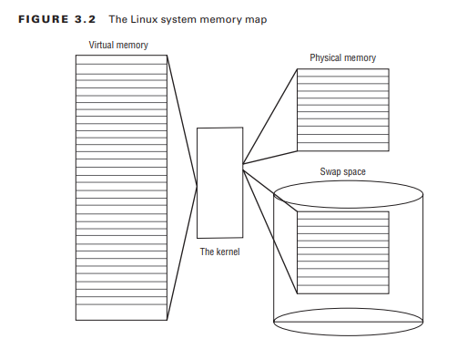
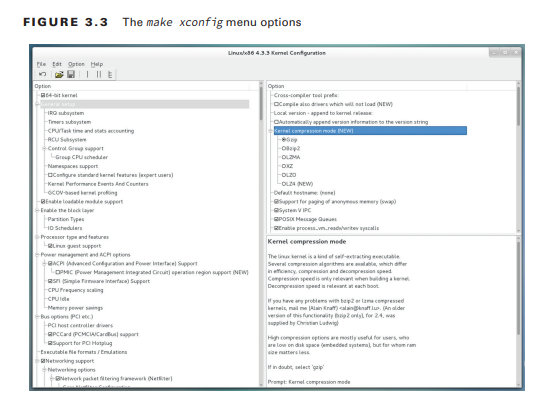

# Dominar el Kernel

Si bien normalmente nos referimos al sistema operativo Linux simplemente como Linux, en realidad, bastantes partes conforman un sistema Linux completo. El kernel de Linux es el componente principal que mantiene cosas juntas y ejecutándose en su sistema. Es el corazón del sistema Linux y controla el hardware, la memoria y las aplicaciones en ejecución.
Este capítulo analiza primero las diferentes partes del kernel de Linux y cómo encajan entre sí para controlar la computadora. A continuación, el capítulo examina cómo se instala el kernel de Linux en diferentes distribuciones de Linux y dónde encontrar las diferentes partes del mismo. Después de eso, el capítulo analiza cómo crear un nuevo kernel para admitir nuevo hardware o simplemente para actualizar su sistema Linux a las últimas funciones. Finalmente, el capítulo examina cómo administrar el kernel y los módulos del kernel, junto con cómo solucionar problemas del kernel si algo sale mal.

### ¿Qué es el Kern el?
Un sistema Linux completo consta de cuatro partes principales:
- El núcleo de Linux
- Las utilidades GNU
- Un entorno de escritorio gráfico
- Software de aplicación

Cada una de estas cuatro partes tiene un trabajo específico en el sistema Linux. Si bien cada una de las partes por sí sola no es muy útil, en conjunto crean lo que llamamos Linux. La Figura 3.1 muestra un diagrama básico de cómo encajan estas partes para crear el sistema Linux general.
El núcleo del sistema Linux es el kernel. El kernel controla todo el hardware y software del sistema informático, asigna hardware cuando es necesario y ejecuta software cuando es necesario.
### Las características del núcleo
Si ha estado siguiendo el mundo Linux, sin duda habrá escuchado el nombre Linus Torvalds. Linus es el responsable de crear el primer software del kernel de Linux mientras era estudiante en la Universidad de Helsinki. Su intención era que fuera una copia del sistema Unix, que era un sistema operativo popular utilizado por muchas universidades en ese momento.

Después de desarrollar el kernel de Linux, Linus lo lanzó a la comunidad de Internet y solicitó sugerencias para mejorarlo. Este sencillo proceso inició una revolución en el mundo de los sistemas operativos informáticos. Pronto Linus recibió sugerencias de estudiantes y programadores profesionales de todo el mundo.

Permitir que cualquiera cambie el código de programación en el kernel resultaría en un caos total. Para simplificar las cosas, Linus actuó como punto central para todas las sugerencias de mejora. En última instancia, fue decisión de Linus incorporar o no el código sugerido en el núcleo. Este mismo concepto todavía está vigente con el código del kernel de Linux, excepto que en lugar de que solo Linus controle el código del kernel, un equipo de desarrolladores llamado la Fundación Linux ha asumido la tarea.

El núcleo es el principal responsable de cuatro funciones principales:
- Gestión de la memoria del sistema
- Gestión de programas de software
- Gestión de hardware
- Gestión del sistema de archivos
### Gestión de la memoria del sistema
Una de las funciones principales del kernel del sistema operativo es la gestión de la memoria.
La gestión de la memoria es la capacidad de controlar cómo se ejecutan los programas y utilidades dentro de las estricciones de memoria del sistema. El kernel no sólo administra la memoria física disponible en el servidor, sino que también puede crear y administrar memoria virtual, o memoria que en realidad no existe pero que se crea en el disco duro y se trata como memoria real.

Lo hace utilizando espacio en el disco duro, llamado espacio de intercambio. El kernel intercambia el contenido de las ubicaciones de la memoria virtual desde el espacio de intercambio a la memoria física real. Esto permite que el sistema piense que hay más memoria disponible de la que existe físicamente, como se muestra en la Figura 3.2.



Las ubicaciones de la memoria se agrupan en bloques llamados páginas de memoria. El kernel ubica cada página de memoria en la memoria física o en el espacio de intercambio. Luego, el núcleo mantiene una tabla de las páginas de memoria que indica qué páginas están en la memoria física y cuáles se intercambian en el disco.

El kernel realiza un seguimiento de qué páginas de memoria están en uso y copia automáticamente las páginas de memoria a las que no se ha accedido durante un período de tiempo al área de espacio de intercambio (esto se llama intercambio), incluso si hay otra memoria disponible. Cuando un programa quiere acceder a una página de memoria que ha sido intercambiada, el núcleo debe dejarle espacio en la memoria física intercambiando una página de memoria diferente e intercambiando la página requerida desde el espacio de intercambio. Obviamente, este proceso lleva tiempo y puede ralentizar un proceso en ejecución. El proceso de intercambio de páginas de memoria para ejecutar aplicaciones continúa mientras el sistema Linux esté en ejecución.
Puede ver el estado actual de la memoria virtual en su sistema Linux viendo el archivo especial `/proc/meminfo`. El Listado 3.1 muestra un ejemplo de una entrada `/proc/meminfo` de muestra.

```sh
cat /proc/meminfo
MemTotal:        1908188 kB
MemFree:          408188 kB
MemAvailable:     855432 kB
Buffers:           32544 kB
Cached:           514140 kB
SwapCached:            0 kB
Active:          1033464 kB
Inactive:         341712 kB
Active(anon):     829016 kB
Inactive(anon):     1120 kB
Active(file):     204448 kB
Inactive(file):   340592 kB
Unevictable:          16 kB
Mlocked:              16 kB
SwapTotal:       1165308 kB
SwapFree:        1165308 kB
Dirty:              2112 kB
Writeback:             0 kB
AnonPages:        828536 kB
Mapped:           199596 kB
Shmem:              1660 kB
Slab:              61352 kB
SReclaimable:      29656 kB
SUnreclaim:        31696 kB
KernelStack:        5680 kB
PageTables:        31972 kB
NFS_Unstable:          0 kB
Bounce:                0 kB
WritebackTmp:          0 kB
CommitLimit:     2119400 kB
Committed_AS:    2673804 kB
VmallocTotal:   34359738367 kB
VmallocUsed:       30256 kB
VmallocChunk:   34359699448 kB
HardwareCorrupted:     0 kB
AnonHugePages:         0 kB
HugePages_Total:       0
HugePages_Free:        0
HugePages_Rsvd:        0
HugePages_Surp:        0
Hugepagesize:       2048 kB
DirectMap4k:       58748 kB
DirectMap2M:     1894400 kB
```

Las líneas `MemTotal` y `MemFree` muestran que este servidor Linux tiene 2 GB de memoria física, pero que actualmente sólo unos 408 MB no están en uso (gratuitos). El resultado también muestra que hay aproximadamente 1 GB de memoria de espacio de intercambio disponible en este sistema.
De forma predeterminada, cada proceso que se ejecuta en el sistema Linux tiene sus propias páginas de memoria privadas. Un proceso no puede acceder a las páginas de memoria que utiliza otro proceso. El kernel mantiene sus propias áreas de memoria. Por motivos de seguridad, ningún proceso puede acceder a la memoria utilizada por los procesos del kernel.

Para facilitar el intercambio de datos, puede crear páginas de memoria compartida. Múltiples procesos pueden leer y escribir desde y hacia un área de memoria compartida común. El kernel mantiene y administra las áreas de memoria compartida y permite que los procesos individuales accedan al área compartida.

El comando especial `ipcs` le permite ver las páginas de memoria compartida actuales en el sistema. Aquí está el resultado de un comando `ipcs` de muestra:

```sh
ipcs -m
———Shared Memory Segments————

key        shmid      owner      perms      bytes      nattch     status
0xcf124bdc 0          root       600        1000       6
0x0b234bfc 32769      root       600        8          6
0x07021999 65538      root       644        1704       2
0x00000000 163843     rich       600        4194304    2          dest 
0x00000000 262148     rich       600        1048576    2          dest
```

Cada segmento de memoria compartida tiene un propietario que creó el segmento. Cada segmento también tiene una configuración de permisos estándar de Linux que establece la disponibilidad del segmento para otros usuarios. El valor clave se utiliza para permitir que otros usuarios obtengan acceso al segmento de memoria compartida.
### Gestión de programas de software
El sistema operativo Linux llama proceso a un programa en ejecución. Un proceso puede ejecutarse en primer plano, mostrando el resultado en una pantalla, o puede ejecutarse en segundo plano detrás de escena. El kernel controla cómo el sistema Linux gestiona todos los procesos que se ejecutan en el sistema.

El kernel crea el primer proceso, llamado `init`, para iniciar todos los demás procesos del sistema. Cuando se inicia el kernel, carga el proceso de inicio en la memoria virtual. A medida que el kernel inicia cada proceso adicional, le proporciona un área única en la memoria virtual para almacenar los datos y el código que utiliza el proceso.

Algunas implementaciones de Linux contienen una tabla de procesos que se inician automáticamente al iniciar. En sistemas Linux, esta tabla normalmente se encuentra en el archivo especial `/etc/inittab`.

Como se analizó en el Capítulo 1, “Inicio de un sistema”, el sistema operativo Linux utiliza un sistema de inicio que utiliza niveles de ejecución (para el método de inicio `SysV`) o destinos (para el método `systemd`) que determinan qué procesos se inician. Hay siete niveles de ejecución inicial en el sistema operativo Linux.

En el nivel de ejecución 1, solo se inician los procesos básicos del sistema, junto con un proceso de terminal de consola. Esto se llama modo de usuario único. El modo de usuario único se utiliza con mayor frecuencia para el mantenimiento de emergencia del sistema de archivos cuando algo falla. Obviamente, en este modo sólo una persona (normalmente el administrador) puede iniciar sesión en el sistema para manipular datos.

Para la mayoría de las distribuciones de Linux, el nivel de ejecución de inicio estándar es 3. En este nivel de ejecución, se inicia la mayoría del software de aplicación, como el software de soporte de red. Otro nivel de ejecución popular en Linux es el nivel de ejecución 5. Este es el nivel de ejecución donde el sistema inicia el software gráfico X Window y le permite iniciar sesión utilizando una ventana gráfica del escritorio.

El sistema Linux puede controlar la funcionalidad general del sistema controlando el nivel de ejecución inicial. Por ejemplo, al cambiar el nivel de ejecución de 3 a 5, el sistema puede cambiar de un sistema basado en consola a un sistema X Window gráfico avanzado.
El comando `ps` le permite ver los procesos que se ejecutan actualmente en el sistema Linux. El Listado 3.2 muestra un ejemplo de lo que verá usando el comando `ps`.

```sh
ps ax
   PID TTY      STAT   TIME COMMAND
	1    ?        S      0:03 init
	2    ?        SW     0:00 [kflushd]
	3    ?        SW     0:00 [kupdate]
	4    ?        SW     0:00 [kpiod]
	5    ?        SW     0:00 [kswapd]
   243   ?        SW     0:00 [portmap]
   295   ?        S      0:00 syslogd
   305   ?        S      0:00 klogd
   320   ?        S      0:00 /usr/sbin/atd
   335   ?        S      0:00 crond
   350   ?        S      0:00 inetd
   365   ?        SW     0:00 [lpd]
   403   ttyS0    S      0:00 gpm -t ms
   418   ?        S      0:00 httpd
   423   ?        S      0:00 httpd
424    ?        SW     0:00 [httpd]
425    ?        SW     0:00 [httpd]
426    ?        SW     0:00 [httpd]
427    ?        SW     0:00 [httpd]
428    ?        SW     0:00 [httpd]
429    ?        SW     0:00 [httpd]
430    ?        SW     0:00 [httpd]
436    ?        SW     0:00 [httpd]
437    ?        SW     0:00 [httpd]
438    ?        SW     0:00 [httpd]
   470 ?        S      0:02 xfs -port -1
   485 ?        SW     0:00 [smbd]
   495 ?        S      0:00 nmbd -D
   533 ?        SW     0:00 [postmaster]
538    tty1     SW     0:00 [mingetty]
539    tty2     SW     0:00 [mingetty]
540    tty3     SW     0:00 [mingetty]
541    tty4     SW     0:00 [mingetty]
542    tty5     SW     0:00 [mingetty]
543    tty6     SW     0:00 [mingetty]
544    ?        SW     0:00 [prefdm]
   549 ?        SW     0:00 [prefdm]
   559 ?        S      0:02 [kwm]
   585 ?        S      0:06 kikbd
594    ?        S      0:00 kwmsound
595    ?        S      0:03 kpanel
596    ?        S      0:02 kfm
597    ?        S      0:00 krootwm
598    ?        S      0:01 kbgndwm
   611 ?        S      0:00 kcmlaptop -daemon
   666 ?        S      0:00 /usr/libexec/postfix/master
   668 ?        S      0:00 qmgr -l -t fifo -u
   787 ?        S      0:00 pickup -l -t fifo
790    ?        S      0:00 telnetd: 192.168.1.2 [vt100]
791    pts/0    S      0:00 login—rich
792    pts/0    S      0:00 -bash
   805 pts/0    R      0:00 ps ax
```

La primera columna del resultado muestra el ID del proceso (PID) del proceso. Observe que el primer proceso es nuestro amigo, el proceso de init, y el sistema Linux le asigna el PID 1. A todos los demás procesos que comienzan después del proceso de inicio se les asignan PID en orden numérico. No hay dos procesos que puedan tener el mismo PID.

La tercera columna muestra el estado actual del proceso (S para dormir, SW para dormir y esperar y R para ejecutar). El nombre del proceso se muestra en la última columna. Los procesos que están entre paréntesis se han intercambiado desde la memoria al espacio de intercambio del disco debido a la inactividad. Puede ver que algunos de los procesos se han intercambiado, pero la mayoría de los procesos en ejecución no.
### Gestión de hardware
Otra responsabilidad más del núcleo es la gestión del hardware. Cualquier dispositivo con el que el sistema Linux deba comunicarse necesita un código de controlador insertado dentro del código del kernel. El código del controlador permite que el kernel pase datos de ida y vuelta al dispositivo, actuando como intermediario entre las aplicaciones y el hardware. Hay dos métodos utilizados para insertar el código del controlador del dispositivo en el kernel de Linux: 
- Controladores compilados en el kernel
- Módulos de controlador agregados al kernel

Anteriormente, la única forma de insertar el código del controlador del dispositivo era recompilar el kernel.

Cada vez que agregaba un nuevo dispositivo al sistema, tenía que recompilar el código del kernel. Este proceso se volvió aún más ineficiente a medida que los kernels de Linux admitían más hardware. Afortunadamente, los desarrolladores de Linux idearon un método mejor para insertar el código del controlador en el kernel en ejecución.

Los programadores desarrollaron el concepto de módulos del kernel para permitirle insertar el código del controlador del dispositivo en un kernel en ejecución sin tener que volver a compilar el kernel. Un módulo es un archivo de biblioteca de controladores autónomo que se puede vincular y desvincular dinámicamente con el kernel. Esto significa que puede eliminar un módulo del kernel cuando haya terminado de usar el dispositivo, algo que no puede hacer con los controladores del kernel compilados. Esto se simplificó y amplió enormemente utilizando hardware con Linux.

El sistema Linux identifica los dispositivos de hardware como archivos especiales, llamados archivos de dispositivo. Hay tres clasificaciones de archivos de dispositivos:
- Carácter
- Bloquear
- Red

Los archivos de dispositivo de caracteres son para dispositivos que pueden manejar datos de solo un carácter a la vez. La mayoría de los tipos de módems y terminales se crean como archivos de caracteres. Los archivos de dispositivos de bloque son para dispositivos que pueden manejar datos en bloques grandes a la vez, como unidades de disco.

Los tipos de archivos de dispositivos de red se utilizan para dispositivos que utilizan paquetes para enviar y recibir datos. Estos incluyen tarjetas de red y un dispositivo de bucle invertido especial que permite que el sistema Linux se comunique consigo mismo mediante protocolos de programación de red comunes.

Linux crea archivos especiales, llamados nodos, para cada dispositivo del sistema. Toda la comunicación con el dispositivo se realiza a través del nodo del dispositivo. Cada nodo tiene un par de números único que lo identifica ante el kernel de Linux. El par de números incluye un número de dispositivo mayor y otro menor. Los dispositivos similares se agrupan en el mismo número de dispositivo principal. El número de dispositivo menor se utiliza para identificar un dispositivo específico dentro del grupo de dispositivos principal. El Listado 3.3 muestra un ejemplo de algunos archivos de dispositivo en un servidor Linux.

```sh
cd /dev
ls -al sda* ttyS*
brw-rw----.   1 root   disk    8,    0   Sep 10 16:27   sda 
brw-rw----.   1 root   disk    8,    1   Sep 10 16:27   sda1 
brw-rw----.   1 root   disk    8,    2   Sep 10 16:27   sda2 
brw-rw----.   1 root   disk    8,    3   Sep 10 16:27   sda3 
brw-rw----.   1 root   disk    8,    4   Sep 10 16:27   sda4 
crw-rw----.   1 root   dialout 4,   64   Sep 10 16:27   ttyS0 
crw-rw----.   1 root   dialout 4,   65   Sep 10 16:27   ttyS1 
crw-rw----.   1 root   dialout 4,   66   Sep 10 16:27   ttyS2 
crw-rw----.   1 root   dialout 4,   67   Sep 10 16:27   ttyS3
```

Diferentes distribuciones de Linux manejan dispositivos con diferentes nombres de dispositivo. En esta distribución, el dispositivo sda es el primer disco duro SCSI y los dispositivos ttyS son los puertos COM estándar de IBM PC. El Listado 3.3 muestra todos los dispositivos sda que se crearon en el sistema Linux de muestra. En realidad no todos se utilizan, pero se crean en caso de que el administrador los necesite. Del mismo modo, el listado muestra todos los dispositivos ttyS creados.
La quinta columna es el número de nodo del dispositivo principal. Observe que todos los dispositivos sda tienen el mismo nodo de dispositivo principal, 8, mientras que todos los dispositivos ttyS usan 4. La sexta columna es el número de nodo del dispositivo menor. Cada dispositivo dentro de un número mayor tiene su propio número de nodo de dispositivo menor único.
La primera columna indica los permisos para el archivo del dispositivo. El primer carácter de los permisos indica el tipo de archivo. Observe que todos los archivos del disco duro SCSI están marcados como dispositivos de bloque (b), mientras que los archivos de dispositivos del puerto COM están marcados como dispositivos de caracteres (c).
### Gestión del sistema de archivos
Un sistema de archivos define cómo el sistema operativo almacena datos en dispositivos de almacenamiento. A diferencia de otros sistemas operativos, el kernel de Linux puede admitir diferentes tipos de sistemas de archivos para leer y escribir datos desde y hacia discos duros, dispositivos de CD o DVD y unidades flash USB. Además de tener más de una docena de sistemas de archivos propios, Linux puede leer y escribir desde y hacia sistemas de archivos utilizados por otros sistemas operativos, como Microsoft Windows. El kernel debe compilarse con soporte para todos los tipos de sistemas de archivos que utilizará el sistema. La Tabla 3.1 enumera los sistemas de archivos estándar que un sistema Linux puede usar para leer y escribir datos.


| filesystem | Description                                                        |
| ---------- | ------------------------------------------------------------------ |
| ext        | Extended filesystem—the original Linux filesystem                  |
| ext2       | Second extended filesystem, provided advanced features over ext    |
| ext3       | Third extended filesystem, supports journaling                     |
| ext4       | Fourth extended filesystem, supports advanced journaling           |
| HPFS       | OS/2 high-performance filesystem                                   |
| JFS        | IBM’s journaling filesystem                                        |
| ISO 9660   | ISO 9660 filesystem (CD-ROMs                                       |
| MINIX      | MINIX filesystem                                                   |
| msdos      | Microsoft FAT16                                                    |
| NCP        | NetWare filesystem                                                 |
| NFS        | Network File System                                                |
| NTFS       | Microsoft NT filesystem                                            |
| procfs     | Access to system information                                       |
| ReiserFS   | Advanced Linux filesystem for better performance and disk recovery |
| SMB        | Samba SMB filesystem for network access                            |
| sysv       | Older Unix filesystem                                              |
| UFS        | BSD filesystem                                                     |
| umsdos     | Unix-like filesystem that resides on top of MS-DOS                 |
| VFAT       | Windows 95 filesystem (FAT32)                                      |
| XFS        | High-performance 64-bit journaling filesystem                      |

Cualquier disco duro al que acceda un servidor Linux debe formatearse utilizando uno de los tipos de sistemas de archivos enumerados en la Tabla 3.1.

El kernel de Linux interactúa con cada sistema de archivos mediante el sistema de archivos virtual (VFS). Esto proporciona una interfaz estándar para que el kernel se comunique con cualquier tipo de sistema de archivos. VFS almacena información en caché en la memoria a medida que se monta y utiliza cada sistema de archivos.
### Partes Kernel
Al instalar un nuevo kernel (o actualizar un kernel existente), hay varios componentes disponibles para instalar. Esta sección analiza cada uno de estos componentes y describe lo que contribuyen al entorno del kernel en su sistema Linux.
### Kernel binario
El archivo binario del kernel es el programa del kernel en sí. Esto es lo que el programa del gestor de arranque carga en la memoria, por lo que debe estar presente en el sistema Linux para que el sistema arranque e inicie.

El archivo binario del kernel puede ser algo grande, dependiendo de cuántos controladores estén compilados en el kernel de forma predeterminada. Por eso, el archivo binario del kernel generalmente se comprime para ahorrar espacio en la memoria cuando se carga el kernel. El nombre del archivo del kernel depende de cómo se comprimió el archivo binario del kernel. La Tabla 3.2 enumera los diferentes nombres de archivos binarios del kernel que se utilizan en las distribuciones de Linux.

| Filename | Description                                                                    |
| -------- | ------------------------------------------------------------------------------ |
| bzImage  | A larger kernel binary file compressed using the GNU zip utility               |
| Kernel   | A generic name for an uncompressed kernel binary file                          |
| vmlinux  | An uncompressed kernel binary file, not usually used as the final boot version |
| vmlinuz  | A generic compressed kernel binary filename                                    |
| zImage   | A small kernel binary file compressed using the GNU zip utility                |

El formato de archivo bzImage es el más popular. Sin embargo, muchas distribuciones de Linux copian ese archivo al nombre de archivo vmlinuz. Cuando busque el archivo binario del kernel en su sistema Linux, a menudo verá el nombre del archivo binario principal con la versión del kernel adjunta, como vmlinuz-4.3.3. Este método le permite mantener más de un kernel en su sistema y arrancar usando una versión de kernel diferente para diferentes situaciones.
El archivo binario del kernel debe ser accesible para el programa de arranque, que es lo que carga el kernel en la memoria en el momento del arranque. Debido a esto, los archivos binarios del kernel normalmente se almacenan en la estructura del directorio `/boot` en el sistema de archivos, aunque algunas distribuciones de Linux mantienen los archivos binarios del kernel directamente en el directorio raíz (`/`).

La mayoría de las distribuciones de Linux incluyen el archivo binario del kernel como un paquete que puede instalar fácilmente utilizando un sistema de administración de paquetes común (como Debian `apt-get` o Red Hat `yum`). El paquete instala el archivo binario del kernel en la ubicación correcta y realiza las modificaciones necesarias en el menú del gestor de arranque GRUB para arrancar usando el nuevo kernel. Esto hace que la instalación de un nuevo kernel sea casi sencilla.
### Módulos del Kernel
El kernel de Linux necesita controladores de dispositivos para comunicarse con los dispositivos de hardware instalados en su sistema Linux. Sin embargo, compilar controladores de dispositivos para todos los dispositivos de hardware conocidos en el kernel generaría un archivo binario del kernel extremadamente grande.

Para evitar esa situación, el kernel de Linux utiliza módulos del kernel, que son archivos de controladores de hardware individuales que se pueden vincular al kernel en tiempo de ejecución. De esa manera, el sistema puede vincular solo los módulos necesarios para el hardware presente en su sistema.

Si el kernel está configurado para cargar módulos de dispositivos de hardware, los archivos de los módulos individuales también deben estar disponibles en el sistema. Si está compilando un nuevo kernel de Linux, también deberá compilar los módulos de hardware junto con el nuevo kernel.
Los archivos de módulo se pueden distribuir como código fuente que debe compilarse o como archivos de objetos binarios en el sistema Linux que están listos para vincularse dinámicamente al programa binario del núcleo principal. Si los archivos del módulo se distribuyen como archivos de código fuente, debe compilarlos para crear el archivo de objeto binario. La extensión de archivo `.ko` se utiliza para identificar los archivos de objetos del módulo.

La ubicación estándar para almacenar archivos de objetos de módulo es el directorio `/lib/modules`. Aquí es donde las utilidades del módulo de Linux (como `insmod` y `modprobe`) buscan archivos de biblioteca de objetos del módulo de forma predeterminada.
### Fuente del Kernel
Si planea recompilar el archivo binario del kernel usted mismo, necesitará tener los archivos de código fuente originales para el kernel de Linux. Puede obtener los archivos de código fuente del kernel de Linux utilizando dos métodos diferentes:
- Descargue el código fuente del kernel desde el repositorio principal de desarrollo del kernel de Linux.
- Instale el código fuente del kernel desde el repositorio de software para su distribución de Linux específica.

El sitio web www.kernel.org mantiene el repositorio oficial de las versiones del kernel de Linux. El repositorio mantiene la versión estable actual del kernel, que se recomienda para uso en producción, además de la última versión de desarrollo. Si está buscando el código fuente del kernel más reciente, este es el lugar al que debe acudir.

Como parte de los requisitos de código abierto, las distribuciones individuales de Linux también publican el código fuente del kernel de Linux como paquetes de distribución, disponibles para su instalación desde sus sitios de repositorio de software individuales. Esta es la forma más segura de instalar el kernel de Linux, porque cada distribución de Linux pone a disposición sólo el código fuente del kernel de Linux que se sabe que funciona correctamente en el entorno de la distribución.
Ya sea que descargue un paquete de código fuente de Linux desde el sitio web www.kernel.org o lo instale desde el repositorio de su distribución, debe extraer los archivos de código fuente en `/usr/src/linux`.
### Parches del Kernel
Las versiones del kernel de Linux tienen versiones incrementales para correcciones de errores y parches de seguridad (como pasar de la versión 4.3.0 a la 4.3.1). Si bien puede recompilar un nuevo kernel descargando el código fuente completo para la versión incremental, si ya tiene el código fuente para la versión original, existe una forma más sencilla de actualizar a la nueva versión.

Una versión de parche es un paquete de código fuente especial que contiene solo los cambios aplicados a la versión principal del código fuente del kernel para llegar a la versión incremental (por ejemplo, actualizar desde la versión 4.3.0 del kernel a la versión de parche 4.3.1). Simplemente descargue el paquete de código fuente del parche, use el comando de parche de Linux para aplicar las actualizaciones del parche a los archivos de código fuente del kernel existentes en su sistema y luego vuelva a compilar el kernel.

Al trabajar con parches para versiones incrementales posteriores (como actualizar 4.3.1 a
4.3.2), primero debe desinstalar el parche anterior (4.3.1) para volver a la versión original (4.3.0) y luego aplicar el parche para la versión incremental 4.3.2, porque cada versión de parche se basa en la actualización. el código de lanzamiento original. La desinstalación de parches también se realiza mediante el comando `patch` utilizando la opción `-R`.
### Encabezados del núcleo
El kernel de Linux está escrito principalmente utilizando el lenguaje de programación C. Parte del lenguaje de programación C es una característica llamada archivos de encabezado. Los archivos de encabezado le dicen al compilador de C qué archivos de biblioteca se requieren para compilar el código fuente del kernel. Estos mismos archivos de biblioteca también son vitales para compilar cualquier archivo de código fuente de módulo.

Si solo necesita compilar módulos a partir del código fuente, no necesita descargar los archivos completos del código fuente del kernel de Linux, solo los archivos de encabezado del kernel. Afortunadamente, la mayoría de las distribuciones de Linux incluyen paquetes solo para los archivos de encabezado del kernel relacionados con la versión del kernel instalada. Esto facilita la compilación de módulos si está experimentando con hardware nuevo.

Los archivos de encabezado del kernel normalmente se instalan en la estructura de directorios `/usr/src/linux/` en distribuciones basadas en Debian o en la estructura de directorios `/usr/src/kernels` en distribuciones basadas en Red Hat, y usan la extensión de archivo `.h`.
###  Documentación del Kernel
Otra parte importante de los archivos del kernel de Linux es la documentación del kernel. La documentación del kernel está dividida en muchos archivos de texto separados, detallando qué hace cada archivo de código fuente dentro de la estructura del kernel. Si planea trabajar con el código fuente del kernel de Linux, es una buena idea tener a mano los archivos de documentación del kernel.

Debido al tamaño de los archivos, los archivos de documentación del kernel a menudo se instalan por separado del paquete de código fuente del kernel en las versiones de distribución, pero si descarga el código fuente del kernel desde el sitio web www.kernel.org, se incluyen. Los archivos de documentación del kernel generalmente se instalan en la estructura de directorios `/usr/src/linux/Documentation`, pero pueden estar en la estructura de directorios `/usr/src/kernels` para sistemas basados en Red Hat.
### Versiones del Kernel
Una de las partes más confusas de trabajar con el kernel de Linux es el sistema de versiones. A lo largo de la historia del kernel de Linux se han implementado seis versiones diferentes del sistema. Esta sección analiza los diferentes números de versión del kernel y describe cómo interpretar lo que significa cada uno.
### Los lanzamientos originales del kernel
Cuando Linus lanzó el kernel de Linux original en septiembre de 1991, le asignó la versión 0.01. Al comenzar con la versión 0, indicó que era principalmente para pruebas y no estaba destinada a ser utilizada como ningún tipo de sistema de producción para manejar datos importantes.

A medida que el sistema Linux se hizo popular y se hicieron nuevas adiciones, las versiones actualizadas aún mantuvieron el número de versión principal 0 y aumentaron la parte después del punto para indicar cada versión más nueva (como 0.01, 0.02, etc.). Este método de versión se mantuvo en uso hasta la versión 0.95, que se lanzó en marzo de 1992.
### La serie Linux versión 1
En marzo de 1994, Linus lanzó la primera versión de producción de Linux como la versión 1.0. Esta versión inició un sistema de versiones estándar que seguía el formato 1.x.y.
En este formato, la x representa el número de versión principal. Los lanzamientos de versiones principales con números impares indican una versión de prueba (o desarrollo), mientras que los lanzamientos de versiones pares indican una versión de producción. La y indica niveles incrementales de versiones de parches menores dentro de las versiones principales. Este método de versión estuvo en uso hasta la versión 1.3, lanzada en mayo de 1995.
### La serie Linux versión 2
Después de la versión 1.3, Linus determinó que la siguiente versión contenía suficientes cambios para garantizar un nuevo número de versión principal, y la versión 2.0 se lanzó en junio de 1996. Los núcleos de la serie de la versión 2 mantuvieron el formato 2.x.y al igual que la serie de la versión 1, con Los lanzamientos principales con números impares indican lanzamientos de prueba y los lanzamientos principales con números pares indican lanzamientos de producción. Este método estuvo en uso hasta la versión 2.4, lanzada en enero de 2001.
### La serie Linux versión 2.6
En diciembre de 2003, Linus lanzó la versión 2.6.0 del kernel de Linux e inició otro nuevo sistema de versiones. Sintió que el kernel principal de Linux era bastante estable y decidió mantener el número de versión 2.6 y comenzar un nuevo formato de numeración. Las versiones más recientes del kernel de Linux usaban el formato 2.6.x.y.

El 2.6 se mantuvo constante, desplazando el número de versión principal hacia abajo un nivel al tercer número (la x) y el número de parche menor incremental como el cuarto número (la y).
Otra cosa que cambió con la versión 2.6 fue que todos los lanzamientos eran lanzamientos de producción. Las versiones de desarrollo utilizaron una designación `-rc` después del final de la versión del kernel (para la versión candidata). Cuando una versión se consideraba estable para producción, se eliminaba `-rc`. Este método permaneció en uso hasta la versión 2.6.39 en mayo de 2011.
### La serie Linux versión 3
En julio de 2011, Linus celebró el vigésimo aniversario del kernel de Linux iniciando la serie de la versión 3 con la versión 3.0. El lanzamiento de la nueva versión volvió a utilizar el sistema de lanzamiento 3.x.y de tres dígitos, donde x representa los lanzamientos principales y y los lanzamientos incrementales de parches menores. Sin embargo, la serie de la versión 3 mantuvo la designación `-rc` para las versiones de desarrollo iniciadas en la serie de versiones 2.6. Este método permaneció en uso hasta la versión 3.19 en febrero de 2015.
### La serie Linux versión 4
En abril de 2015, Linus determinó que era hora de realizar otro cambio importante en la versión de lanzamiento y, por lo tanto, la serie de la versión 4 comenzó con la versión 4.0. La serie de la versión 4 mantiene el sistema de lanzamiento 4.x.y y también utiliza la designación `-rc` para los lanzamientos de prueba. 

Al momento de escribir este resumen nos encontramos en la version 6.7.
### Compilando un kernel
En la mayoría de los entornos Linux normales, nunca tendrá que preocuparse por compilar un nuevo kernel. Todas las principales distribuciones de Linux hacen eso por usted y lanzan los nuevos núcleos como paquetes de software en sus repositorios. La actualización del kernel suele ser automática y se realiza mediante el proceso de actualización automática de software de la distribución.

Sin embargo, puede haber ocasiones en las que desee experimentar con un nuevo kernel, como al implementar nuevo hardware o probar nuevas funciones del kernel. Si decide emprender la tarea de compilar su propio kernel de Linux, el proceso implica cinco pasos:

1. Obtención del código fuente
2. Crear un archivo de configuración basado en el hardware del sistema.
3. Compilando el código fuente
4. Compilación e instalación de archivos de módulo.
5. Instalación del nuevo archivo binario del kernel
### Obtención del código fuente
Como se menciona en la sección "Fuente del kernel", hay dos formas de obtener el código fuente del kernel de Linux. Puede descargar la versión más reciente directamente desde el sitio web oficial www.kernel.org, o puede obtenerla con la mayoría de las distribuciones de Linux, que incluyen un paquete de software que contiene el código fuente del kernel para la versión del kernel instalada más recientemente.

Si simplemente está experimentando con diferentes funciones del kernel en su distribución de Linux específica, le recomendamos que instale solo el paquete de software del kernel desde el repositorio de su distribución. Esto garantiza que está trabajando con un kernel que sabe que funciona en su entorno Linux. Sin embargo, la mayoría de las distribuciones de Linux están algo atrasadas en mantenerse al día con las últimas versiones del kernel. Si está intentando trabajar con las últimas funciones de hardware o kernel, es posible que deba descargar e instalar el código fuente actual estable o de desarrollo directamente desde el sitio web www.kernel.org.

Cuando vaya al sitio web www.kernel.org, verá una matriz de diferentes versiones del kernel disponibles, junto con diferentes opciones de descarga (como descargar solo el parche incremental o el código fuente completo). La versión de producción más reciente del kernel está etiquetada como estable. Las versiones anteriores del kernel están etiquetadas como de largo plazo, mientras que la versión de desarrollo más reciente está etiquetada como principal.
Los paquetes de código fuente se empaquetan usando la utilidad de archivo tar y se comprimen usando la utilidad de compresión `xz`. Necesitará ambas utilidades instaladas en su sistema para poder extraer los archivos del código fuente.

Para descargar un paquete completo de código fuente del kernel, haga clic en el enlace `tar.xz` para obtener la versión que necesita. El nombre del archivo de descarga tendrá el formato `linux-version.tar.xz` donde versión es la versión del kernel. Para extraer el archivo de código fuente, utilice el siguiente comando:

```sh
tar xvf linux-version.tar.xz
```

El comando tar extraerá todos los archivos de código fuente en una carpeta llamada `linuxversion`, creando automáticamente las subcarpetas necesarias contenidas en el paquete.

Puede extraer los archivos del código fuente del kernel en una carpeta debajo de su directorio de inicio si solo desea examinar los archivos y la documentación. Sin embargo, si planea compilar e instalar el kernel en su sistema Linux, es mejor extraer los archivos del código fuente en la estructura de carpetas `/usr/src/`. No coloque los nuevos archivos de código fuente directamente en la carpeta `/usr/src/linux`; en su lugar, cree un enlace entre la carpeta `/usr/src/linux` y la carpeta del código fuente que creó al extraer los archivos:

```sh
ln /usr/src/linux-4.3.3 /usr/src/linux
```

### Creando el archivo de configuración
Antes de poder compilar el nuevo kernel a partir del código fuente, necesita determinar qué características del kernel desea incluir en su nuevo archivo binario del kernel. Esto se hace usando un archivo de configuración del kernel.

El archivo de configuración del kernel es un archivo de texto que contiene líneas separadas para cada característica del kernel, que muestra el nombre de la característica y su configuración. El archivo de configuración del kernel se almacena en el archivo `/usr/src/linux/.config`. Si ya tiene instalado el código fuente del kernel, puede consultar este archivo para ver qué funciones están disponibles para la configuración. El Listado 3.4 muestra un pequeño fragmento de un archivo .config de un sistema Ubuntu.

```sh
CONFIG_64BIT=y
CONFIG_X86_64=y
CONFIG_X86=y
CONFIG_INSTRUCTION_DECODER=y
CONFIG_PERF_EVENTS_INTEL_UNCORE=y
CONFIG_OUTPUT_FORMAT="elf64-x86–64"
CONFIG_ARCH_DEFCONFIG="arch/x86/configs/x86_64_defconfig"
CONFIG_LOCKDEP_SUPPORT=y
CONFIG_STACKTRACE_SUPPORT=y
CONFIG_HAVE_LATENCYTOP_SUPPORT=y
CONFIG_MMU=y
CONFIG_NEED_DMA_MAP_STATE=y
CONFIG_NEED_SG_DMA_LENGTH=y
CONFIG_GENERIC_ISA_DMA=y
CONFIG_GENERIC_BUG=y
CONFIG_GENERIC_BUG_RELATIVE_POINTERS=y
CONFIG_GENERIC_HWEIGHT=y
CONFIG_ARCH_MAY_HAVE_PC_FDC=y
CONFIG_RWSEM_XCHGADD_ALGORITHM=y ...
```

Necesita establecer muchas opciones de configuración para el kernel. Para crear el archivo `.config`, no es necesario ejecutar cada línea manualmente. En su lugar, puede utilizar un script automatizado que haga preguntas para cada función y cree el archivo `.config` en función de sus respuestas a las preguntas.

La utilidad `make` ejecuta el script contenido en el código fuente. La utilidad `make` utiliza objetivos `make` para determinar qué script ejecutar. Hay muchos objetivos diferentes que puedes utilizar.
El destino `make config` es el script básico que se ejecutará para crear el archivo de configuración.

Hace muchas preguntas sobre cada característica que puede incluir en el kernel. El Listado 3.5 muestra algunas de las preguntas que se formulan.

```sh
make config 
...
*
* Linux/x86 4.3.3 Kernel Configuration
*
64-bit kernel (64BIT) [Y/n/?] y
*
*   General setup
*
Cross-compiler tool prefix (CROSS_COMPILE) []
Compile also drivers which will not load (COMPILE_TEST) [N/y/?]
Local version—append to kernel release (LOCALVERSION) []
Automatically append version information to the version string (LOCALVERSION_
AUTO) [N/y/?]
Kernel compression mode
> 1. Gzip (KERNEL_GZIP)
  2. Bzip2 (KERNEL_BZIP2)
  3. LZMA (KERNEL_LZMA)
  4. XZ (KERNEL_XZ)
  5. LZO (KERNEL_LZO)
  6. LZ4 (KERNEL_LZ4)choice[1–6?]:
Default hostname (DEFAULT_HOSTNAME) [(none)]
Support for paging of anonymous memory (swap) (SWAP) [Y/n/?]
System V IPC (SYSVIPC) [Y/n/?]
POSIX Message Queues (POSIX_MQUEUE) [Y/n/?]
Enable process_vm_readv/writev syscalls (CROSS_MEMORY_ATTACH) [Y/n/?]
open by fhandle syscalls (FHANDLE) [Y/n/?] uselib syscall (USELIB) [Y/n/?] (NEW)
Auditing support (AUDIT) [Y/?] y
Enable system-call auditing support (AUDITSYSCALL) [Y/n/?]
...
```

Si bien la mayoría de las preguntas tienen respuestas predeterminadas que normalmente puedes usar, revisar tantas preguntas no es una forma eficiente de crear el archivo de configuración. Afortunadamente, puedes utilizar algunos scripts de acceso directo adicionales especificando diferentes objetivos:
- defconfig: crea un archivo de configuración predeterminado según el tipo de sistema detectado
- oldconfig: actualiza un archivo de configuración existente solo con las nuevas funciones
- menuconfig: utiliza un sistema de menú basado en texto que le permite seleccionar qué funciones incluir
- xconfig: crea un menú gráfico que le permite seleccionar qué funciones incluir
- gconfig: utiliza el menú gráfico GTK que le permite seleccionar qué funciones incluir

El objetivo xconfig produce un menú fácil de usar para el sistema de escritorio GNOME o KDE, como se muestra en la Figura 3.3.

Los menús de configuración gráfica son útiles porque dividen la multitud de preguntas en categorías para ayudar a que los cambios sean más manejables. El panel izquierdo muestra las principales categorías de ajustes de configuración, como memoria, sistema de archivos y funciones de red. Cuando haces clic en el tema de una categoría principal, el panel superior derecho muestra las subopciones disponibles dentro de la categoría. Cuando hace clic en una subopción, aparece una explicación de la opción en el panel inferior derecho.



Cuando haya terminado de completar la configuración de categorías y subopciones, guarde la configuración haciendo clic en el icono del disco en la barra de herramientas en la parte superior de la ventana. Una vez que hayas creado el archivo `/usr/src/linux/.config`, está listo para comenzar a compilar el nuevo kernel.
### Compilación e instalación del kernel
Una vez que haya creado el archivo de configuración para el kernel, estará listo para comenzar el proceso de compilación. Gracias a la utilidad make, este paso es muy sencillo.
Primero, si hizo algún intento previo de compilar el kernel, querrá eliminar los archivos objeto antiguos creados usando el objetivo limpio:

```sh
make clean
```

Luego, si desea crear un archivo binario del kernel sin comprimir, simplemente ingrese el comando

```sh
make
```

Luego, el script se hará cargo y compilará todo el código del kernel para producir el nuevo kernel. (Esté preparado; este proceso llevará mucho tiempo). Si prefiere crear un archivo de kernel comprimido, simplemente use el destino `bzImage`:

```sh
make bzImage
```

A medida que funciona el proceso de compilación, verá muchos mensajes pasar por la consola, como estos:

```sh
  CC      lib/list_sort.o
  CC      lib/uuid.o
  CC      lib/flex_array.o
  CC      lib/iov_iter.o
  CC      lib/clz_ctz.o
  CC      lib/bsearch.o
  CC      lib/find_bit.o
  CC      lib/llist.o
  CC      lib/memweight.o
```

Las líneas `CC` indican archivos de código objeto que se están creando. Las líneas `LD` indican archivos de código objeto que se están vinculando para crear el archivo ejecutable. Cuando se complete el proceso, el archivo binario final del kernel debe estar en la carpeta `/usr/src/linux/arch/x86/boot` como `bzImage`.
Una vez que se complete el proceso de compilación, estará listo para instalar el nuevo archivo binario del kernel.

Puede instalar manualmente el archivo binario del kernel simplemente copiando el archivo `bzImage` en la carpeta `/boot` de su sistema. Querrá agregar el número de versión al archivo para poder distinguirlo de los otros archivos binarios del kernel. Nómbralo usando el nombre de archivo `vmlinuz`, que es reconocido por la mayoría de las distribuciones de Linux:

```sh
cp /usr/src/linux/arch/x86/boot/bzImage /boot/vmlinuz-4.3.3
```

Además del archivo binario del kernel, también hay un archivo `System.map` en la carpeta `/usr/src/linux` asociado con el archivo binario del kernel generado. El archivo `System.map` se utiliza para depurar el kernel, por lo que no es necesario, pero también puede ser útil copiarlo en la carpeta `/boot`. Al igual que con el archivo binario del kernel, querrás agregar la versión del kernel al final del nombre del archivo `System.map`:

```sh
cp /usr/src/linux/System.map /boot/System.map-4.3.3
```

Como probablemente puedas adivinar, también hay un destino de script `make` para instalar automáticamente los archivos binarios del kernel y `System.map`:

```sh
make install
```

Esto copia automáticamente el nuevo binario del kernel desde la carpeta `/usr/src/linux` a la ubicación adecuada en la carpeta `/boot` de su gestor de arranque. Sin embargo, aún necesitará cambiar el nombre del nuevo archivo binario del kernel para agregarle la versión del kernel, separándolo de los archivos del kernel más antiguos instalados.
### Compilación e instalación de módulos
Después de compilar e instalar el kernel, querrás compilar e instalar la versión más nueva de los módulos necesarios para tu sistema. Al igual que con la compilación del kernel, utiliza la utilidad `make` para crear e instalar los nuevos archivos de la biblioteca de objetos del módulo.
Primero, deberá crear los archivos de la biblioteca de objetos del módulo utilizando el destino del módulo:

```sh
make modules
```

Una vez que se complete, puede instalarlos usando el destino de instalación `make_modules`:

```sh
make modules_install
```

Este script instala los módulos en la carpeta `/lib/modules/kernel-version/`, donde la versión coincide con la versión del kernel. El kernel buscará en esta carpeta de forma predeterminada cuando
necesita cargar módulos. Esto también se aplica a cualquier comando de línea de comandos utilizado para cargar módulos manualmente. 
### Crear un disco RAM inicial
Una desventaja de utilizar módulos del kernel es que el kernel debe cargar cada uno de los módulos en el momento del arranque para acceder a los dispositivos de hardware. Sin embargo, si hay módulos que controlan cómo el kernel lee el disco duro (como con un sistema RAID) o módulos para leer un sistema de archivos específico (como ReiserFS), esa situación causará un problema. (¿Cómo puede el kernel cargar un módulo necesario para leer el sistema de archivos en el que está almacenado el módulo?)

Para resolver ese problema, los desarrolladores de Linux crearon la idea de un disco RAM inicial (también llamado `initrd`). El disco RAM inicial es un sistema de archivos contenido en un archivo que el kernel carga en la memoria en el momento del arranque como un disco. El kernel puede leer y cargar cualquier archivo contenido en el disco RAM inicial mientras arranca. Todo lo que necesita hacer es crear un archivo de disco RAM inicial que contenga los archivos del módulo necesarios para iniciar el sistema. Una vez que se inicia el sistema, el disco RAM inicial se elimina de la memoria para liberar espacio en la memoria.

Hay dos utilidades comunes que se utilizan para crear un archivo de disco RAM inicial, según la distribución de Linux que utilice. 
### La utilidad `mkinitrd`
Las distribuciones de Linux basadas en Red Hat (como Red Hat Enterprise Linux, Fedora y CentOS) utilizan la utilidad `mkinitrd` para generar un archivo de disco RAM inicial y copiar los archivos del módulo en él. El formato general del comando es:

```sh
mkinitrd outputfile version
```

donde archivo de salida es el nombre del archivo de disco RAM inicial que se creará y versión es la versión del kernel para la cual se crea el archivo. Hay algunas opciones de línea de comandos que puede utilizar para el comando `mkinitrd`. Se muestran en la Tabla 3.3.


|     |     |
| --- | --- |
|     |     |
