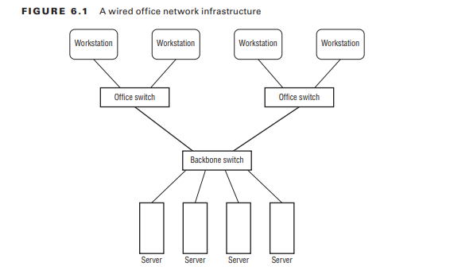

# Navegación por servicios de red

Hoy en día, es necesario tener su sistema Linux conectado a algún tipo de red. Ya sea por la necesidad de compartir archivos e impresoras en una red local o porque a pesar de la necesidad de conectarse a Internet para descargar actualizaciones y parches de seguridad, la mayoría de los sistemas Linux cuentan con algún tipo de conexión de red.

Este capítulo analiza cómo configurar su sistema Linux para conectarse a una red, así como también cómo solucionar problemas de conexiones de red si algo sale mal. Primero, cubre los conceptos básicos de las redes para asegurarse de que esté familiarizado con todos los términos y elementos de configuración necesarios para hablar con otros dispositivos en la red. A continuación, el capítulo examina cómo establecer esos valores de configuración en entornos de red tanto cableados como inalámbricos. Después de eso, el capítulo muestra algunas técnicas simples de solución de problemas que puede utilizar para encontrar el problema si algo sale mal.
### Conceptos básicos de redes
Antes de ver cómo Linux maneja la conectividad de red, será útil repasar los conceptos básicos de las redes de computadoras. Las redes de computadoras son la forma en que pasamos datos de un sistema informático a otro. Para ayudar a simplificar las cosas, las redes informáticas a menudo se describen como un sistema en capas. Diferentes capas desempeñan diferentes roles en el proceso de pasar los datos de un dispositivo de red a otro.

Sin embargo, existe mucho debate sobre cuál es la mejor manera de dividir las capas de red. Si bien el modelo de red OSI estándar utiliza siete capas, utilizaremos un enfoque simplificado de cuatro capas para describir las funciones de la red:
- La capa física
- La capa de red
- La capa de transporte
- La capa de aplicación
Las siguientes secciones detallan las partes contenidas en cada una de estas cuatro capas.
### La capa física
La capa física consta del hardware necesario para conectar su sistema Linux a la red. Si alguna vez ha conectado una computadora a una red doméstica o de oficina, ya está familiarizado con los dos métodos principales utilizados para conectar dispositivos de red: conexiones de red inalámbricas y por cable.

Las conexiones de red por cable utilizan una serie de conmutadores de red para conectar dispositivos de red mediante cables Ethernet especiales. El conmutador de red acepta paquetes de datos del dispositivo de red y luego envía los paquetes de datos al dispositivo de destino correcto en la red. Para instalaciones de redes de oficinas grandes, los conmutadores generalmente se conectan en un diseño en cascada para ayudar a reducir la carga de tráfico en la red. Los conmutadores se pueden interconectar para ayudar a segmentar el tráfico de la red en áreas más pequeñas. La Figura 6.1 muestra un diseño común para una red cableada.

