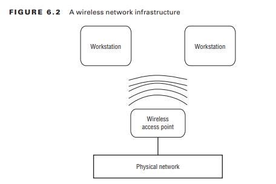
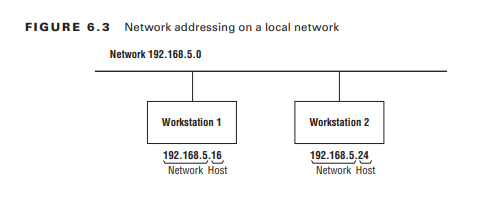
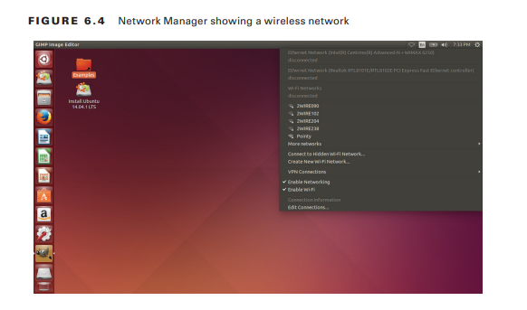
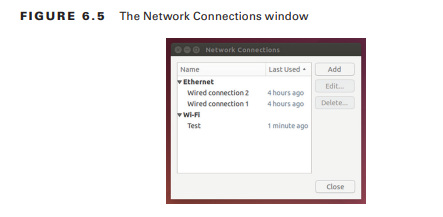

# Navegación por servicios de red

Hoy en día, es necesario tener su sistema Linux conectado a algún tipo de red. Ya sea por la necesidad de compartir archivos e impresoras en una red local o porque a pesar de la necesidad de conectarse a Internet para descargar actualizaciones y parches de seguridad, la mayoría de los sistemas Linux cuentan con algún tipo de conexión de red.

Este capítulo analiza cómo configurar su sistema Linux para conectarse a una red, así como también cómo solucionar problemas de conexiones de red si algo sale mal. Primero, cubre los conceptos básicos de las redes para asegurarse de que esté familiarizado con todos los términos y elementos de configuración necesarios para hablar con otros dispositivos en la red. A continuación, el capítulo examina cómo establecer esos valores de configuración en entornos de red tanto cableados como inalámbricos. Después de eso, el capítulo muestra algunas técnicas simples de solución de problemas que puede utilizar para encontrar el problema si algo sale mal.
### Conceptos básicos de redes
Antes de ver cómo Linux maneja la conectividad de red, será útil repasar los conceptos básicos de las redes de computadoras. Las redes de computadoras son la forma en que pasamos datos de un sistema informático a otro. Para ayudar a simplificar las cosas, las redes informáticas a menudo se describen como un sistema en capas. Diferentes capas desempeñan diferentes roles en el proceso de pasar los datos de un dispositivo de red a otro.

Sin embargo, existe mucho debate sobre cuál es la mejor manera de dividir las capas de red. Si bien el modelo de red OSI estándar utiliza siete capas, utilizaremos un enfoque simplificado de cuatro capas para describir las funciones de la red:
- La capa física
- La capa de red
- La capa de transporte
- La capa de aplicación
Las siguientes secciones detallan las partes contenidas en cada una de estas cuatro capas.
### La capa física
La capa física consta del hardware necesario para conectar su sistema Linux a la red. Si alguna vez ha conectado una computadora a una red doméstica o de oficina, ya está familiarizado con los dos métodos principales utilizados para conectar dispositivos de red: conexiones de red inalámbricas y por cable.

Las conexiones de red por cable utilizan una serie de conmutadores de red para conectar dispositivos de red mediante cables Ethernet especiales. El conmutador de red acepta paquetes de datos del dispositivo de red y luego envía los paquetes de datos al dispositivo de destino correcto en la red. Para instalaciones de redes de oficinas grandes, los conmutadores generalmente se conectan en un diseño en cascada para ayudar a reducir la carga de tráfico en la red. Los conmutadores se pueden interconectar para ayudar a segmentar el tráfico de la red en áreas más pequeñas. La Figura 6.1 muestra un diseño común para una red cableada.


Si bien el término cableado puede hacerle pensar en cables de cobre, también puede aplicarse a conexiones de red que utilizan cables de fibra óptica. Los cables de fibra óptica utilizan luz para transmitir datos a través de un fino hilo de vidrio, logrando velocidades más rápidas y cubriendo distancias más largas que las conexiones de cobre convencionales. Aunque las redes por cable pueden ser engorrosas, proporcionan las velocidades de red más rápidas (actualmente hasta 100 gigabits por segundo). Por ese motivo, las redes por cable siguen siendo populares en entornos de servidores Linux donde es imprescindible un alto rendimiento.

Sin embargo, hoy en día, la mayoría de las redes domésticas y de pequeñas oficinas utilizan redes inalámbricas. En lugar de utilizar cables físicos o cables de fibra para conectar dispositivos, las redes inalámbricas utilizan señales de radio para transmitir datos entre el dispositivo de red y un punto de acceso a la red. El punto de acceso funciona de manera similar al conmutador, en el sentido de que controla cómo se envían los datos a cada dispositivo de red que se comunica con él.

Cada punto de acceso utiliza un Identificador de conjunto de servicios (SSID) único para identificarlo de otros puntos de acceso, que puede ser un nombre o un número. Simplemente le dice a su sistema Linux a qué punto de acceso debe conectarse especificando el valor SSID correcto. La Figura 6.2 muestra un diseño de red inalámbrica común.



La desventaja de las redes inalámbricas es que no se puede controlar hacia dónde viajan las señales de radio. Es posible que alguien fuera de su casa intercepte las señales de su punto de acceso e intente conectarse con ellas. Por eso, es importante implementar algún tipo de seguridad de cifrado en su punto de acceso. Sólo los dispositivos que utilicen la clave de cifrado correcta pueden conectarse al punto de acceso inalámbrico. Las técnicas de cifrado inalámbrico comunes son Privacidad equivalente a cables (WEP), Acceso protegido Wi-Fi (WPA) y Acceso protegido Wi-Fi versión 2 (WPA2).
### La capa de red
La capa de red controla cómo se envían los datos entre los dispositivos de red conectados, tanto en su red local como a través de Internet. Para que los datos lleguen al dispositivo de destino correcto, debe haber algún tipo de esquema de direccionamiento de red para identificar cada dispositivo de red de forma única. Para conectar su sistema Linux a una red IP, necesitará cuatro datos:
- Una dirección IP
- Un nombre de host
- Un enrutador predeterminado
- Un valor de máscara de red

Las siguientes secciones explican lo que representa cada uno de estos valores.
### La dirección IP
En una red IP, a cada dispositivo de red se le asigna una dirección única de 32 bits. El software de capa de red incorpora las direcciones IP de origen y destino en el paquete de datos para que los dispositivos de red sepan cómo manejar el paquete de datos y el sistema Linux sepa qué paquetes leer y cuáles ignorar.

Para que a los humanos les resulte más fácil reconocer la dirección, las direcciones IP se dividen en cuatro valores de 8 bits, representados por números decimales, con un punto entre cada valor. Este formato se llama notación decimal con puntos. Por ejemplo, una dirección IP estándar en notación decimal con puntos parece 192.168.1.10.

Las direcciones IP se dividen en dos secciones. Una parte de la dirección IP representa la dirección de red. Todos los dispositivos en la misma red física tienen la misma parte de dirección de red en su dirección IP. Por ejemplo, si a su red doméstica se le asigna la dirección de red 192.168.1.0, todos los dispositivos de red deben comenzar con la dirección IP 192.168.1.

La segunda parte representa la dirección del host. Cada dispositivo en la misma red debe tener una dirección de host única. La Figura 6.3 muestra la asignación de direcciones IP únicas a dispositivos en una red local.



Para complicar aún más las cosas, se ha vuelto popular un protocolo de red IP más nuevo llamado Protocolo de Internet versión 6 (IPv6). El esquema de red IPv6 utiliza direcciones de 128 bits en lugar de las direcciones de 32 bits utilizadas por IP, lo que permite identificar de forma única muchos más dispositivos de red en Internet.

El método IPv6 utiliza números hexadecimales para identificar direcciones. La dirección de 128 bits se divide en ocho grupos de cuatro dígitos hexadecimales separados por dos puntos, como este:

```shell-session
fed1:0000:0000:08d3:1319:8a2e:0370:7334
```

Si uno o más grupos de cuatro dígitos son 0000, ese grupo o esos grupos pueden omitirse, dejando dos dos puntos:

```shell-session
fed1::08d3:1319:8a2e:0370:7334
```

Sin embargo, de esta manera sólo se puede comprimir un conjunto de ceros consecutivos. IPv6 también proporciona dos tipos diferentes de direcciones de host:
- Link Local Addresses
- Global Addresses

El software IPv6 en un dispositivo host asigna automáticamente la dirección local del enlace. La dirección local del enlace utiliza una dirección de red predeterminada de `fe80::`; luego deriva la parte del host de la dirección de la dirección de control de acceso a medios (MAC) integrada en la tarjeta de red. Esto garantiza que cualquier dispositivo IPv6 pueda comunicarse automáticamente con cualquier otro dispositivo IPv6 en una red local sin ninguna configuración.

La dirección global IPv6 funciona de manera similar a la versión IP original: a cada red se le asigna una dirección de red única y cada host de la red debe tener una dirección de host única.

### Default Router
Con IP e IPv6, los dispositivos sólo pueden comunicarse directamente con otros dispositivos en la misma red física. Para conectar diferentes redes físicas, se utiliza un enrutador. Un enrutador pasa datos de una red a otra red. Los dispositivos que necesitan enviar paquetes a hosts en redes remotas deben utilizar el enrutador como intermediario. Por lo general, una red contendrá un único enrutador para reenviar paquetes a una red de nivel superior. Esto se denomina enrutador predeterminado (o, a veces, puerta de enlace predeterminada).
Por lo tanto, para que un dispositivo se comunique en una red IP, debe conocer tres datos distintos:
- Su propia dirección de host en la red
- La dirección de red de la red física local
- La dirección de un enrutador local utilizado para enviar paquetes a redes remotas

Ya ha visto cómo especificar direcciones de host utilizando la notación decimal con puntos (como 192.168.1.10). La dirección de red se especifica mediante una dirección de máscara de red, que se trata en la siguiente sección.

### Dirección de máscara de red
La dirección de máscara de red distingue entre las partes de la dirección de red y de host en la dirección IP usando 1 bit para mostrar qué bits de la dirección IP de 32 bits son utilizados por la red y 0 bits para mostrar qué bits representan la dirección de host. Como a la mayoría de las personas no les gusta trabajar con números binarios, la dirección de la máscara de red generalmente se muestra en formato decimal con puntos. Por ejemplo, la dirección de máscara de red 255.255.255.0 indica que los primeros tres números decimales de la dirección IP representan la dirección de red y el último número decimal representa la dirección del host.

Como se mencionó, para conectar su sistema Linux a una red, debe especificar tres valores. Aquí hay un ejemplo de lo que necesitaría:
- Dirección de host: 192.168.20.5
- Dirección de máscara de red: 255.255.255.0
- Puerta de enlace predeterminada: 192.168.20.1

Con estos tres valores en la mano, está casi listo para configurar su sistema Linux para que funcione en Internet. Sólo hay una pieza más del rompecabezas de la que deberá preocuparse y la veremos en la siguiente sección.
### Nombres de host
Con todas estas direcciones IP, puede resultar imposible recordar qué servidores tienen qué direcciones. Afortunadamente para nosotros, existe otro estándar de red que puede ayudarnos. El Sistema de nombres de dominio (DNS) asigna un nombre a los hosts de la red.

Con DNS, a cada dirección de red se le asigna un nombre de dominio (como linux.org) que identifica de manera única la red, y a cada host en esa red se le asigna un nombre de host, que se agrega al nombre de dominio para identificar de manera única al host en la red. .

Por lo tanto, para encontrar el host shadrach en el dominio ejemplo.org, usaría el nombre DNS shadrach.example.org. El sistema DNS utiliza servidores para asignar nombres de dominio y host a las direcciones de red específicas necesarias para comunicarse con ese servidor. Los servidores responsables de definir la red y los nombres de host para una red local interoperan con servidores DNS de nivel superior para resolver nombres de host remotos.

Para usar DNS en sus aplicaciones de red, todo lo que necesita configurar es la dirección del servidor DNS que da servicio a su red local. Desde allí, su servidor DNS local puede encontrar la dirección de cualquier nombre de host en cualquier lugar de Internet.
### Dynamic Host Configuration Protocol
Necesitamos analizar una característica más de la capa de red antes de pasar a configurar el sistema Linux. Intentar realizar un seguimiento de las direcciones de host de todos los dispositivos en una red grande puede resultar engorroso. Mantener las asignaciones de direcciones IP individuales en orden puede ser un desafío y, a menudo, se encontrará con la situación en la que a dos o más dispositivos se les asigna accidentalmente la misma dirección IP.

El Protocolo de configuración dinámica de host (DHCP) se creó para facilitar la configuración de las estaciones de trabajo de los clientes, que no necesariamente necesitan usar la misma dirección IP todo el tiempo. Con DHCP, el cliente se comunica con un servidor DHCP en la red mediante una dirección temporal. Luego, el servidor DHCP le dice al cliente exactamente qué dirección IP, dirección de máscara de red, puerta de enlace predeterminada e incluso servidor DNS usar. Cada vez que el cliente se reinicia, puede recibir una dirección IP diferente, pero eso no importa siempre que sea única en la red.

La mayoría de los enrutadores de redes domésticas incluyen una función de servidor DHCP, por lo que todo lo que necesita hacer es configurar su cliente Linux para que use DHCP y listo. No necesita conocer ninguno de los detalles "entre bastidores" de las direcciones de red.

### La capa de transporte
La _capa de transporte_ a menudo puede ser la parte más confusa de la red. Mientras que la capa de red ayuda a llevar datos a un host específico en la red, la capa de transporte ayuda a llevar los datos a la aplicación correcta contenida en el host. Lo hace mediante el uso de _puertos_.

Los puertos son como números de apartamentos. A cada aplicación que se ejecuta en un servidor de red se le asigna su propio número de puerto, del mismo modo que a cada apartamento del mismo edificio se le asigna un número de apartamento único. Para enviar datos a una aplicación específica en un servidor, el software cliente necesita conocer tanto la dirección IP del servidor (como la dirección del edificio de apartamentos) como el número de puerto de la capa de transporte (como el número de apartamento).

Hay dos protocolos de transporte comunes que se utilizan en el mundo de las redes IP:

- Protocolo de control de transmisión
- Protocolo de datagramas de usuario

El _Protocolo de control de transmisión (TCP)_ envía datos utilizando un método de entrega garantizado. Garantiza que el servidor reciba cada porción de datos que envía la computadora cliente y viceversa. La desventaja de esto es que se requiere una gran cantidad de gastos generales para rastrear y verificar todos los datos enviados, lo que puede disminuir la velocidad de transferencia de datos.

Para los datos que son sensibles a la velocidad de transferencia (como datos en tiempo real como voz y video), esto puede causar retrasos no deseados. La alternativa a esto es el _Protocolo de datagramas de usuario (UDP)_. UDP no se molesta en garantizar la entrega de cada parte de los datos; ¡simplemente envía los datos a la red y espera que lleguen al servidor!

Si bien la pérdida de datos puede parecer algo malo, para algunas aplicaciones (como voz y video) es perfectamente aceptable. Los paquetes de audio o vídeo que faltan simplemente aparecen como interrupciones y cortes en el resultado final de audio o vídeo. Mientras lleguen la mayoría de los paquetes de datos, el audio y el vídeo serán comprensibles.
### La capa de aplicación
La capa de aplicación es donde ocurre toda la acción. Aquí es donde los programas de red procesan los datos enviados a través de la red y luego devuelven un resultado. La mayoría de las aplicaciones de red se comportan utilizando el paradigma cliente/servidor. Con el paradigma cliente/servidor, un dispositivo de red actúa como servidor, ofreciendo algún tipo de servicio a múltiples clientes de la red (como un servidor web que ofrece contenido a través de páginas web). El servidor escucha conexiones entrantes en puertos de capa de transporte específicos asignados a la aplicación. Los clientes deben saber qué puerto de la capa de transporte utilizar para enviar solicitudes a la aplicación del servidor.

Para simplificar ese proceso, tanto TCP como UDP utilizan puertos conocidos para representar aplicaciones comunes. Estos números de puerto están reservados para que los clientes de la red sepan utilizarlos cuando busquen hosts de aplicaciones específicas en la red. La Tabla 6.1 muestra algunos de los puertos de aplicaciones más comunes y conocidos.

| **Port** | **Protocol** | **Application**                         |
| -------- | ------------ | --------------------------------------- |
| 22       | TCP          | Secure Shell Protocol (SSH)             |
| 23       | TCP          | Telnet (interactive command lines)      |
| 25       | TCP          | SMTP (Simple Mail Transport Protocol)   |
| 53       | UDP          | DNS (Dynamic Name System)               |
| 80       | TCP          | HTTP (Hypertext Transport Protocol)     |
| 143      | TCP          | IMAP (Internet Message Access Protocol) |
| 443      | TCP          | HTTPS (Secure HTTP)                     |

Ahora que ha visto los conceptos básicos de cómo Linux utiliza las redes para transferir datos entre sistemas, la siguiente sección profundiza en los detalles sobre cómo configurar estas funciones en su sistema Linux.
### Configuración de funciones de red
Como vio en la sección anterior, necesitará configurar cinco piezas principales de información en su sistema Linux para interactuar en una red:
- La dirección del host
- La dirección de red
- El enrutador predeterminado (a veces llamado puerta de enlace)
- El nombre de host del sistema
- Una dirección de servidor DNS para resolver nombres de host

Hay tres formas diferentes de configurar esta información en sistemas Linux:
- Edición manual de archivos de configuración de red
- Utilizar una herramienta gráfica
- Uso de herramientas de línea de comandos

Las siguientes secciones lo guiarán a través de cada uno de estos métodos.
### Archivos de configuración de red
Cada distribución de Linux utiliza archivos de configuración de red para definir las configuraciones de red necesarias para comunicarse en la red. Desafortunadamente, sin embargo, no existe un único archivo de configuración estándar que utilicen todas las distribuciones. En cambio, diferentes distribuciones utilizan diferentes archivos de configuración para definir la configuración de red.

| **Distribution** | **Network Configuration Location**       |
| ---------------- | ---------------------------------------- |
| Debian-based     | /etc/network/interfaces file             |
| Red Hat–based    | /etc/sysconfig/network-scripts directory |
| OpenSUSE         | /etc/sysconfig/network file              |

Si bien cada una de las distribuciones de Linux utiliza un método diferente para definir la configuración de red, todas tienen características similares. La mayoría de los archivos de configuración definen cada una de las configuraciones de red requeridas como valores separados en el archivo de configuración. Ejemplo de un sistema Linux basado en Debian.

```shell-session
auto eth0
iface eth0 inet static    
	address 192.168.1.77    
	netmask 255.255.255.0    
	gateway 192.168.1.254

iface eth0 inet6 static    
address 2003:aef0::23d1::0a10:00a1
   netmask 64
   gateway 2003:aef0::23d1::0a10:0001
```

El ejemplo asigna una dirección IP y una dirección IPv6 a la interfaz de red cableada designada como eth0.

Ejemplo de configuración de DHCP de red Debian `auto eth0 iface eth0`

```shell-session
inet dhcp iface eth0 inet6 dhcp
```

Si solo desea asignar una dirección local de enlace IPv6 y no recuperar una dirección IPv6 de un servidor DHCP, reemplace la línea inet6 con esto:

```shell-session
iface eth0 inet6 auto
```

El atributo auto le dice a Linux que asigne la dirección local del enlace, lo que permite que el sistema Linux se comunique con cualquier otro dispositivo IPv6 en la red local pero no con una dirección global.

Para los sistemas basados ​​en Red Hat, deberá configurar la configuración de red en dos archivos separados. El primer archivo define las direcciones de red y máscara de red en un archivo que lleva el nombre del nombre de la interfaz de red (como `ifcfg-eth0`). Ejemplo de un sistema CentOS Linux.

```shell-session
DEVICE="eth0"
NM_CONTROLLED="no"
ONBOOT=yes
TYPE=Ethernet
BOOTPROTO=static
NAME="System eth0"
IPADDR=192.168.1.77
NETMASK=255.255.255.0
IPV6INIT=yes
IPV6ADDR=2003:aef0::23d1::0a10:00a1/64
```

El segundo archivo requerido en los sistemas basados ​​en Red Hat es el archivo de red, que define el nombre de host y la puerta de enlace predeterminada.

Ejemplos de configuración de archivos de red CentOS

```shell-session
NETWORKING=yes
HOSTNAME=mysystem
GATEWAY=192.168.1.254
IPV6FORWARDING=yes
IPV6_AUTOCONF=no
IPV6_AUTOTUNNEL=no
IPV6_DEFAULTGW=2003:aef0::23d1::0a10:0001
IPV6_DEFAULTDEV=eth0
```

Observe que el archivo de configuración de red de Red Hat también define el nombre de host asignado al sistema Linux. Para otros tipos de sistemas Linux, almacenar el nombre de host en el archivo `/etc/hostname` se ha convertido en una especie de estándar de facto. Sin embargo, algunas distribuciones de Linux utilizan `/etc/HOSTNAME` en su lugar.

También deberá definir un servidor DNS para que el sistema pueda usar nombres de host DNS. Afortunadamente, todos los sistemas Linux siguen este estándar y se maneja en el archivo de configuración `/etc/resolv.conf`:

```shell-session
domain mydomain.com 
search mytest.com 
nameserver 192.168.1.1
```

La entrada de dominio define el nombre de dominio asignado a la red. De forma predeterminada, el sistema agregará este nombre de dominio a cualquier nombre de host que especifique. La entrada de búsqueda define cualquier dominio adicional utilizado para buscar nombres de host. La entrada del servidor de nombres es donde especifica el servidor DNS asignado a su red. Algunas redes pueden tener más de un servidor DNS; simplemente agregue varias entradas de servidor de nombres en el archivo.
### Herramientas gráficas
La herramienta Network Manager es un programa popular utilizado por muchas distribuciones de Linux para proporcionar una interfaz gráfica para definir conexiones de red. Network Manager se inicia automáticamente en el momento del arranque y aparece en el área de la bandeja del sistema del escritorio como un icono.

Si su sistema detecta una conexión de red por cable, el icono aparece como dos flechas que apuntan en direcciones opuestas. Si su sistema detecta una conexión de red inalámbrica, el icono aparece como una señal de radio vacía. Cuando hace clic en el icono, verá una lista de las redes inalámbricas disponibles detectadas por la tarjeta de red, como se muestra en la Figura 6.4.



Haga clic en su punto de acceso para seleccionarlo de la lista. Si su punto de acceso está cifrado, se le pedirá que ingrese la contraseña para acceder a la red.
Una vez que su sistema esté conectado a un punto de acceso inalámbrico, el ícono aparece como una señal de radio. Haga clic en el icono y luego seleccione Editar conexiones para editar la configuración de conexión de red para el sistema, como se muestra en la Figura 6.5.



Puede seleccionar la conexión de red que desea configurar (ya sea inalámbrica o por cable) y luego hacer clic en el botón Editar para cambiar la configuración actual. Network Manager le permite especificar los cuatro valores de configuración de red usando la opción de configuración manual, o puede configurar la configuración para usar DHCP para determinar la configuración. Network Manager actualiza automáticamente los archivos de configuración de red apropiados con la configuración actualizada.
### Herramientas de línea de comandos
Si no está trabajando con un entorno de cliente de escritorio gráfico, deberá utilizar las herramientas de línea de comandos de Linux para configurar la información de configuración de la red. Necesitará conocer tres comandos principales para hacerlo:
`ifconfig`: este comando establece los valores de dirección IP y máscara de red para una interfaz de red. 
`iwconfig`: este comando establece el SSID y la clave de cifrado para una interfaz inalámbrica. 
`route`: este comando establece la dirección predeterminada del enrutador.

Antes de poder llegar muy lejos, necesitará saber el nombre del dispositivo que Linux asigna a su tarjeta de red. La forma más sencilla de hacerlo es utilizar el comando `ifconfig` solo, sin ningún parámetro, como se muestra en Listado

```shell-session
$ ifconfig

eth0      Link encap:Ethernet  HWaddr 08:00:27:b0:e3:02
          inet addr:192.168.1.67  Bcast:192.168.1.255  Mask:255.255.255.0
          inet6 addr: fe80::a00:27ff:feb0:e302/64 Scope:Link           
          UP BROADCAST RUNNING MULTICAST  MTU:1500  Metric:1
          RX packets:677 errors:0 dropped:0 overruns:0 frame:0
          TX packets:118 errors:0 dropped:0 overruns:0 carrier:0
          collisions:0 txqueuelen:1000
          RX bytes:97003 (97.0 KB)  TX bytes:15225 (15.2 KB)

lo        Link encap:Local Loopback           
		  inet addr:127.0.0.1  Mask:255.0.0.0           
		  inet6 addr: ::1/128 Scope:Host
          UP LOOPBACK RUNNING  MTU:65536  Metric:1
          RX packets:171 errors:0 dropped:0 overruns:0 frame:0
          TX packets:171 errors:0 dropped:0 overruns:0 carrier:0
          collisions:0 txqueuelen:0
          RX bytes:39325 (39.3 KB)  TX bytes:39325 (39.3 KB)
$
```

Este ejemplo muestra dos interfaces de red en el sistema Linux:
`eth0`: la interfaz Ethernet cableada 
`lo`: la interfaz de bucle invertido local La interfaz de bucle invertido local es una interfaz de red virtual especial. Cualquier programa local puede usarlo para comunicarse con otros programas como si estuvieran a través de una red. Eso puede simplificar la transferencia de datos entre programas.
La interfaz de red `eth0` es la conexión de red por cable para el sistema Linux. El comando `ifconfig` muestra la dirección IP asignada a la interfaz (se asignan tanto una dirección IP como una dirección local de enlace IPv6), el valor de la máscara de red y algunas estadísticas básicas sobre los paquetes en la interfaz.

Si el resultado no muestra una dirección de red asignada a la interfaz, puede usar el comando `ifconfig` para especificar la dirección del host y los valores de máscara de red para la interfaz.

```shell-session
OPTIONS

       -a     display all interfaces which are currently available, even
              if down

       -s     display a short list (like netstat -i)

       -v     be more verbose for some error conditions

       interface

              The name of the interface.  This is usually a driver name
              followed by a unit number, for example eth0 for the first
              Ethernet interface. If your kernel supports alias
              interfaces, you can specify them with syntax like eth0:0
              for the first alias of eth0. You can use them to assign
              more addresses. To delete an alias interface use ifconfig
              eth0:0 down.  Note: for every scope (i.e. same net with
              address/netmask combination) all aliases are deleted, if
              you delete the first (primary).

       up     This flag causes the interface to be activated.  It is
              implicitly specified if an address is assigned to the
              interface; you can suppress this behavior when using an
              alias interface by appending an - to the alias (e.g.
              eth0:0-).  It is also suppressed when using the IPv4
              0.0.0.0 address as the kernel will use this to implicitly
              delete alias interfaces.

       down   This flag causes the driver for this interface to be shut
              down.

       [-]arp Enable or disable the use of the ARP protocol on this
              interface.

       [-]promisc

              Enable or disable the promiscuous mode of the interface.
              If selected, all packets on the network will be received
              by the interface.

       [-]allmulti

              Enable or disable all-multicast mode.  If selected, all
              multicast packets on the network will be received by the
              interface.

       mtu N  This parameter sets the Maximum Transfer Unit (MTU) of an
              interface.

       dstaddr addr
              Set the remote IP address for a point-to-point link (suc
              as PPP).  This keyword is now obsolete; use the
              pointopoint keyword instead.

       netmask addr
              Set the IP network mask for this interface.  This value
              defaults to the usual class A, B or C network mask (as
              derived from the interface IP address), but it can be set
              to any value.

       add addr/prefixlen

              Add an IPv6 address to an interface.

       del addr/prefixlen
              Remove an IPv6 address from an interface.

       tunnel ::aa.bb.cc.dd
              Create a new SIT (IPv6-in-IPv4) device, tunnelling to the
              given destination.

       irq addr
              Set the interrupt line used by this device.  Not all
              devices can dynamically change their IRQ setting.

       io_addr addr
              Set the start address in I/O space for this device.

       mem_start addr
              Set the start address for shared memory used by this
              device.  Only a few devices need this.

       media type
              Set the physical port or medium type to be used by the
              device.  Not all devices can change this setting, and
              those that can vary in what values they support.  Typical
              values for type are 10base2 (thin Ethernet), 10baseT
              (twisted-pair 10Mbps Ethernet), AUI (external transceiver)
              and so on.  The special medium type of auto can be used to
              tell the driver to auto-sense the media.  Again, not all
              drivers can do this.

       [-]broadcast [addr]
              If the address argument is given, set the protocol
              broadcast address for this interface.  Otherwise, set (or
              clear) the IFF_BROADCAST flag for the interface.

       [-]pointopoint [addr]
              This keyword enables the point-to-point mode of an
              interface, meaning that it is a direct link between two
              machines with nobody else listening on it.
              If the address argument is also given, set the protocol
              address of the other side of the link, just like th
              obsolete dstaddr keyword does.  Otherwise, set or clear
              the IFF_POINTOPOINT flag for the interface.

       hw class address
              Set the hardware address of this interface, if the device
              driver supports this operation.  The keyword must be
              followed by the name of the hardware class and the
              printable ASCII equivalent of the hardware address.
              Hardware classes currently supported include ether
              (Ethernet), ax25 (AMPR AX.25), ARCnet and netrom (AMPR
              NET/ROM).

       multicast
              Set the multicast flag on the interface. This should not
              normally be needed as the drivers set the flag correctly
              themselves.

       address
              The IP address to be assigned to this interface.

       txqueuelen length
              Set the length of the transmit queue of the device. It is
              useful to set this to small values for slower devices with
              a high latency (modem links, ISDN) to prevent fast bulk
              transfers from disturbing interactive traffic like telnet
              too much.

       name newname
              Change the name of this interface to newname. The
              interface must be shut down first.
```

Esta larga lista de opciones le permite personalizar muchas funciones de la interfaz de red. Sin embargo, normalmente sólo necesitas utilizar un par de opciones para definir la configuración básica de la red. Por ejemplo, para configurar los valores de dirección y máscara de red y luego activar la interfaz eth0, usaría el siguiente comando:

```shell-session
# ifconfig eth0 up 192.168.1.67 netmask 255.255.255.0
```

El parámetro `up` le dice al sistema Linux que active la interfaz después de configurarla. También puede asignar una dirección a una interfaz y dejarla desactivada usando el parámetro `down`.
Si su sistema Linux utiliza una conexión de red inalámbrica, lo más probable es que vea una interfaz `wlan0` en la salida de `ifconfig`:

```shell-session
wlan0   Link encap:Ethernet  HWaddr 00:23:15:a6:1b:dc
         inet addr:192.168.1.65  Bcast:192.168.1.255  Mask:255.255.255.0
         inet6 addr:fe80::223:15ff:fea6:1bdc/64 Scope:Link          
         UP BROADCAST RUNNING MULTICAST  MTU:1500  Metric:1
         RX packets:13513 errors:0 dropped:0 overruns:0 frame:0
         TX packets:6894 errors:0 dropped:0 overruns:0 carrier:0
         collisions:0 txqueuelen:1000          
         RX bytes:20016644 (20.0 MB)  TX bytes:608292 (608.2 KB)
```

Antes de poder usar el comando `ifconfig` para asignar una dirección a una interfaz inalámbrica, debe asignar los valores de clave de cifrado y SSID inalámbrico usando el comando `iwconfig`:

```shell-session
# iwconfig wlan0 essid "MyNetwork" key s:mypassword
```

El parámetro `essid` especifica el nombre SSID del punto de acceso y el parámetro `key` especifica la clave de cifrado necesaria para conectarse a él. Observe que la clave de cifrado está precedida por `s:`. Eso le permite especificar la clave de cifrado en caracteres de texto ASCII; de lo contrario, deberá especificar la clave utilizando valores hexadecimales.

Si no conoce el nombre de una conexión inalámbrica local, puede usar el comando `iwlist` para mostrar todas las señales inalámbricas que detecta su tarjeta inalámbrica. Simplemente especifique el nombre del dispositivo inalámbrico y use la opción de escaneo:

```shell-session
$ iwlist wlan0 scan
```

Para especificar el enrutador predeterminado para su red, debe usar el comando `route`:

```shell-session
# route add default gw 192.168.1.1
```

También puede usar el comando `route` por sí solo para ver el enrutador predeterminado actual configurado para el sistema.

```shell-session
$ route

Kernel IP routing table

Destination     Gateway         Genmask         Flags Metric Ref Use Iface default         192.168.1.254   0.0.0.0         UG    0      0   0   eth0 192.168.1.0     *               255.255.255.0   U     1      0   0   eth0

$
```

El enrutador predeterminado definido para el sistema Linux es 192.168.1.254 y está disponible desde la interfaz de red `eth0`. El resultado también muestra que para acceder a la red 192.168.1.0 no necesita una puerta de enlace, ya que esa es la red local a la que está conectado el sistema Linux.

Si su red está conectada a varias redes a través de varios enrutadores, puede crear manualmente la tabla de enrutamiento en el sistema usando la opción de línea de comando `add` o `del` para el comando `route`. El formato para esto es ruta [add] [eliminar] puerta de enlace `gw` de destino donde el destino es el host o red de destino y la puerta de enlace es la dirección del enrutador.

Si su red utiliza DHCP, deberá asegurarse de que se esté ejecutando un programa cliente DHCP adecuado en su sistema Linux. El programa cliente DHCP se comunica con el servidor DHCP de la red en segundo plano y asigna la configuración de dirección IP necesaria según las indicaciones del servidor DHCP. Hay tres programas DHCP comunes disponibles para sistemas Linux:

- dhcpcd
- dhclient
- pump

El programa `dhcpcd` se está convirtiendo en el más popular de los tres, pero aún verás los otros dos utilizados en algunas distribuciones de Linux.

Cuando utiliza la utilidad de administración de paquetes de software de su sistema Linux para instalar el programa cliente DHCP, configura el programa para que se inicie automáticamente en el momento del arranque y maneje la configuración de la dirección IP necesaria para interactuar en la red.
### Solución de problemas básicos de red
Una vez que tenga instalada una interfaz de red Linux, hay algunas cosas que puede hacer para asegurarse de que funcione correctamente. Esta sección lo guía a través de los comandos que debe conocer para monitorear la interfaz de red y solucionar problemas si algo no funciona correctamente.
### Comprobación de los archivos de registro
Una razón principal de la falta de conectividad de red es que algo salió mal con el kernel al cargar el módulo apropiado para el hardware de la tarjeta de red. La forma de solucionar este problema es mirar los mensajes de arranque del kernel.

Una forma de hacerlo es con el comando `dmesg`, que muestra el contenido del búfer circular del núcleo. El búfer circular del núcleo contiene mensajes del núcleo, pero realiza un ciclo de mensajes antiguos.

a medida que se reciben nuevos mensajes. Si inició recientemente el sistema Linux, es posible que los mensajes de inicio aún estén en el búfer. A continuación se muestra un ejemplo de los mensajes de arranque del kernel para una conexión de red por cable cargada correctamente:

```shell-session
[2.06] e1000 0000:00:03.0 eth0: (PCI:33MHz:32-bit) 08:00:27:b0:e3:02
[2.06] e1000 0000:00:03.0 eth0: Intel(R) PRO/1000 Network Connection
[21.89] e1000: eth0 NIC Link is Up 1000 Mbps Full Duplex, Flow Control: RX
[21.90] IPv6: ADDRCONF(NETDEV_UP): eth0: link is not ready
[21.90] IPv6: ADDRCONF(NETDEV_CHANGE): eth0: link becomes ready
```

Si ha pasado un tiempo desde que inició el sistema Linux, es posible que los mensajes de inicio del kernel se hayan eliminado del búfer circular del kernel. En ese caso, deberá verificar los archivos de registro en el directorio `/var/log`. Dependiendo de su distribución de Linux, los mensajes de arranque del kernel pueden estar en el archivo `dmesg`, `syslog` o `message`.
### Ver la caché ARP
Cada sistema Linux en la red tiene dos direcciones únicas asignadas. Ha visto que requiere una dirección IP única (o IPv6), pero también tiene una dirección de hardware única asignada a la propia tarjeta de red. Esta es la dirección de control de acceso a medios (MAC) y la asigna el fabricante de la tarjeta de red para identificar cada tarjeta de red de forma única en la red.

A medida que su sistema Linux se comunica con otros dispositivos en la red, asigna las direcciones MAC de hardware asociadas con cada sistema con el que habla a las direcciones IP de la red individuales. Lo hace utilizando el _Protocolo de resolución de direcciones (ARP)_. Linux mantiene un caché de estas direcciones, llamado _tabla ARP_. Puede ver el contenido de la tabla ARP utilizando el comando `arp`:

```shell-session
$ arp

Address          HWtype  HWaddress           Flags Mask            Iface
10.0.2.2         ether   52:54:00:12:35:02   C                     enp0s3

$
```

Esto le ayuda a asignar direcciones IP a dispositivos de hardware específicos en la red. La Tabla 6.4 muestra algunas opciones de línea de comandos para el comando `arp` que le permiten manipular la tabla ARP si tiene problemas.

```shell-session
OPTIONS      

       -v, --verbose
              Tell the user what is going on by being verbose.

       -n, --numeric
              shows numerical addresses instead of trying to determine
              symbolic host, port or user names.

       -H type, --hw-type type, -t type
              When setting or reading the ARP cache, this optional
              parameter tells arp which class of entries it should check
              for.  The default value of this parameter is ether (i.e.
              hardware code 0x01 for IEEE 802.3 10Mbps Ethernet).  Other
              values might include network technologies such as ARCnet
              (arcnet) , PROnet (pronet) , AX.25 (ax25) and NET/ROM
              (netrom).

       -a     Use alternate BSD style output format (with no fixed
              columns).

       -e     Use default Linux style output format (with fixed
              columns).

       -D, --use-device
              Instead of a hw_addr, the given argument is the name of an
              interface.  arp will use the MAC address of that interface
              for the table entry. This is usually the best option to
              set up a proxy ARP entry to yourself.

       -i If, --device If
              Select an interface. When dumping the ARP cache only
              entries matching the specified interface will be printed.
              When setting a permanent or temp ARP entry this interface
              will be associated with the entry; if this option is not
              used, the kernel will guess based on the routing table.
              For pub entries the specified interface is the interface
              on which ARP requests will be answered.
              
              NOTE: This has to be different from the interface to which
              the IP datagrams will be routed.  NOTE: As of kernel 2.2.0
              it is no longer possible to set an ARP entry for an entire
              subnet. Linux instead does automagic proxy arp when a
              route exists and it is forwarding.

              Also the dontpub option which is available for delete and
              set operations cannot be used with 2.4 and newer kernels.

       -f filename, --file filename
              Similar to the -s option, only this time the address info
              is taken from file filename.  This can be used if ARP
              entries for a lot of hosts have to be set up.  The name of
              the data file is very often /etc/ethers, but this is not
              official. If no filename is specified /etc/ethers is used
              as default.

              The format of the file is simple; it only contains ASCII
              text lines with a hostname, and a hardware address
              separated by whitespace. Additionally the pub, temp and
              netmask flags can be used.
```

Al comparar las direcciones MAC asignadas a las direcciones IP, es posible que pueda detectar direcciones IP duplicadas asignadas a diferentes dispositivos en su red local.
### Envío de paquetes de prueba
Una forma de probar la conectividad de la red es enviar paquetes de prueba a hosts conocidos. Linux proporciona los comandos `ping` y `ping6` para hacer precisamente eso. Los comandos `ping` y `ping6` envían paquetes _Protocolo de mensajes de control de Internet (ICMP)_ a hosts remotos mediante IP (ping) o IPv6 (ping6). Los paquetes ICMP funcionan entre bastidores para rastrear la conectividad y proporcionar mensajes de control entre sistemas. Si el host remoto admite ICMP, enviará un paquete de respuesta cuando reciba un paquete ping.

El formato básico para el comando ping es simplemente especificar la dirección IP del host remoto:

```shell-session
$ ping 10.0.2.2 
PING 10.0.2.2 (10.0.2.2) 56(84) bytes of data.
64 bytes from 10.0.2.2: icmp_seq=1 ttl=63 time=14.6 ms
64 bytes from 10.0.2.2: icmp_seq=2 ttl=63 time=3.82 ms
64 bytes from 10.0.2.2: icmp_seq=3 ttl=63 time=2.05 ms
64 bytes from 10.0.2.2: icmp_seq=4 ttl=63 time=0.088 ms
64 bytes from 10.0.2.2: icmp_seq=5 ttl=63 time=3.54 ms
64 bytes from 10.0.2.2: icmp_seq=6 ttl=63 time=3.97 ms
64 bytes from 10.0.2.2: icmp_seq=7 ttl=63 time=0.040 ms
^C

--- 10.0.2.2 ping statistics ---
7 packets transmitted, 7 received, 0% packet loss, time 6020ms
rtt min/avg/max/mdev = 0.040/4.030/14.696/4.620 ms 
$
```

El comando `ping` continúa enviando paquetes hasta que presiona Ctrl+C. También puede usar la opción de línea de comando `-c` para especificar una cantidad determinada de paquetes para enviar y luego detener.

Para el comando `ping6`, las cosas se vuelven un poco más complicadas. Si está utilizando una dirección local de enlace IPv6, también debe indicarle al comando a qué interfaz enviar los paquetes:

```shell-session
$ ping6 –c 4 fe80::c418:2ed0:aead:cbce%eth0
PING fe80::c418:2ed0:aead:cbce%eth0(fe80::c418:2ed0:aead:cbce) 56 data bytes
64 bytes from fe80::c418:2ed0:aead:cbce: icmp_seq=1 ttl=128 time=1.47 ms
64 bytes from fe80::c418:2ed0:aead:cbce: icmp_seq=2 ttl=128 time=0.478 ms
64 bytes from fe80::c418:2ed0:aead:cbce: icmp_seq=3 ttl=128 time=0.777 ms 64 bytes from fe80::c418:2ed0:aead:cbce: icmp_seq=4 ttl=128 time=0.659 ms

--- fe80::c418:2ed0:aead:cbce%eth0 ping statistics ---
4 packets transmitted, 4 received, 0% packet loss, time 3003ms
rtt min/avg/max/mdev = 0.478/0.847/1.475/0.378 ms $
```

La parte `%eth0` le dice al sistema que envíe los paquetes de ping a la interfaz de red `eth0` para la dirección local del enlace.