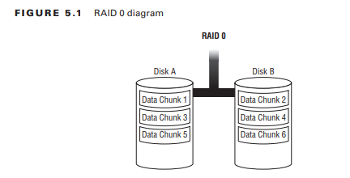
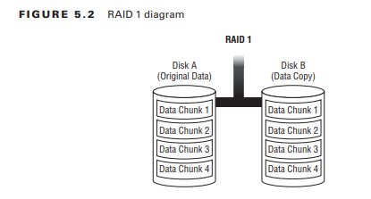
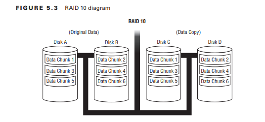
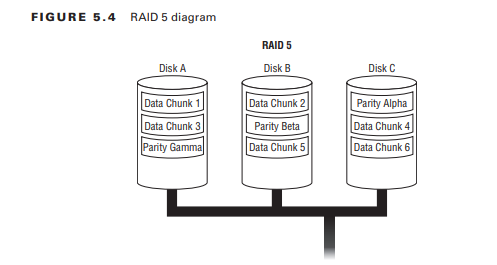
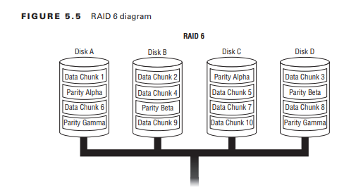

# Administrar Dispositivos de Almacenamiento

Los volúmenes RAID y lógicos se consideran configuraciones avanzadas de dispositivos de almacenamiento, debido a sus estructuras complicadas y los muchos términos confusos que los rodean.
Las figuraciones pueden ayudar a proteger sus datos, así como a mejorar sus velocidades generales de acceso a los datos. Además, a medida que aumentan las necesidades de almacenamiento de sus datos, estas estructuras de almacenamiento ofrecen una progresión de medios de almacenamiento bastante fluida. Varias utilidades pueden ayudar a configurar las opciones del kernel para admitir y configurar estos dispositivos avanzados. Algunas de estas utilidades también son útiles para monitorear los dispositivos. Comprender estos dispositivos y su configuración y administración es importante para la gestión de sus datos. Todos estos temas se tratan en este capítulo.
### Configuración de RAID
Por motivos de rendimiento y protección de datos del sistema, muchas empresas y particulares recurren a RAID. Una matriz redundante de discos independientes (RAID) es un conjunto de múltiples particiones de discos físicos combinadas en una única unidad virtual. Dependiendo de la estructura RAID elegida, esta unidad lógica puede lograr un rendimiento de acceso mejorado, una mayor protección de datos y un tiempo de inactividad reducido.
### Entendiendo el RAID
Las matrices RAID vienen en varias estructuras (a veces llamadas niveles RAID). Cada estructura se indica con un número y proporciona beneficios particulares. Si bien no sustituyen a las copias de seguridad, algunas estructuras RAID pueden mejorar la protección de los datos. Otras estructuras pueden mejorar los tiempos de lectura. Primero, determine sus necesidades de datos particulares para cada sistema y aplicación. Una vez que tenga esos requisitos a la mano, revise estas diversas estructuras RAID para elegir las mejores para satisfacer sus necesidades de datos.
RAID 0 Esta estructura RAID también se denomina división de discos. Cada archivo de datos se distribuye en varios discos de la matriz. Por ejemplo, si tiene dos discos, los datos de un archivo se dividen en partes entre los dos discos. En la Figura 5.1 se muestra un ejemplo diagramado de RAID 0 de dos discos.



La lectura y escritura en diferentes fragmentos de archivos puede ocurrir en paralelo, lo que potencialmente puede acelerar las lecturas y escrituras en el archivo. Esta estructura RAID se utiliza normalmente para aplicaciones de gráficos o espacio de intercambio. La desventaja es que no hay tolerancia a fallos. Si alguna unidad de la matriz RAID falla, perderá toda la matriz.

La duplicación de disco RAID 1 es el otro nombre para este tipo de estructura RAID. Los mismos datos se escriben en dos discos diferentes, lo que proporciona una copia de seguridad original y una copia de seguridad reflejada. La estructura requiere un mínimo de dos discos, y los discos siempre deben ser múltiplos de dos: un disco para los datos y un disco para la copia de datos (espejo). En la Figura 5.2 se muestra un ejemplo de RAID 1 de dos discos.



Esta estructura RAID proporciona una alta tolerancia a fallos. Si pierde un disco, tiene una copia de seguridad a la que se puede acceder inmediatamente. El principal problema de esta estructura RAID es su coste. Debe comprar una unidad duplicada por cada unidad que se incluirá en la matriz.
RAID 10 También llamada duplicación y división de discos o RAID 1+0, esta estructura RAID es una combinación de RAID 1 (duplicación) y RAID 0 (separación). Necesita un mínimo de cuatro discos: dos discos para la creación de bandas y dos discos para reflejar los discos de la creación de bandas. En la Figura 5.3 se muestra un ejemplo de RAID 10 de cuatro discos.



Si bien esta estructura de matriz proporciona tolerancia a fallas, incluida una regeneración muy rápida de cualquier disco defectuoso, el costo es alto. Debe tener el doble de capacidad para la parte de la estructura de espejo.

RAID 2, 3, 4 Estas tres estructuras RAID normalmente ya no se utilizan, aunque es posible que todavía existan algunas matrices RAID 4. RAID 2 es una forma de RAID 0, que proporcionaba una comprobación de errores especializada que ahora gestionan las propias unidades de disco.

RAID 3 también es una forma de RAID 0, pero agrega datos de paridad y utiliza un mínimo de tres discos. Los datos de paridad se almacenan en un disco designado, llamado disco de paridad. Otros datos, como los datos de archivos, se almacenan en los otros dos discos. Se requiere un mínimo de tres discos. Si falla un solo disco de datos, los datos se pueden regenerar utilizando el otro disco de datos y el disco de paridad. Sin embargo, no hay regeneración si falla el disco de paridad.

La estructura RAID 4 es una forma de RAID 3 y también requiere un mínimo de tres discos. La diferencia es que proporciona un acceso más rápido que RAID 3, porque RAID 3 procesa bytes de datos, mientras que RAID 4 procesa bloques de datos. La estructura RAID 4 todavía tiene el defecto fatal de no regenerar los datos originales si falla el disco de paridad.

RAID 5 Esta estructura RAID también se denomina división de discos con paridad, porque divide tanto los datos como la paridad. Los datos de paridad no se escriben en una sola unidad, como en RAID 3 o RAID 4, sino que se distribuyen entre los discos. En la Figura 5.4 se muestra un ejemplo de RAID 5 de tres discos.



RAID 5 se puede implementar mediante controladores de software o de hardware, pero normalmente se recomiendan controladores de hardware para implementaciones de RAID 5 de gran tamaño. Con un controlador de hardware, el rendimiento de escritura se puede mejorar agregando memoria caché adicional.

Para RAID 5, se requiere un mínimo de tres discos. Al distribuir la paridad entre las unidades, se mejora la tolerancia a fallos con respecto a RAID 3 y RAID 4 y se consiguen mejores tiempos de lectura de datos. Sin embargo, si falla una sola unidad, se necesita tiempo para reconstruir los datos de la unidad perdida. En ese tiempo, si otra unidad falla (y puede ocurrir), habrá perdido toda la matriz RAID. Por este motivo, muchas empresas con grandes instalaciones de datos no recomiendan una estructura RAID 5.

RAID 6 Esta estructura de matriz RAID también se denomina división de discos con doble paridad. Secciona tanto los datos como la paridad, como RAID 5, excepto que el mismo fragmento de datos de paridad se escribe dos veces, cada una en un disco diferente. Esto permite que dos unidades fallen sin problemas y aumenta su tolerancia a fallos. En la Figura 5.5 se muestra un ejemplo de RAID 6 de cuatro discos.



Hay un requisito mínimo de cuatro discos para RAID 6, lo que lo hace un poco más caro que RAID 5. Además, las escrituras son ligeramente más lentas debido a la doble paridad. Sin embargo, esta estructura proporciona lecturas más rápidas, por lo que es útil para aplicaciones de datos de gran tamaño.

Es bueno tener opciones, y las diversas estructuras de matriz RAID ofrecen varias. Al comprender estas variedades de RAID y sus requisitos de datos particulares, puede elegir la estructura más aplicable para satisfacer las necesidades de sus sistemas.
### Implementación de RAID en Linux
Esta sección se centra en implementar y mantener una estructura RAID de Linux mediante software. Las matrices RAID de software de Linux se implementan a través del controlador de dispositivo Múltiples dispositivos (md) y son compatibles con RAID 0, 1, 10, 4, 5 y 6.
Antes de configurar una matriz RAID en Linux, debe verificar algunas cosas en su sistema. Además, debe preparar todas las unidades necesarias para ser miembros de la matriz RAID. Una vez que haya manejado estos preliminares, puede crear su matriz RAID. Una vez creada la matriz RAID, intervienen varias utilidades para administrarla. 
### Comprobando su sistema
El primer elemento que debe verificar en su sistema es si el kernel admite RAID. El kernel de Linux v2.6 y superior puede admitir todos los niveles de RAID. Puede verificar la versión de su kernel usando el comando `uname -r`, como se muestra aquí en una distribución de Ubuntu:

```sh
uname -r 
3.13.0–71-generic
```

Además, verifique si su sistema tiene el archivo `/proc/mdstat`. Este útil archivo proporciona información sobre el estado actual del RAID del sistema. Sólo su presencia es otro indicador positivo de que su sistema admite RAID:

```sh
ls /proc/mdstat
/proc/mdstat
```

Otra verificación utiliza el comando `modprobe` para ver si puede cargar varios módulos del kernel RAID. Usando privilegios de super usuario, escriba `modprobe raid6` en la línea de comando, como se muestra aquí:

```sh
sudo modprobe raid6
[sudo] password for christine:
```

No recibir ningún mensaje de error después de ejecutar este comando `modprobe` es una buena señal. Sin embargo, verifique que funcionó mostrando el contenido actual del `/proc/mdstat file`:

```sh
cat /proc/mdstat
Personalities: [raid6] [raid5] [raid4]
unused devices: <none> 
```

Observe que la línea Personalidades en el archivo `/proc/mdstat` de esta distribución de Ubuntu muestra tres niveles RAID diferentes: 6, 5 y 4. Esto indica que este sistema admite esos niveles RAID.

En este punto, puede verificar los niveles RAID adicionales admitidos continuando emitiendo `modprobe raid#`, donde `#` es el nivel RAID que desea verificar. Normalmente, encontrará que los niveles RAID 0, 1, 10, 4, 5 y 6 son compatibles con las distribuciones actuales de Linux sin ninguna modificación. Si un nivel no es compatible actualmente, recibirá un mensaje de error similar al siguiente:

```sh
sudo modprobe raid3
[sudo] password for christine:
modprobe: FATAL: Module raid3 not found.
```

Una vez que sepa que su sistema Linux puede admitir el nivel RAID deseado, deberá ver si su sistema tiene instalada la utilidad Administración de dispositivos o discos múltiples (`mdadm`). En esta distribución de Ubuntu, no está instalado de forma predeterminada:

```sh
dpkg -s mdadm
dpkg-query: package 'mdadm' is not installed and
 no information is available
[...]
```

Sin embargo, en este sistema CentOS, la utilidad `mdadm` está instalada de forma predeterminada:

```sh
rpm -qa | grep mdadm
mdadm-3.3.2–2.el7_1.1.x86_64 
```

Si no tiene la utilidad `mdadm` y necesita instalarla, su paquete se llama convenientemente `mdadm`. Entonces, por ejemplo, en un sistema Ubuntu puede instalarlo mediante el comando `sudo apt-get install mdadm`, asumiendo que tiene privilegios de super usuario.

Una vez que se completen estas comprobaciones del sistema y se realicen los cambios necesarios, puede continuar con la implementación de una matriz RAID. El siguiente paso implica las unidades de disco.
### Preparar una unidad para ser miembro de RAID
Antes de crear una matriz RAID, debe particionar las distintas unidades que serán miembros de la matriz. Pero antes de comenzar a particionar, debe pensar en algunas cuestiones importantes, como el código de tipo de partición que se utilizará, así como el tamaño de la partición y cuánto espacio en disco dejará sin particionar.

Una partición de disco de datos normal normalmente tiene un código de tipo de partición de 83 (para particiones MBR) o 8300 (para particiones GPT). Para un miembro de la matriz RAID, el código de tipo de partición se puede configurar en da (solo particiones MBR) o fd.

Deberá elegir el tipo de código correcto según la tabla de particiones y el _superbloque md_, a veces llamado _metadatos_. Cuando se crea una matriz RAID, de forma predeterminada, el superbloque md se escribe en una ubicación particular en todos los discos de la matriz. Actualmente, Linux reconoce dos grupos de versiones de md superblock, v0.90 y v1.0 y superiores. La principal diferencia entre estos dos grupos de versiones es la ubicación del superbloque en el disco. También ayudan a determinar qué tipo de código de partición utilizar.

Si está utilizando una tabla de particiones GPT, se recomienda el código de tipo fd (0xFD00), porque el sistema Linux puede detectar RAID automáticamente. Si su sistema utiliza md superblock v1.0 o superior (lo que suele ser el caso, si no ha creado una matriz RAID usando esta partición) y es una partición MBR, use el código de tipo de partición da (0xDA).

Lo ideal es que todas las unidades de la matriz RAID y las unidades de repuesto sean del mismo tamaño, pero no siempre es así. En situaciones en las que las unidades no tienen el mismo tamaño, puede ser una buena idea dejar algo de espacio sin particionar. Esto puede resultar útil si sus discos de repuesto son ligeramente más pequeños que los miembros de la unidad de matriz RAID y necesita usarlos para reemplazar una unidad de matriz defectuosa.

Para las unidades que se utilizarán en la misma matriz RAID (miembros y repuestos), haga que todas tengan el mismo tamaño de partición. El controlador del dispositivo md puede manejar diferentes tamaños de partición en una matriz RAID ignorando el exceso. Sin embargo, estarás desperdiciando ese espacio no coincidente.

Ahora que ha determinado el código de tipo de partición y el tamaño, está listo para particionar sus unidades. Utilice la herramienta de partición adecuada, como `fdisk` o `parted`, para crear las particiones necesarias. En el ejemplo recortado aquí, se particionan cinco unidades en una distribución CentOS utilizando privilegios de super usuario para prepararlas para la membresía en una matriz RAID:

```sh
lsblk

NAME       MAJ:MIN RM  SIZE RO TYPE MOUNTPOINT 
sda         8:0    0    8G  0 disk
├─sda1      8:1    0  500M  0 part  /boot
└─sda2      8:2    0  7.5G  0 part
[...]

sde         8:64   0    1G  0 disk 
sdf         8:80   0    1G  0 disk 
sdg         8:96   0    1G  0 disk 
sdh         8:112  0    1G  0 disk 
sdi         8:128  0    1G  0 disk
[...]


fdisk /dev/sde
[...]
Command (m for help): n
Partition type:    
	p   primary (0 primary, 0 extended, 4 free)
	e   extended
Select (default p): p
Partition number (1–4, default 1): 1 
First sector (2048–2097151, default 2048):
Using default value 2048
[...]
Command (m for help): t
Selected partition 1
Hex code (type L to list all codes): da 
Changed type of partition 'Linux' to 'Non-FS data'

Command (m for help): w
[...]
fdisk /dev/sdf
[...]
fdisk /dev/sdg
[...]
fdisk /dev/sdh
[...]
fdisk /dev/sdi
[...]

lsblk
NAME       MAJ:MIN RM  SIZE RO TYPE MOUNTPOINT 
sda         8:0    0    8G  0 disk
├─sda1      8:1    0  500M  0 part  /boot
└─sda2      8:2    0  7.5G  0 part
[...]
sde         8:64   0    1G  0 disk 
└─sde1      8:65   0 1023M  0 part sdf         8:80   0    1G  0 disk 
└─sdf1      8:81   0 1023M  0 part sdg         8:96   0    1G  0 disk 
└─sdg1      8:97   0 1023M  0 part sdh         8:112  0    1G  0 disk 
└─sdh1      8:113  0 1023M  0 part sdi         8:128  0    1G  0 disk 
└─sdi1      8:129  0 1023M  0 part
[...]
```

En este ejemplo, el comando `lsblk` se utiliza para mostrar todos los distintos dispositivos de bloque actualmente conectados al sistema. La utilidad `fdisk` se emplea para crear particiones de disco completas en cinco unidades. Observe que el código de tipo de partición utilizado es da (0xDA).

Una vez que haya verificado la compatibilidad con RAID de su sistema, haya instalado los paquetes necesarios y haya preparado las unidades necesarias para ser miembro de la matriz RAID, estará listo para la siguiente tarea: crear una matriz RAID.
### Creando una matriz RAID
Para configurar una matriz RAID, debe emplear la Administración de dispositivos o discos múltiples

(`mdadm`) utilidad. La sintaxis básica de esta herramienta flexible es `mdadm  [--mode] raid-device [opciones] componentes-dispositivos`

La utilidad `mdadm` es un programa único que realiza muchos trabajos relacionados con matrices RAID. Requiere privilegios de super usuario y tiene varios modos de funcionamiento. Cada modo de funcionamiento está diseñado para una función particular, como la creación de una matriz RAID. Además, cada modo tiene sus propias opciones de comando `mdadm` específicas. Puede elegir el modo de funcionamiento con la opción `--mode` y las sus opciones.

```
Options

Options for selecting a mode are:

-A, --assemble
Assemble a pre-existing array.

-B, --build
Build a legacy array without superblocks.

-C, --create
Create a new array.

-F, --follow, --monitor
Select Monitor mode.

-G, --grow
Change the size or shape of an active array.

-I, --incremental
Add/remove a single device to/from an appropriate array, and possibly start the array.

--auto-detect
Request that the kernel starts any auto-detected arrays. This can only work if _md_ is compiled into the kernel - not if it is a module. Arrays can be auto-detected by the kernel if all the components are in primary MS-DOS partitions with partition type FD, and all use v0.90 metadata. In-kernel autodetect is not recommended for new installations. Using _mdadm_ to detect and assemble arrays - possibly in an _initrd_ - is substantially more flexible and should be preferred.

If a device is given before any options, or if the first option is --add, --fail, or --remove, then the MANAGE mode is assumed. Anything other than these will cause the Misc mode to be assumed.
```

La atención se centra aquí en el modo de creación `mdadm`. Debido a que las unidades particionadas anteriormente no tenían superbloques, es necesario crear los superbloques en ellas. Una vez completado, las unidades se ensamblan en la configuración RAID deseada.

En el siguiente ejemplo recortado, cuatro (`-n 4`) de los discos previamente particionados se crean (`-C`) en una matriz RAID de nivel 6 de muestra (`-l 6`), designada por `/dev/md0`, en una distribución CentOS. El comando de ejemplo aquí está dividido en varias líneas para mayor claridad:

```
mdadm -C /dev/md0 -l 6 -n 4 \
> /dev/sdf1 /dev/sdg1 /dev/sdh1 /dev/sdi1 
mdadm: Defaulting to version 1.2 metadata 
mdadm: array /dev/md0 started. 
```

Si la utilidad encuentra algo en las particiones que sea un problema potencial, muestra un mensaje sobre el problema potencial junto con la pregunta: ¿Continuar creando matriz?. Si encuentra algún mensaje de problema con la utilidad `mdadm`, investigue a fondo antes de continuar con la creación de la matriz RAID.

Observe que en el ejemplo anterior, cuando la utilidad `mdadm` crea un superbloque en los nuevos miembros de la matriz RAID, utiliza de forma predeterminada los metadatos de la versión 1.2 (superbloque). Además, una vez que se escribe un superbloque en las particiones, se inicia la nueva matriz RAID, `/dev/md0`.

Cuando se creó la matriz RAID nivel 6 en el ejemplo anterior, se utilizaron opciones cortas en el comando `mdadm`. Puede utilizar las opciones largas, si lo desea.

Anteriormente mencionamos que cada modo de utilidad `mdadm` tiene su propio conjunto de opciones. Puede ver rápidamente estas opciones en la línea de comando ingresando al modo y luego escribiendo `--help`, como se muestra aquí:

```sh
mdadm --create --help 
Usage:  mdadm --create device -chunk=X --level=Y --raid-devices=Z devices
[...] 
Options that are valid with --create (-C) are:
--bitmap=            : Create a bitmap for the array with the given filename or an internal bitmap is 'internal' is given
 --chunk=         -c  : chunk size in kibibytes
 --rounding=          : rounding factor for linear array (==chunk size)
 --level=         -l  : raid level: 0,1,4,5,6,10,linear,multipath and synonyms
 --parity=        -p  : raid5/6 parity algorithm: {left,right}-{,a}symmetric
 --layout=            : same as --parity, for RAID10: [fno]NN
 --raid-devices=  -n  : number of active devices in array
 --spare-devices= -x  : number of spare (eXtra) devices in initial array
 --size=          -z  : Size (in K) of each drive in RAID1/4/5/6/10 - optional
 --data-offset=       : Space to leave between start of device and start of array data.  
 --force          -f  : Honour devices as listed on command line.  Dont insert a missing drive for RAID5.  
 --run            -R  : insist of running the array even if not all devices are present or some look odd.
 --readonly       -o  : start the array readonly - not supported yet.
 --name=          -N  : Textual name for array - max 32 characters  
 --bitmap-chunk=      : bitmap chunksize in Kilobytes.
 --delay=         -d  : bitmap update delay in seconds.
```

Esta opción `--help` es útil si necesita recuperar rápidamente la sintaxis de la opción de un modo en particular. Tenga en cuenta que el modo de detección automática no tiene opciones, por lo que al utilizar `--help` solo se mostrará información de ayuda general de `mdadm`.
### Comprobando una matriz RAID
Una vez que cree una matriz RAID, debe verificar inmediatamente para asegurarse de que todo esté bien. El archivo `/proc/mdstat` es útil aquí, porque contiene el estado actual de cualquier matriz RAID en ejecución. En este ejemplo, se muestra la información de estado actual de la matriz RAID nivel 6 `/dev/md0`:

```
cat /proc/mdstat
Personalities: [raid6] [raid5] [raid4]
md0: active raid6 sdi1[3] sdh1[2] sdg1[1] sdf1[0]
      2093056 blocks super 1.2 level 6, 512k chunk, [...]
unused devices: <none> #
```

El estado de la matriz RAID `/dev/md0` parece bueno. Las cuatro particiones participan activamente. También puede ver información sobre el nivel RAID de la matriz (nivel 6) y su tamaño de fragmento (512k).

Otra buena comprobación requiere el uso del modo misceláneo de la utilidad `mdadm`. A continuación se muestra un ejemplo de cómo verificar la muestra `/dev/md0 RAID array`:

```
mdadm --misc --detail  /dev/md0 /dev/md0:
        Version: 1.2
  Creation Time: Tue Feb  9 14:05:42 2017
     Raid Level: raid6
     Array Size: 2093056 (2044.34 MiB 2143.29 MB)
  Used Dev Size: 1046528 (1022.17 MiB 1071.64 MB)
   Raid Devices: 4
  Total Devices: 4
    Persistence: Superblock is persistent

    Update Time: Tue Feb  9 14:05:54 2017
          State: clean
 Active Devices: 4
Working Devices: 4
 Failed Devices: 0
  Spare Devices: 0
         Layout: left-symmetric
     Chunk Size: 512K
           Name: localhost.localdomain: [...]
           UUID: 38edfd0d:45092996:954b269a:9e919b3a
         Events: 17

Number   Major   Minor   RaidDevice State
0                      8       81        0      active sync   /dev/sdf1
1                      8       97        1      active sync   /dev/sdg1
2                      8      113        2      active sync   /dev/sdh1
3                      8      129        3      active sync   /dev/sdi1
```

Este comando proporciona una gran cantidad de información útil. Observe en el ejemplo anterior que no solo se proporciona información de estado, sino que también se muestra información de identificación, como el UUID. Estos datos pueden ayudarle a diagnosticar cualquier problema que haya ocurrido durante la creación de la matriz RAID.
